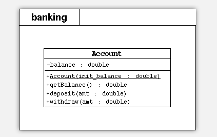

尚硅谷 Java 基础实战—Bank 项目 
==

# 实验题目 1
创建一个简单的银行程序包

# 实验目的
Java 语言中面向对象的封装性及构造器的创建和使用。

# 实验说明
在这个练习里，创建一个简单版本的 Account 类。将这个源文件放入 banking 程
序包中。在创建单个帐户的默认程序包中，已编写了一个测试程序 TestBanking。
这个测试程序初始化帐户余额，并可执行几种简单的事物处理。最后，该测试程 序
显示该帐户的最终余额。

## 提示
```text
1．创建 banking 包
2． 在 banking 包下创建 Account 类。该类必须实现上述 UML 框图中的模型。
a. 声明一个私有对象属性：balance，这个属性保留了银行帐户的当前（或 即
时）余额。
b. 声明一个带有一个参数（ init_balance ）的公有构造器 ，这个参数为
balance 属性赋值。
c. 声明一个公有方法 getBalance，该方法用于获取账户余额。
d. 声明一个公有方法 deposit,该方法向当前余额增加金额。
e. 声明一个公有方法 withdraw 从当前余额中减去金额。
3．打开TestBanking.java文件，按提示完成编写，并编译 TestBanking.java 文件。
4． 运行 TestBanking 类。可以看到下列输出结果：
Creating an account with a 500.00 balance
Withdraw 150.00
Deposit 22.50
Withdraw 47.62
The account has a balance of 324.88
```

类的UML图

