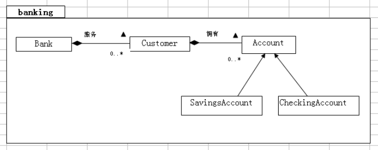

尚硅谷 Java 基础实战—Bank 项目 
==

# 实验题目 5
在银行项目中创建 Account 的两个子类：SavingAccount 和 CheckingAccount
实验目的：
继承、多态、方法的重写。

## 提示
```text
创建 Account 类的两个子类：SavingAccount 和 CheckingAccount 子类
a. 修改 Account 类；将 balance 属性的访问方式改为 protected
b. 创建 SavingAccount 类，该类继承 Account 类
c. 该类必须包含一个类型为 double 的 interestRate 属性
d. 该类必须包括带有两个参数（balance 和 interest_rate）的公有构造器。该
构 造器必须通过调用 super(balance)将 balance 参数传递给父类构造
器。

实现 CheckingAccount 类
1． CheckingAccount 类必须扩展 Account 类
2． 该类必须包含一个类型为 double 的 overdraftProtection 属性。
3． 该类必须包含一个带有参数（balance）的共有构造器。该构造器必须通过调
用 super(balance)将 balance 参数传递给父类构造器。
4． 给类必须包括另一个带有两个参数（balance 和 protect）的公有构造器。该
构造器必须通过调用 super(balance)并设置 overdragtProtection 属性，
将 balance 参数传递给父类构造器。
5． CheckingAccount 类必须覆盖 withdraw 方法。此方法必须执行下列检
查。如 果当前余额足够弥补取款 amount,则正常进行。如果不够弥补但是
存在透支 保护，则尝试用 overdraftProtection 得值来弥补该差值
（balance-amount）. 如果弥补该透支所需要的金额大于当前的保护级别。
则整个交易失败，但余 额未受影响。
6． 在主 exercise1 目录中，编译并执行 TestBanking 程序。输出应为：

Creating the customer Jane Smith.
Creating her Savings Account with a 500.00 balance and 3% interest.
 尚硅谷 Java 基础实战—Bank 项目 
Creating the customer Owen Bryant.
Creating his Checking Account with a 500.00 balance and no 
overdraft protection.
Creating the customer Tim Soley.
Creating his Checking Account with a 500.00 balance and 500.00 in 
overdraft protection.
Creating the customer Maria Soley.
Maria shares her Checking Account with her husband Tim.
Retrieving the customer Jane Smith with her savings account.
Withdraw 150.00: true
Deposit 22.50: true
Withdraw 47.62: true
Withdraw 400.00: false
Customer [Simms, Jane] has a balance of 324.88
Retrieving the customer Owen Bryant with his checking account with 
no overdraft protection.
Withdraw 150.00: true
Deposit 22.50: true
Withdraw 47.62: true
Withdraw 400.00: false
Customer [Bryant, Owen] has a balance of 324.88
Retrieving the customer Tim Soley with his checking account that 
has overdraft protection.
Withdraw 150.00: true
Deposit 22.50: true
Withdraw 47.62: true
Withdraw 400.00: true
Customer [Soley, Tim] has a balance of 0.0
Retrieving the customer Maria Soley with her joint checking account 
with husband Tim.
Deposit 150.00: true
Withdraw 750.00: false
Customer [Soley, Maria] has a balance of 150.0
```

## URM图


# 实验题目 5_2
创建客户账户  


## 实验目的
instanceof 运算符的应用

## 提示
```text
修改 Customer 类
1．修改 Customer 类来处理具有多种类型的联合账户。
（例如用数组表示多重性一节所作的，该类必须包括以下的公有方法：
addAccount(Account)，getAccount(int)和 getNumOfAccounts()。
每个 Customer 可以有多个 Account。（声明至少有 5 个）
2．完成 TestBanking 程序
该程序创建一个客户和账户的集合，并生成这些客户及其账户余额的报告。在
TestBanking.Java 文件中，你会发现注释块以/***…***/来开头和结尾。这
些注释只是必须提供的代码的位置。
3．使用 instanceof 操作符测试拥有的账户类型，并且将 account_type 设置
为适当的值，例如：“SavingsAccount”或“CheckingAccount”。
4．编译并运行该程序，将看到下列结果
 CUSTOMERS REPORT
 ================
Customer: Simms, Jane
 Savings Account: current balance is ￥500.00
 Checking Account: current balance is ￥200.00
Customer: Bryant, Owen
 Checking Account: current balance is ￥200.00
Customer: Soley, Tim
 Savings Account: current balance is ￥1,500.00
 Checking Account: current balance is ￥200.00
Customer: Soley, Maria
 Checking Account: current balance is ￥200.00
Savings Account: current balance is ￥150.00
```

# 实验题目 5_3
实现更为复杂的透支保护机制  

一个客户Customer可以有储蓄卡(SavingAccount)、信用卡(CheckingAccount)，  
这两种卡可二选一，也可同时拥有两种卡，  
信用卡可以绑定到储蓄主卡  


```text
信用卡取钱规则：
    1 先用信用卡上的现金
    2 用完了信用卡现金再使用信用卡透支额度
    3 使用完信用卡透支额度后，再使用主卡现金

```

## 实验目的
继承、多态、方法的重写。

## 说明
```text
说 明：
修改 SavingAccount 类
1.仿照练习 1“Account 类的两个子类”一节实现 SavingAccount 类。
2.SavingAccount 类必须扩展 Account 类。
3.该类必须包含一个类型为 double 的 interestRate 属性
4.该类必须包括一个带有两个参数（balance和interest_rate）的公有构造器。
该构造器必须通过调用 super（balance）来将 balance 参数传递给父类构造
器
修改 CheckingAccount 类
注释-这是练习 1 的选择练习。它包括了更为复杂的透支保护机制模型。它使用
客户储蓄。它使用客户储蓄账户完成透支保护。本练习必须在完成上述两个练
习后进行。
1.仿照练习 1“Account 类的两个子类”一节实现 CheckingAccount 类。
2.CheckingAccount 类必须扩展 Account 类
3.该类必须包括一个关联属性，称作 protectedBy，表示透支保护。该属性的
类型为 SavingAccount，缺省值必须是 null。除此之外该类没有其他的数据属
性。
4.该类必须包括一个带有参数（balance）的公有构造器，该构造器必须通过调
用 super(balance)将 balance 参数传递到父类构造器。
5. 修 改 构 造 器 为 CheckingAccount(double balance,SavingAccount 
protect)构造器。该构造器必须通过调用 super（balance）将 balance 参数
传递给父类构造器。
6. CheckingAccount 类必须覆盖 withdraw 方法。该类必须执行下面的检查：
如果当前余额足够弥补取款 amount，则正常进行。如果不够弥补但是存在透支
保护则尝试用储蓄账户来弥补这个差值（balance-amount）。如果后一个交易
失败，则整个交易一定失败，但余额未受影响。
修改 Customer 类，使其拥有两个账户：一个储蓄账户和一个支票账户：两个
都是可选的。
1.在练习 5_续 1 修改，原来的 Customer 类包含一个称作 account 的关联属
性，可用该属性控制一个 Account 对象。重写这个类，使其包含两个关联属性：
savingAccount 和 checkingAccount，这两个属性的缺省值是 null
2.包含两个访问方法：getSaving 和 getChecking，这两个方法分别返回储蓄
和支票总数。
3. 包含两个相反的方法：SetSaving 和 setChecking，这两个方法分别为
savingAccount 和 checkingAccount 这两个关联属性赋值。
完成 TestBanking 程序
```

## 测试结果
```text
Customer [Simms, Jane] has a checking balance of 200.0 and a savings balance of 500.0
Checking Acct [Jane Simms] : withdraw 150.00 succeeds? true
Checking Acct [Jane Simms] : deposit 22.50 succeeds? true
Checking Acct [Jane Simms] : withdraw 147.62 succeeds? true
Customer [Simms, Jane] has a checking balance of 72.5 and a savings balance of 424.88

Customer [Bryant, Owen] has a checking balance of 200.0
Checking Acct [Owen Bryant] : withdraw 100.00 succeeds? true
Checking Acct [Owen Bryant] : deposit 25.00 succeeds? true
Checking Acct [Owen Bryant] : withdraw 175.00 succeeds? false
Customer [Bryant, Owen] has a checking balance of 125.0

```