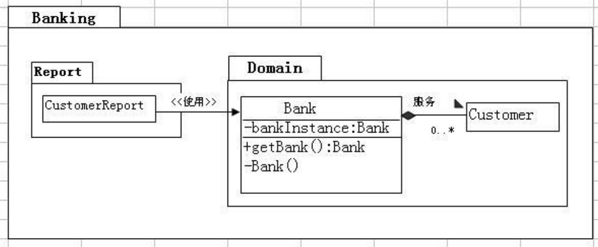

尚硅谷 Java 基础实战—Bank 项目
==
 
# 实验题目 6：(在5_续1的基础上修改)
修改 Bank 类来实现单子设计模式


# 实验目的
单例模式。

# 提示
```text

1． 修改 Bank 类，创建名为 getBank 的公有静态方法，它返回一个 Bank 
类的实例。
2． 单个的实例应是静态属性，且为私有。同样，Bank 构造器也应该是私有的
创建 CustomerReport 类
1.在前面的银行项目练习中，“客户报告”嵌入在 TestBanking 应用程序的
main 方法中。在这个练习中，改代码被放在 ，banking.report 包的
CustomerReport 类中。您的任务是修改这个类，使其使用单一银行对象。
2． 查找标注为注释块/*** ***/的代码行.修改该行以检索单子银行对象。
编译并运行 TestBanking 应用程序
看到下列输入结果：
CUSTOMER REPORT
=======================
Customer:simms,jane
Savings Account:current balance is 
$500.00 Checking Account:current 
balance is $200.00
Customer:Bryant,owen
 尚硅谷 Java 基础实战—Bank 项目 
Checking Account:current balance is $200.00
Customer: Soley,Tim
Savings Account:current balance is $1,500.00
Checking Account:current balance is $200.00
Customer:Soley ,Maria
Checking Account:current balance is $200.00
Savings Account:current balance is $150.00
```
