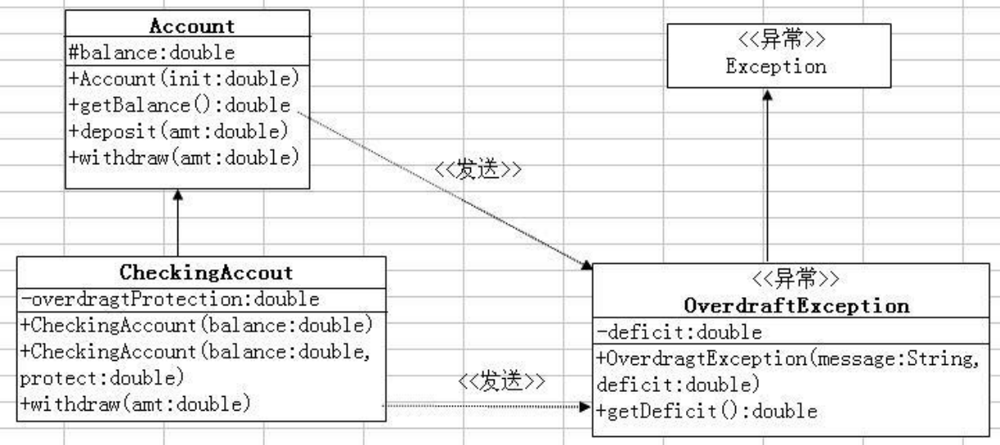

尚硅谷 Java 基础实战—Bank 项目 
==

# 实验题目 7：（在6基础上修改）
将建立一个 OverdraftException 异常，它由 Account 类的withdraw()方法
抛出。



# 实验目的
自定义异常

# 实验说明
```text

创建 OverdraftException 类
1． 在 banking.domain 包中建立一个共有类 OverdraftException. 这个类
扩展 Exception 类。
2． 添加一个 double 类型的私有属性 deficit.增加一个共有访问方法
getDeficit
3． 添加一个有两个参数的共有构造器。deficit 参数初始化 deficit 属性
修改 Account 类
4． 重写 withdraw 方法使它不返回值（即 void）.声明方法抛出
overdraftException
异常
5． 修改代码抛出新异常，指明“资金不足”以及不足数额（当前余额扣除请求
的数额）
修改 CheckingAccount 类
6． 重写 withdraw 方法使它不返回值（即 void）.声明方法抛出
overdraftException
异常
7． 修改代码使其在需要时抛出异常。两种情况要处理：第一是存在没有透支保
 尚硅谷 Java 基础实战—Bank 项目 
护的赤字，对这个异常使用 “no overdraft protection”信息。第二是
overdraftProtection 数 额 不 足 以 弥 补 赤 字 ： 对 这 个 异 常 可 使
用 ”Insufficient funds for overdraft protection” 信息
编译并运行 TestBanking 程序
Customer [simms,Jane]has a checking balance of 200.0 with a 500.0 
overdraft protection
Checking Acct[Jane Simms]: withdraw 150.00
Checking Acct[Jane Simms]: deposit 22.50
Checking Acct[Jane Simms]: withdraw 147.62
Checking Acct[Jane Simms]: withdraw 470.00 
Exception: Insufficient funds for overdraft protection Deifcit:45.12
Customer [Simms,Jane]has a checking balance of 0.0
Customer [Bryant,Owen]has a checking balance of 200.0
Checking Acct[Bryant,Owen]: withdraw 100.00
Checking Acct[Bryant,Owen]: deposit25.00
Checking Acct[Bryant,Owen]: withdraw 175.00
Exception: no overdraft protection Deficit:50.0
Customer [Bryant,Owen]has a checking balance of 125.0

```