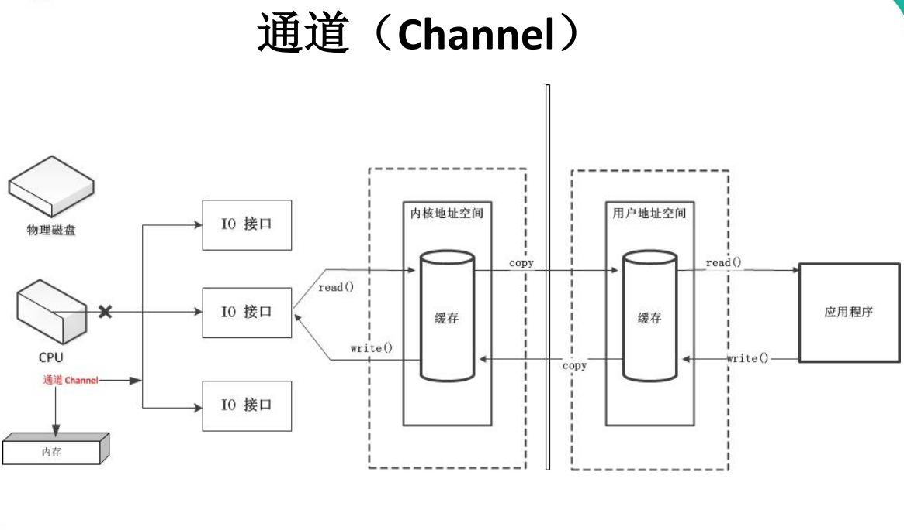
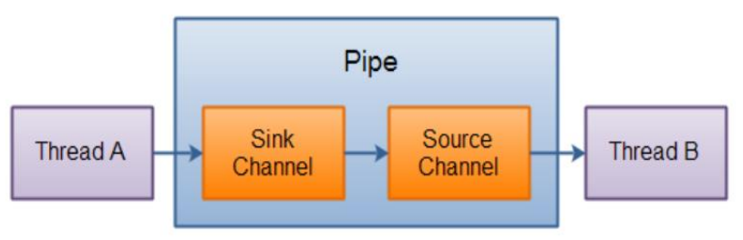

NIO
==

# 本章主要内容
* java NIO简介
* java NIO与IO的区别
* 缓冲区(Buffer)和通道(Channel)
* 文件通道(FileChannle)
* NIO的非阻塞式网络通信
    * 选择器Selector
    * SocketChannel,ServerSocketChannel,DatagramChannel
* 管道Pipe
* java NIO2(Path, Paths, Files)


# NIO概述
```
Java NIO(New IO, Non-blocking IO)是从java 1.4开始加入。可以替代原来的java IO接口。
IO是面向流，NIO是面向缓冲区，基于通道的IO操作。NIO效率更高。
```


```text
java.nio.channels.Channel
    |--FileChannel  处理本地文件
    |--SocketChannel  TCP网络编程中客户端的Channel
    |--ServerSocketChannel  TCP网络编程中服务器的Channel
    |--DatagramChannel  UDP网络编程中发送端和接受端的Channel
    
    |--Pipe管道
        |--SinkChannel 
        |--SourceChannel

```

# NIO与IO的区别
内容 |IO |NIO 
:--- |:--- |:---
面向的对象 |面向流 Stream Oriented |面向缓冲区 Buffer Oriented
IO是否阻塞 |阻塞IO(Blocking IO) |非阻塞IO(Non Blocking IO)
是否有选择器 |无 |选择器 Selector

# Channel通道与Buffer缓冲区
java NIO系统的核心在于:Channel通道与Buffer缓冲区。
通道表示打开到IO设备的连接(如文件、socket)。
使用NIO系统，需要分配用于读写数据的缓冲区。
Channel：负责连接传输
Buffer：负责存储

# Buffer缓冲区
* 缓冲区（Buffer）概念
```text
一个用于特定基本数据类型的容器。
由 java.nio 包定义的，所有缓冲区都是 Buffer 抽象类的子类
```

* Buffuer用途
```text
Java NIO 中的 Buffer 主要用于与NIO通道进行交互，
1. 从in通道读取数据是写入缓冲区，
2. 从缓冲区读取数据到out通道中
```

* Buffer存储数据的是一个数组，
* Buffer子类
    ```text
    根据数据类型不同(boolean 除外) ，有以下 Buffer 常用子类
    static XxxBuffer allocate(int capacity) : 创建一个容量为 capacity 的 XxxBuffer 对象
    ```
    * ByteBuffer
    * CharBuffer
    * ShortBuffer
    * IntBuffer
    * LongBuffer
    * FloatBuffer
    * DoubleBuffer

## 缓冲区的基本属性
* capacity容量
```text
表示Buffer能存放的数据个数，即存放数据的数组长度，
不能为负数，并且创建后不能更改
```
* limit限制
```text
第一个不应该读取或写入的数据的索引，即位于 limit 后的数据
不可读写。缓冲区的限制不能为负，并且不能大于其容量
```
* position位置
```text
下一个要读取或写入的数据的索引。缓冲区的位置不能为
负，并且不能大于其限制
```
* mark标记
```text
用于标记当前偏移位置的变量，-1表示还未标记过
```

* 以上几个属性存在的关系
```text
不变式: mark <= position <= limit <= capacity
```

## Buffer常用方法
* Buffer clean()
```text
清空此缓冲区并返回此缓冲区.
public Buffer clear() {
    position = 0;
    limit = capacity;
    mark = -1;
    return this;
}
```

* Buffer flip()
```text
将缓冲区设置数据读取模式，执行flip()后，就可以通过get读取数据
将缓冲区的limit设置为当前位置position，并将当前位置position充值为0
public Buffer flip() {
    limit = position;
    position = 0;
    mark = -1;
    return this;
}
```

* int capacity()
>返回capacity容量值

* int limit()
>返回此缓冲区当前的limit值

* int position()
>返回此缓冲区当前的position值

* Buffer limit(int newLimit)
>将缓冲区limit值设置为newLimit, 并返回一个此缓冲区

* Buffer position(int newPosition)
>将缓冲区position值设置为newPosition, 并返回一个此缓冲区

* boolean hasRemaining()
>从目前的position到limit是否有元素, true:有， false:无

* int remaining()
>从目前的position到limit的元素个数

* Buffer mark()
>记录当前的position位置，即mark = position

* Buffer reset()
>position恢复到mark记录的位置，可用于再重读等需求。当 mark >= 0，则position = mark

* Buffer rewind()
```text
倒回起点，取消标记，可重复读。
public Buffer rewind() {
    position = 0;
    mark = -1;
    return this;
}
```

## Buffer数据操作方法
* 获取 Buffer 中的数据
    * get()
        >读取单个字节
    * get(byte[] dst)
        >批量读取多个(dst长度)字节到 dst 数组中
    * get(int index)
        >读取指定索引位置的字节(不会移动 position)

* 放入数据到 Buffer 中
    * put(byte b)
        >将给定单个字节写入缓冲区的当前位置
    * put(byte[] src)
        >将 src 中的字节写入缓冲区的当前位置
    * put(int index, byte b)
        >将指定字节写入缓冲区的索引位置(不会移动 position)


## 直接缓冲区与非直接缓冲区
```text
字节缓冲区要么是直接的，要么是非直接的。如果为直接字节缓冲区，
则 Java 虚拟机会尽最大努力直接在此缓冲区上执行本机 I/O 操作。
也就是说，在每次调用基础操作系统的一个本机 I/O 操作之前（或之后），
虚拟机都会尽量避免将缓冲区的内容复制到中间缓冲区中（或从中间缓冲区中复制内容）。
```

```text
直接字节缓冲区可以通过调用此类的 allocateDirect() 工厂方法来创建。
此方法返回的缓冲区进行分配和取消分配所需成本通常高于非直接缓冲区。

直接缓冲区的内容可以驻留在常规的垃圾回收堆之外，
因此，它们对应用程序的内存需求量造成的影响可能并不明显。
所以，建议将直接缓冲区主要分配给那些易受基础系统的本机 I/O 操作影响的大型、持久的缓冲区。
一般情况下，最好仅在直接缓冲区能在程序性能方面带来明显好处时分配它们。
```
```text
直接字节缓冲区还可以通过 FileChannel 的 map() 方法 将文件区域直接映射到内存中来创建。
该方法返回MappedByteBuffer。Java 平台的实现有助于通过 JNI 从本机代码创建直接字节缓冲区。
如果以上这些缓冲区中的某个缓冲区实例指的是不可访问的内存区域，
则试图访问该区域不会更改该缓冲区的内容，
并且将会在访问期间或稍后的某个时间导致抛出不确定的异常。
```

```text
字节缓冲区是直接缓冲区还是非直接缓冲区可通过调用其 isDirect() 方法来确定。
提供此方法是为了能够在性能关键型代码中执行显式缓冲区管理。
```

## HeapByteBuffer与DirectByteBuffer
* HeapByteBuffer非直接缓冲(堆缓冲区)
```text
是写在jvm堆上面的一个buffer，底层的本质是一个数组，用类封装维护了很多的索引（make/limit/position/capacity等） 
优点：由于内容维护在jvm里，所以把内容写进buffer里速度会快些；并且，可以更容易回收

创建方式：XxxBuffer.allocate(int capacity)
```

* DirectByteBuffer直接缓冲区
```text
底层的数据其实是维护在操作系统的内存中，而不是jvm里，DirectByteBuffer里维护了一个引用address指向了数据，从而操作数据
优点：跟外设（IO设备）打交道时会快很多，因为外设读取jvm堆里的数据时，不是直接读取的，而是把jvm里的数据读到一个内存块里，再在这个块里读取的，如果使用DirectByteBuffer，则可以省去这一步，实现zero copy（零拷贝）

创建方式：ByteBuffer.allocateDirect(int capacity)
只有ByteBuffer能创建直接缓冲区

```

* DirectByteBuffer的必要性
```text
外设之所以要把jvm堆里的数据copy出来再操作，不是因为操作系统不能直接操作jvm内存，
而是因为jvm在进行gc（垃圾回收）时，会对数据进行移动，一旦出现这种问题，外设就会出现数据错乱的情况
```

# Channel通道
```text
由 java.nio.channels 包定义的。
Channel 表示 IO 源与目标打开的连接。
Channel 类似于传统的“流”。
只不过 Channel 本身不能直接访问数据，
Channel 只能与Buffer 进行交互。
```

  


## Channel接口的主要实现类
* FileChannel
>用于读取、写入、映射和操作文件的通道。
* DatagramChannel
>通过 UDP 读写网络中的数据通道。
* SocketChannel
>通过 TCP 读写网络中的数据。
* ServerSocketChannel
>可以监听新进来的 TCP 连接，对每一个新进来的连接都会创建一个 SocketChannel。


## 获取通道
### 方式1
>对支持通道的对象调用getChannel()方法
* FileInputStream
* FileOutputStream
* RandomAccessFile
* DatagramSocket
* Socket
* ServerSocket

### 方式2
```text
使用 Files 类的静态方法 newByteChannel() 获取字节通道
```

### 方式3
```text
通过通道的静态方法 open() 打开并返回指定通道
```
[获取通道方式](./src/com/java/www/ChannelTest.java)

## 通道的数据传输
* 从Channel中读取数据写到Buffer中
```text
ByteBuffer byteBuffer = ByteBuffer.allocate(1024);
inChannel.read(byteBuffer)
```

* 读取Buffer中数据写到Channel中
```text
byteBuffer.flip();
outChannel.write(byteBuffer);
// 每次读取完缓冲区数据后，做清空处理
byteBuffer.clear();
```

**利用通道完成文件的复制示例**  
[ChannelTest test4](./src/com/java/www/ChannelTest.java)


## 分散读取Scatter和聚集写入Gather
分散读取：把通道中的数据分段写到多个缓冲区，写满一个再换下一个
聚集写入：把多个缓冲区中的数据逐个缓冲区数据写到通道，读取完一个缓冲区再读下一个
[ChannelTest test7](./src/com/java/www/ChannelTest.java)

## 通道之间的数据传输
* long transferTo(long position, long count, WritableByteChannel target)
>将此通道的数据从position位置开始，count个字节传输到target通道
* long transferFrom(ReadableByteChannel src, long position, long count)
>将通道ReadableByteChannel数据从position位置开始，count个字节传输到此通道

**通道之间的数据传输**  
[ChannelTest test6](./src/com/java/www/ChannelTest.java)


# FileChannel常用方法
* int read(ByteBuffer dst)
>从 Channel 中读取数据到 ByteBuffer
* long read(ByteBuffer[] dsts)
>将 Channel 中的数据“分散”到 ByteBuffer[]
* int write(ByteBuffer src) 
>将 ByteBuffer 中的数据写入到 Channel
* long write(ByteBuffer[] srcs) 
>将 ByteBuffer[] 中的数据“聚集”到 Channel
* long position() 
>返回此通道的文件位置
* FileChannel position(long p) 
>设置此通道的文件位置
* long size() 
>返回此通道的文件的当前大小
* FileChannel truncate(long s) 
>将此通道的文件截取为给定大小
* void force(boolean metaData) 
>强制将所有对此通道的文件更新写入到存储设备中

# 非阻塞式NIO、阻塞式NIO、与阻塞式IO

* IO流都是阻塞式的
```text
当一个线程调用 read() 或 write() 时，该线程被阻塞，
直到有一些数据被读取或写入，该线程在此期间不能执行其他任务。
因此，在完成网络通信进行 IO 操作时，由于线程会阻塞，
所以服务器端必须为每个客户端都提供一个独立的线程进行处理，
当服务器端需要处理大量客户端时，性能急剧下降。
```

* NIO可配置为非阻塞模式
```text
当线程从某通道进行读写数据时，若没有数据可用时，该线程可以进行其他任务。
线程通常将非阻塞 IO 的空闲时间用于在其他通道上执行 IO 操作，
所以单独的线程可以管理多个输入和输出通道。
因此，NIO 可以让服务器端使用一个或有限几个线程来同时处理连接到服务器端的所有客户端
```
## NIO TCP socket编程
[NioTcpBlockingTest](./src/com/java/tcp/NioTcpBlockingTest.java)  
[NioTcpBlockingTest2](./src/com/java/tcp/NioTcpBlockingTest2.java)  
[NioTcpNonblockingTest 非阻塞](./src/com/java/tcp/NioTcpNonblockingTest.java)  

## NIO UDP socket编程
[NIO UDP传输文件](./src/com/java/udp/NioUdpBlockingTest.java)  
[NioUdpNonBlockingTest 非阻塞](./src/com/java/udp/NioUdpNonBlockingTest.java)  

## 选择器Selector
```text
选择器（Selector） 是 SelectableChannle 对象的多路复用器，
Selector 可以同时监控多个 SelectableChannel 的 IO 状况，
也就是说，利用 Selector 可使一个单独的线程管理多个 Channel。
Selector 是非阻塞 IO 的核心。
```

**示例**  
[NioTcpNonblockingTest server](./src/com/java/tcp/NioTcpNonblockingTest.java)  

### 选择器Selector的应用
* 当调用 register(Selector sel, int ops) 将通道注册选择器时，
选择器对通道的监听事件，需要通过第二个参数 ops 指定。
* 可以监听的事件类型（可使用 SelectionKey 的四个常量表示）：
    * 读 : SelectionKey.OP_READ （1 << 0, 即1） 
    * 写 : SelectionKey.OP_WRITE （1<<2, 即4）
    * 连接 : SelectionKey.OP_CONNECT （1<<3, 即8）
    * 接收 : SelectionKey.OP_ACCEPT （1<<4, 即16）

* 若注册时不止监听一个事件，则可以使用“位或”操作符连接
```text
// 注册"监听事件类型"
serverSocketChannel.register(selector, SelectionKey.OP_READ | SelectionKey.OP_WRITE)

```

## SelectionKey
```text
表示 SelectableChannel 和 Selector 之间的注册关系。
每次向选择器注册通道时就会选择一个事件(选择键)。
选择键包含两个表示为整数值的操作集。
操作集的每一位都表示该键的通道所支持的一类可选择操作。
```

### SelectionKey常用方法
* int interestOps()
>获取感兴趣事件集合

* int readyOps()
>获取通道已经准备就绪的操作的集合

* SelectableChannel channel()
>获取注册通道

* Selector selector()
>返回选择器

* boolean isReadable()
>检测 Channal 中读事件是否就绪

* boolean isWritable()
>检测 Channal 中写事件是否就绪

* boolean isConnectable()
>检测 Channel 中连接是否就绪

* boolean isAcceptable()
>检测 Channel 中接收是否就绪


### Selector常用方法
* Set<SelectionKey> keys()
>所有的 SelectionKey 集合。代表注册在该Selector上的Channel

* selectedKeys()
>被选择的 SelectionKey 集合。返回此Selector的已选择键集
* int select()
```text
监控所有注册的Channel，当它们中间有需要处理的 IO 操作时，该方法返回，
并将对应得的 SelectionKey 加入被选择的SelectionKey 集合中，
该方法返回这些 Channel 的数量。
```
* int select(long timeout)
>可以设置超时时长的 select() 操作

* int selectNow()
>执行一个立即返回的 select() 操作，该方法不会阻塞线程

* Selector wakeup()
>使一个还未返回的 select() 方法立即返回

* void close()
>关闭该选择器

## 网络编程常用Channel
* SocketChannel
```text
Java NIO中的SocketChannel是一个连接到TCP网络套接字的通道

操作步骤：
* 打开 SocketChannel
* 读写数据
* 关闭 SocketChannel
```
* ServerSocketChannel
> Java NIO中的 ServerSocketChannel 是一个可以监听新进来的TCP连接的通道，就像标准IO中 的ServerSocket一样

* DatagramChannel
```text
Java NIO中的DatagramChannel是一个能收发UDP包的通道

操作步骤：
* 打开 DatagramChannel
* 接收/发送数据
* 关闭通道

```

# 字符集编码与解码
Charset 字符集
编码：字符数组 -> 字节数组
解码：字节数组 -> 字符数组

* 返回指定字符集名的字符集
 ```text
Charset charset = Charset.forName("GBK");
```
* 获取编码器
```text
CharsetEncoder encoder = charset.newEncoder();
```

* 获取解码器
```text
CharsetDecoder decoder = charset.newDecoder();
```

* encoder.encode()编码

* decoder.decode()解码

[字符集编码、解码示例](./src/com/java/www/CharsetTest.java)  


# Pipe管道
```text
Java NIO 管道是2个线程之间的单向数据连接。
Pipe有一个source通道和一个sink通道。
数据会被写到sink通道，从source通道读取
```


**Pipe管道示例**  
[PipeTest](./src/com/java/www/PipeTest.java)  


# NIO2 Path、Paths、Files
java 7对原来的NIO进一步加强


```text
java.nio.file.Path 接口代表一个平台无关的平台路径，
描述了目录结构中文件的位置
```

## Path接口
Path可以看成是File类的升级  

Path接口详情  
[Path接口](./Path接口.md)  

**Path接口方法测试示例**  
[PathTest](./src/com/java/www/PathTest.java)  


## Paths类
* 只有一个私有的构造器，private Paths() { }

* 只有两个静态方法
    * public static Path get(String first, String... more)
        >根据给定的一个或多个字符串创建Path对象，最终是调用了Path.of(first, more)
    * public static Path get(URI uri)
        ```text
        解析根据给定的uri并创建Path对象，最终是调用了Path.of(uri)。
        只能解析file文件系统资源，无法解析URL资源
        ```

## Files类
java.nio.file.Files 用于操作文件或目录的工具类

[Files类方法使用示例](./src/com/java/www/FilesTest.java)  

[Files类方法详情](./Files类.md)  

# 自动资源管理
```text
Java 7 增加了自动资源管理((Automatic Resource Management, ARM),
该特性以 try 语句的扩展版为基础。
自动资源管理主要用于，
当不再需要文件（或其他资源）时，
可以防止无意中忘记释放它们
```

* 自动资源管理基于 try 语句的扩展形式
```text
try (需要关闭的资源声明) {
    //可能发生异常的语句
} catch(异常类型 变量名) {
    //异常的处理语句
}
……
finally {
    //一定执行的语句
}
```

```text
当 try 代码块结束时，自动释放资源。
因此不需要显示的调用 close() 方法。
该形式也称为“带资源的 try 语句”

注意：
①try 语句中声明的资源被隐式声明为 final ，资源的作用局限于带资源的 try 语句
②可以在一条 try 语句中管理多个资源，每个资源以“;” 隔开即可。
③需要关闭的资源，必须实现了 AutoCloseable 接口或其自接口 Closeable

```