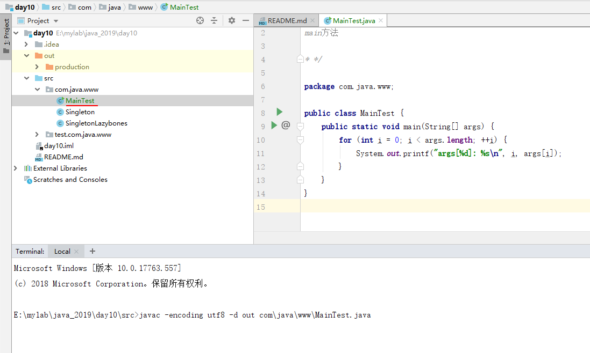
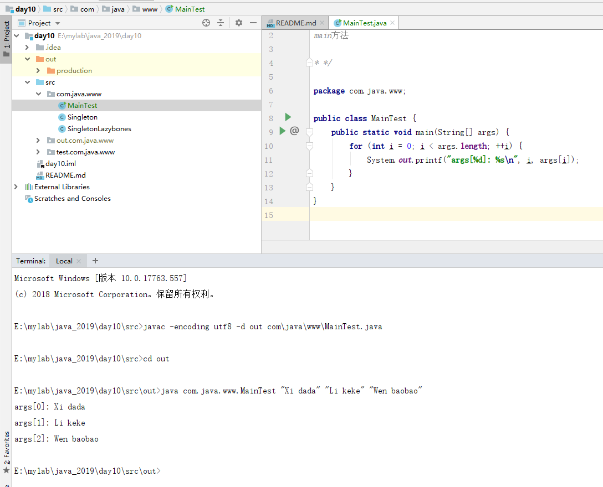

如何编译和运行包含package的java源文件
==

# 编译
1. cmd转到src根目录下
2. javac -encoding utf8 -d out com\java\www\MainTest.java
    * -d：编译出来的class文件存放存放目录，这里指定src/out
    * 最后一个为源文件路径，同个包下有多个.java文件时可用*来表示，如：com\java\www\*.java
    * 有多个包时，需要把每个包下的.java文件都进行编译

    
    
# 运行
1. cd out  // 切换到存放编译后class的根目录
2. 运行入口函数：java com.java.www.MainTest "Xi dada" "Li keke" "Wen baobao"

