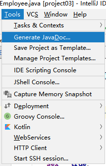
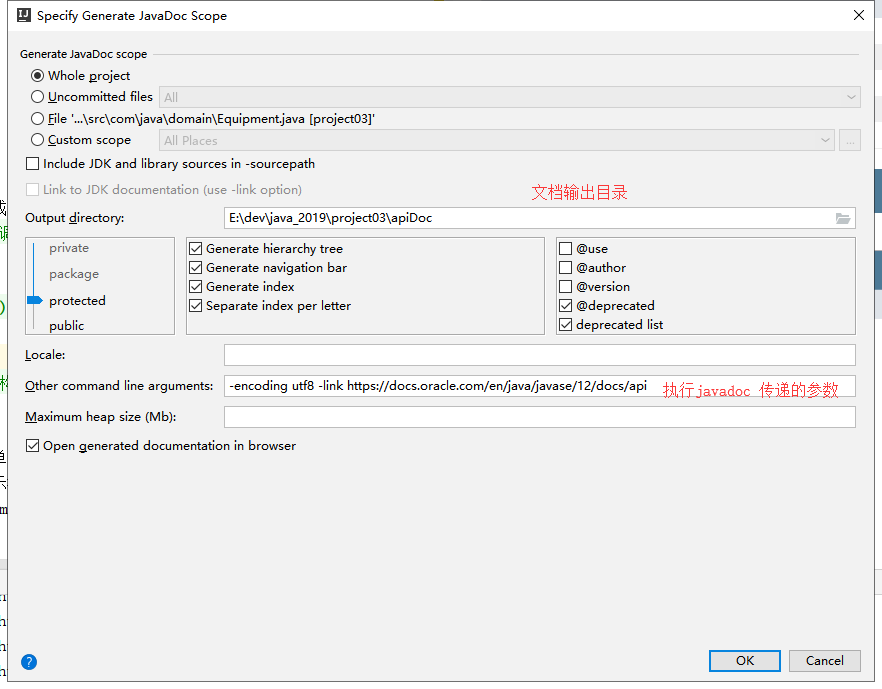
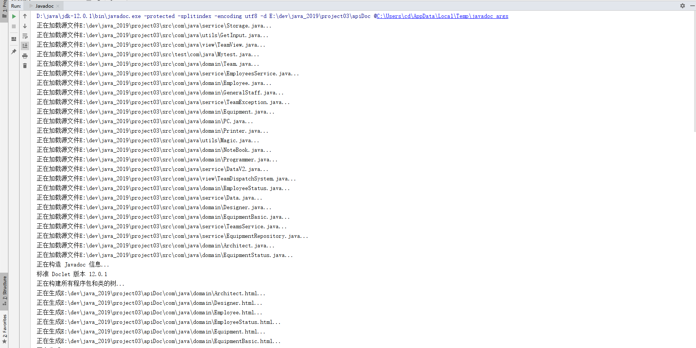
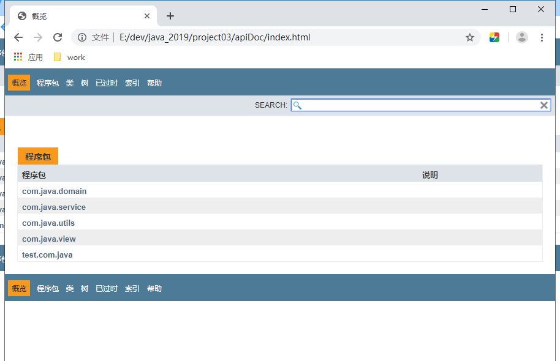
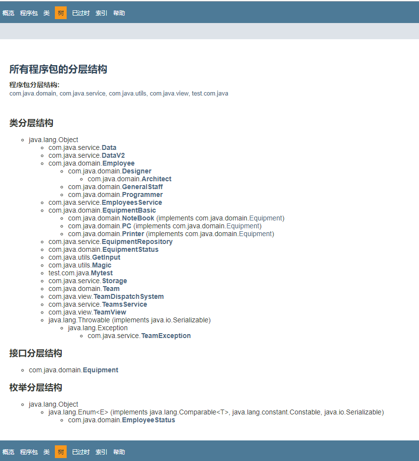

IntelliJ_IDEA生成JavaDoc文档
==

# JavaDoc文档包含注释要求
* 使用文档注释格式，必须以 /** 开头的注释
```text
/**
 * 
 */
 
 或
/**
 
*/ 
```
* 单行注释 和 块注释(多行注释) 不会被添加到JavaDoc生成的文档中
```text
单行注释
//


块注释
/*
*
*/

块注释
/*

*/
```

# 操作步骤
1. 点击生成JavaDoc  

    IntelliJ 的 JavaDoc 生成功能在菜单 Tools->Generate JavaDoc 项里面  
      
      
    
* 设置生成JavaDoc配置  
  
    * Generate JavaDoc scope: 生成范围
    * Output directory(必填): 输出JavaDoc的目录，要求目录为空，否则生成时将卡主
    * 可以选择类权限范围、注解范围等
    * Locae: 需要生成的 JavaDoc 以何种语言版本展示，不填写ide自动判断，如L：zh_CN
    * Other command line arguments(重要): 执行javadoc时传递的参数
        * -encoding utf8 指定源码.java文档的编码
        * -link https://docs.oracle.com/en/java/javase/12/docs/api 使用超链接的短名称
        * 举例：-encoding UTF-8 -charset UTF-8 -windowtitle "接口文档" -link https://docs.oracle.com/en/java/javase/12/docs/api
        ```text
        第一个参数 -encoding UTF-8 表示你的源代码（含有符合 JavaDoc 标准的注释）是基于 UTF-8 编码的，以免处理过程中出现中文等非英语字符乱码；
        
        第二个参数 -charset UTF-8 表示在处理并生成 JavaDoc 超文本时使用的字符集也是以 UTF-8 为编码，目前所有浏览器都支持 UTF-8，这样最具有通用性，支持中文非常好；
        
        第三个参数 -windowtitle 表示生成的 JavaDoc 超文本在浏览器中打开时，浏览器窗口标题栏显示的文字内容；
        
        第四个参数 -link 很重要，它表示你生成的 JavaDoc 中涉及到很多对其他外部 Java 类的引用,是使用全限定名称还是带有超链接的短名称
        ```
<details>
<summary>       -link 参数说明</summay>

        ```text
            举个例子，我创建了一个方法 public void func(String arg)，这个方法在生成 JavaDoc 时如果不指定 -link 参数，
        
        则 JavaDoc 中对该方法的表述就会自动变为 public void func(java.lang.String arg)，因为 String 这个类对我自己
        
        实现的类来讲就是外部引用的类，虽然它是 Java 标准库的类。如果指定了 -link http://docs.oracle.com/javase/7/docs/api 参数，
        
        则 javadoc.exe 在生成 JavaDoc 时，会使用 String 这样的短名称而非全限定名称 java.lang.String，同时自动为 String 短名称生成一个超链接，
        
        指向官方 JavaSE 标准文档 http://docs.oracle.com/javase/7/docs/api 中对 String 类的详细文档地址。
        
        -link 实质上是告诉 javadoc.exe 根据提供的外部引用类的 JavaDoc 地址去找一个叫 package-list 的文本文件，
        
        在这个文本文件中包含了所有外部引用类的全限定名称，因此生成的新 JavaDoc 不必使用外部引用类的全限定名，
        
        只需要使用短名称，同时可以自动创建指向其外部引用 JavaDoc 中的详细文档超链接。
        
        每个 JavaDoc 都会在根目录下有一个 package-list 文件，包括我们自己生成的 JavaDoc。
        ```
</details> 

    * 最后点击OK开始生成JavaDoc文档
    
      
    
* 查看文档
  
  