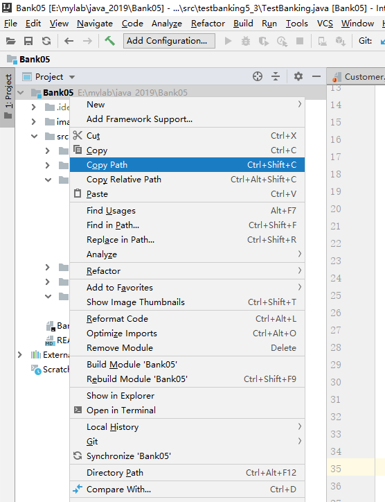

clone或一个新的Interlij IDE项目到本地如何正常运行
==

# 步骤
* 设置src目录为Source Root
* 添加SDK
* 指定SDK和设置项目编译输出目录
* 这时候就可以选择.java文件点击 运行(Ctrl + Shift + F10)

设置src目录为Source Root，设置后src目录会变浅蓝色  
如果没有src文件夹，手动创建即可。package只能在设置为Source Root的目录下创建  

添加SDK，需要先安装好JDK，打开 Project Structure  
  

指定SDK和设置项目编译输出目录  
  

  

  
