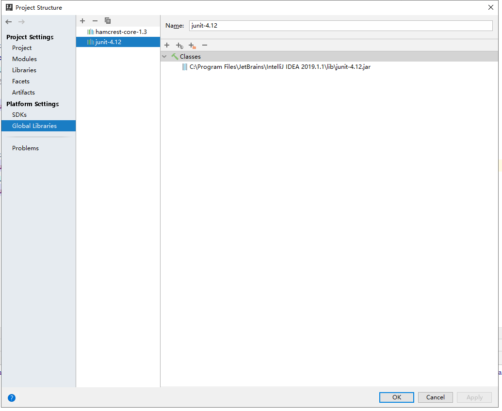
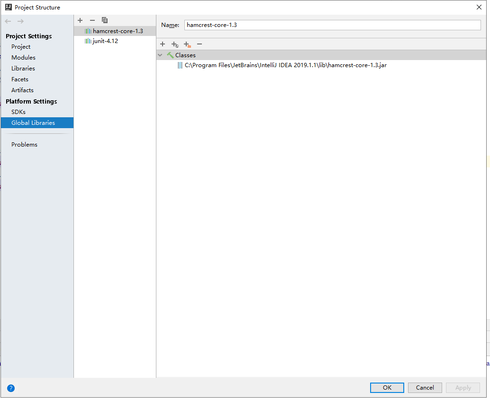
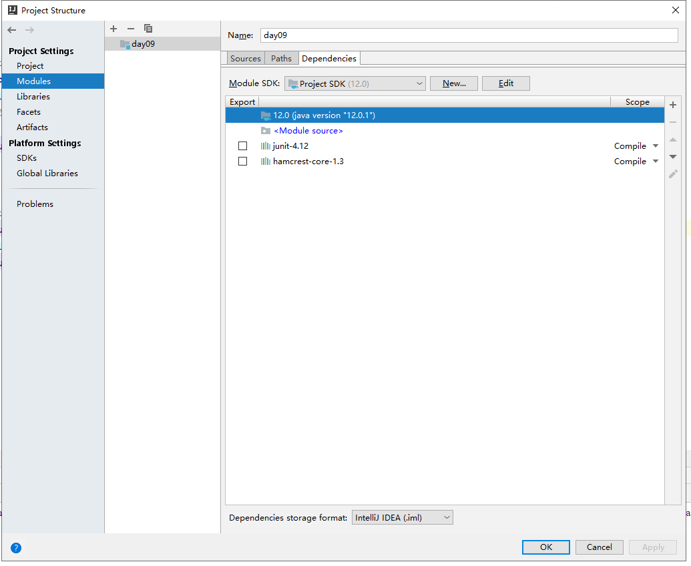
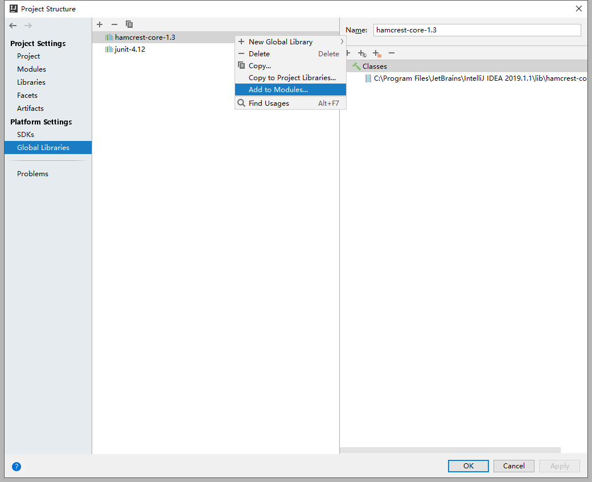
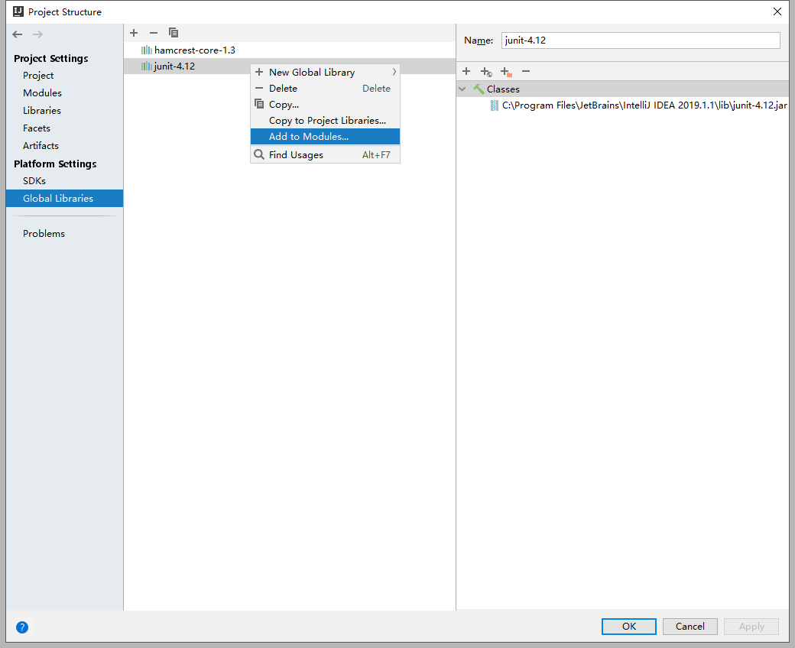
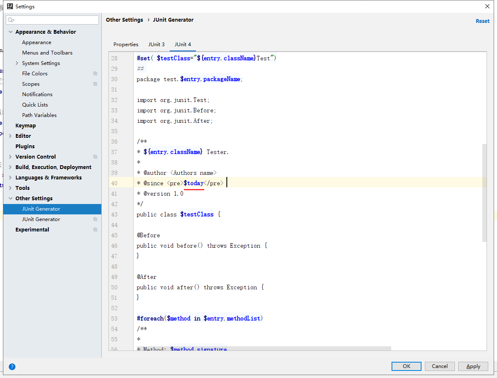
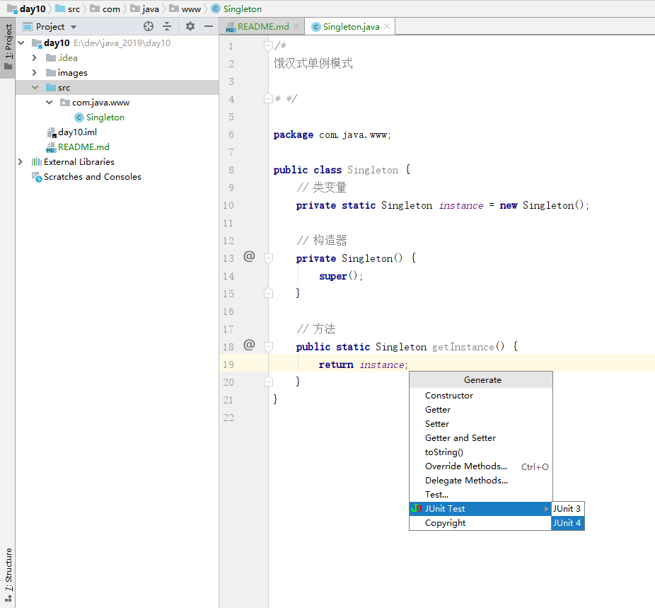
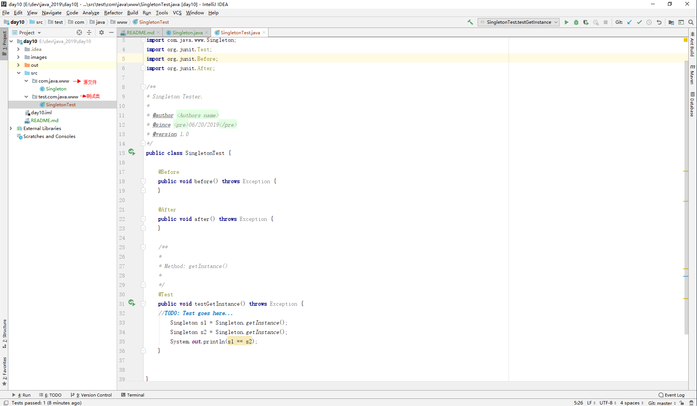
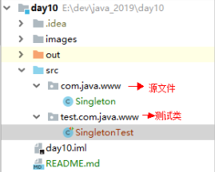

JUnit单元测试 -- InterliJ IDEA
==

# 为什么要用JUnit
一个@Test装饰方法就像main方法一样，这样就不写太多的main()方法也能像在main()方法中操作一样，提供了一个方便入口

# 环境配置
* 安装JUnit插件
>File > Settings > Plugins  
要求安装JUnit（默认已经安装）、JUnitGenerator V2.0
搜索框中输入 JUnit，  
在搜索结果中选择JUnitGenerator V2.0 点击进行安装

* 添加junit Library  
主要目的是在Project的Modules添加上该依赖(Dependencies) 如果已经添加则不需要添加了
```text
File > Project Structrue > Global Libraries > 点击上面的 + 
类型选择Java
路径选择：在InterliJ IDEA安装的根目录下lib目录找junit-4.12.jar
如:
C:\Program Files\JetBrains\IntelliJ IDEA 2019.1.1\lib\junit-4.12.jar

```
如图：  


* 添加hamcrest-core库  
添加方法同上,主要目的是在Project的Modules添加上该依赖(Dependencies) 如果已经添加则不需要添加了
```text
如:
C:\Program Files\JetBrains\IntelliJ IDEA 2019.1.1\lib\hamcrest-core-1.3.jar

```

如图：  


添加上面两个库到modules  




* 修改JUnit Generator模板  
建议把生成的文件字符集转成UTF-8
```text
主要是因为字符的问题，一般设置项目的文件字符集为UTF-8，而JUnit Generator生成文件字符集为GBK,且$date值在windows下含中文

把
* @since <pre>$date</pre>
修改为
* @since <pre>$today</pre> 

```




修改退格，如下
```text
######################################################################################## 
## 
## Available variables: 
##         $entryList.methodList - List of method composites 
##         $entryList.privateMethodList - List of private method composites 
##         $entryList.fieldList - ArrayList of class scope field names 
##         $entryList.className - class name 
##         $entryList.packageName - package name 
##         $today - Todays date in MM/dd/yyyy format 
## 
##            MethodComposite variables: 
##                $method.name - Method Name 
##                $method.signature - Full method signature in String form 
##                $method.reflectionCode - list of strings representing commented out reflection code to access method (Private Methods) 
##                $method.paramNames - List of Strings representing the method's parameters' names 
##                $method.paramClasses - List of Strings representing the method's parameters' classes 
## 
## You can configure the output class name using "testClass" variable below. 
## Here are some examples: 
## Test${entry.ClassName} - will produce TestSomeClass 
## ${entry.className}Test - will produce SomeClassTest 
## 
######################################################################################## 
## 
#macro (cap $strIn)$strIn.valueOf($strIn.charAt(0)).toUpperCase()$strIn.substring(1)#end 
## Iterate through the list and generate testcase for every entry. 
#foreach ($entry in $entryList) 
#set( $testClass="${entry.className}Test") 
## 
package test.$entry.packageName; 

import org.junit.Test; 
import org.junit.Before; 
import org.junit.After; 

/** 
* ${entry.className} Tester. 
* 
* @author <Authors name> 
* @since <pre>$today</pre> 
* @version 1.0 
*/ 
public class $testClass { 

    @Before
    public void before() throws Exception { 
    } 
    
    @After
    public void after() throws Exception { 
    } 

#foreach($method in $entry.methodList) 
    /** 
    * 
    * Method: $method.signature 
    * 
    */ 
    @Test
    public void test#cap(${method.name})() throws Exception { 
        //TODO: Test goes here... 
    } 

#end 

#foreach($method in $entry.privateMethodList) 
    /** 
    * 
    * Method: $method.signature 
    * 
    */ 
    @Test
    public void test#cap(${method.name})() throws Exception { 
        //TODO: Test goes here... 
    #foreach($string in $method.reflectionCode) 
        $string 
    #end 
    } 

#end 
} 
#end
```

* 使用JUnit插件
>在需要进行单元测试的类中，使用快捷键 Alt + Insert，选择JUnit test，选择JUnit 4  
选择@Test的方法块内，右击选择运行(Ctrl +  Shift + F10)

  

生成的JUnit test
  


# 单元测试
```java
import org.junit.Test;

    @Test
    public void testAdd() {
        assetEquals(1, new UserDao().add(1, 1));
    
    }

```
## 注意事项
* 测试方法上面必须使用@Test注解进行修饰
* 测试方法必须使用public void修饰，不能带有任何参数
* 新建一个源代码目录用来存放测试代码  

* 测试类的包应该与被测试类的在同一个包中
* 测试单元中的第一个方法必须独立测试，每个测试方法之间不能有依赖
* 测试类使用Test做为类名的后缀（非必须）
* 测试方法使用test作为访求名的前缀（非必须）

* JUnit测试方法使用与Scanner、System.in相关的要输入时停止不动解决方法
```test
https://intellij-support.jetbrains.com/hc/en-us/community/posts/115000556544-Why-can-t-I-input-anything-from-console-when-i-run-unit-test-with-JUNIT
编辑 .vmoptions配置文件，选择相应位数的文件
位置：{IntelliJ IDEA根目录}/bin/idea64.exe.vmoptions
加上下面最后这行配置，然后重启 IntelliJ IDEA
-Xms512m
-Xmx1500m
-XX:ReservedCodeCacheSize=480m
-XX:+UseConcMarkSweepGC
-XX:SoftRefLRUPolicyMSPerMB=50
-ea
-Dsun.io.useCanonCaches=false
-Djava.net.preferIPv4Stack=true
-Djdk.http.auth.tunneling.disabledSchemes=""
-XX:+HeapDumpOnOutOfMemoryError
-XX:-OmitStackTraceInFastThrow
-javaagent:C:\Program Files\JetBrains\patch\jetbrains-agent.jar
-Deditable.java.test.console=true

```

## 错误解析
* Failure 一般是单元测试使用的断言方法判断失败引起，说明预期结果和程序运行结果不一致。
* error 是有代码异常引起的，他产生于测试代码本身中的Bug。
* 测试用例是不是用来证明你是对的，而是用来证明你没有错。
    
## 测试流程
代码demo
```java
@BeforeClass
    public static void setUpBeforeClass() throws Exception {

    }
    @AfterClass
    public static void setUpAfterClass() throws Exception {

    }

    @Before
    public void before() throws Exception {

    }

    @After
    public void after() throws Exception {

    }

```
* @BeforeClass所修饰的方法在所有方法加载前执行，而且他是静态的在类加载后就会执行该方法，在内存中只有一份实例，适合用来加载配置文件。
* @AfterClass所修饰的方法在所有方法执行完毕之后执行，通常用来进行资源清理，例如关闭数据库连接。
* @Before和@After在每个测试方法执行前都会执行一次。

## 常用注解
* @Test(excepted=XX.class) 在运行时忽略某个异常。
* @Test(timeout=毫秒) 允许程序运行的时间。
* @Ignore 所修饰的方法被测试器忽略。
* RunWith 可以修改测试运行器 org.junit.runner.Runner

## 测试套件
测试套件是组织测试类一起运行的测试类

代码demo
```java
    @RunWith(Suite.class)
    @Suite.SuiteClasses({UserTest1, UserTest2, UserTest3})
    public class SuiteTest{
        
    }

```
注意事项
* 作为测试套件的入口类，类中不能包含任何方法
* 更改测试运行器Suite.class
* 将需要运行的测试类放入Suite.SuiteClasses({ })的数组中

## 参数化设置
需要测试的仅仅是测试数据，代码结构是不变的，只需要更改测试数据

代码demo
```java
@RunWith(Parameterized.class)
public class parameterTest {
    int expected = 0;
    int input1 = 0;
    int input2 = 0;

    @Parameters
    public static Collection<Object[]> t() {
        return Arrays.asList(new Object[][]{
                {3, 1, 2},
                {5, 2, 3}
        });
    }

    public parameterTest(int expected, int input1, int input2) {
        this.expected = expected;
        this.input1 = input1;
        this.input2 = input2;
    }

    @Test
    public void testAdd() {
        assertEquals(expected, UserDao.add(input1, input2));
    }

}

```

具体步骤
* 更改默认的测试运行器为@RunWith(Parameterized.class)
* 声明变量来存放预期值和测试值
* 声明一个返回值为Collection的公共静态方法，并用@Parameters修饰
* 为测试类声明一个带有参数的公共构造函数，并在其中为他声明变量赋值