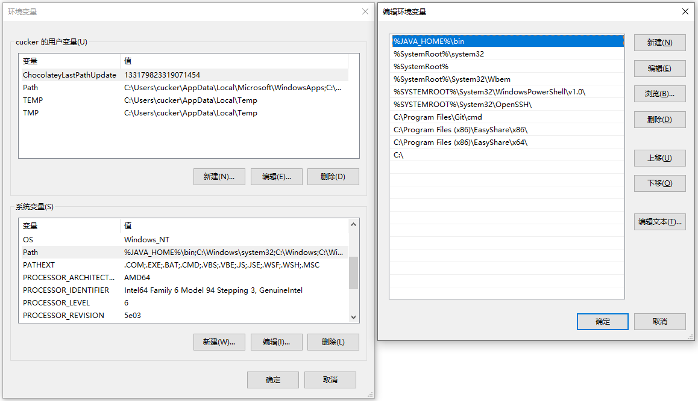

安装JDK
==

# Windows 安装JDK
* 下载相应的JDK包
* 解压JDK包到自定义目录
>例如：D:\java 专门存放JDK，jdk-12.0.1的解压到D:\java\jdk-12.0.1
* 设置系统环境变量


到www.oracle.com下载相应版本的JDK包
https://www.oracle.com/technetwork/java/javase/downloads/index.html
选择版本  


下载指定版本，这里下载zip版  


JDK解压路径  


设置系统环境变量  


变量名：JAVA_HOME  
变量值：D:\java\jdk-12.0.1  


变量名：CLASSPATH  
变量值：.;%Java_Home%\bin;%Java_Home%\lib\dt.jar;%Java_Home%\lib\tools.jar  


修改Path，添加%JAVA_HOME%\bin; 并移至最前面  



# Linux安装JDK
* 下载相应的JDK包
* 解压JDK包到自定义目录
>例如：/usr/local/java 专门存放JDK，jdk-12.0.1的解压到/usr/local/java/jdk-12.0.1  
tar -xvf jdk-12.0.1_linux-x64_bin.tar.gz -C /usr/local/java/  
ln -s /usr/local/java/jdk-12.0.1 /usr/local/java/jdk  

* 设置系统环境变量


下载Linux tar.gz版的jdk  


设置环境变量，编辑 /etc/profile  
新增变量 JAVA_HOME、CLASSPATH  
PATH变量中增加:$JAVA_HOME/bin  
```text
... ...
## JAVA_HOME
export JAVA_HOME=/usr/local/java/jdk
export CLASSPATH=.:$JAVA_HOME/lib/dt.jar:$JAVA_HOME/lib/tools.jar

## PATH
export PATH=/usr/local/sbin:/usr/local/bin:/usr/sbin:/usr/bin:/root/bin:$JAVA_HOME/bin
... ...

```
重载环境变量
. /etc/profile
