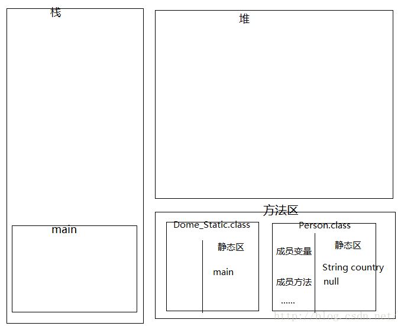
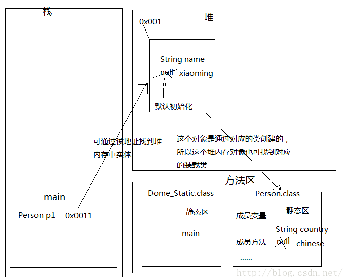
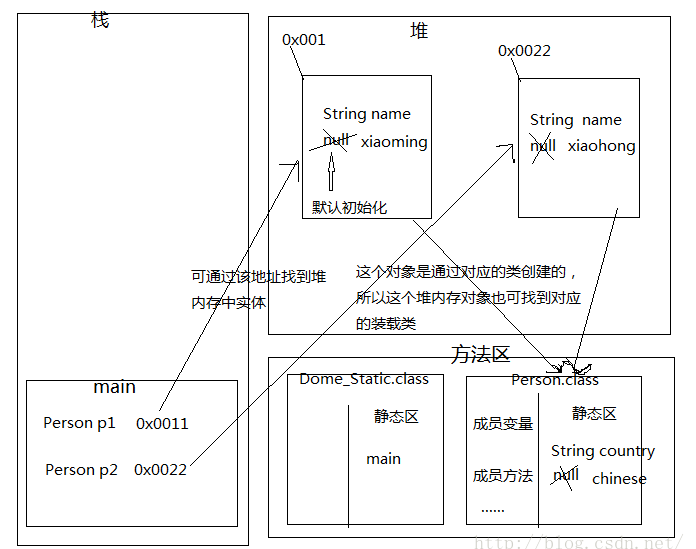

java方法区以及static的内存分配图
==
引用 https://blog.csdn.net/wang_1997/article/details/52267688


# 什么是方法区
>方法区是系统分配的一个内存逻辑区域，是JVM在装载类文件时，用于存储类型信息的(类的描述信息)。

## 方法区存放的信息
* 类的基本信息
    * 每个类的全限定名
    * 每个类的直接超类的全限定名(可约束类型转换)
    * 该类是类还是接口
    * 该类型的访问修饰符
    * 直接超接口的全限定名的有序列表

* 已装载类的详细信息
    * 运行时常量池
    >在方法区中，每个类型都对应一个常量池，存放该类型所用到的所有常量，常量池中存储了诸如文字字符串、final变量值、类名和方法名常量。
    * 字段信息
    >字段信息存放类中声明的每一个字段的信息，包括字段的名、类型、修饰符。
    * 方法信息
    >类中声明的每一个方法的信息，包括方法名、返回值类型、参数类型、修饰符、异常、方法的字节码。
(在编译的时候，就已经将方法的局部变量、操作数栈大小等确定并存放在字节码中，在装载的时候，随着类一起装入方法区。)
    * 静态变量(类变量)
    >类的所有实例都共享，我们只需知道，在方法区有个静态区，静态区专门存放静态变量和静态块。
    * 到类classloader的引用
    >到该类的类装载器的引用。
    * 到类class 的引用
    >虚拟机为每一个被装载的类型创建一个class实例，用来代表这个被装载的类。 


# 下面分析static的内存分配
```java

public class Dome_Static {
 
	public static void main(String[] args) {
		Person p1 = new Person();
		p1.name = "xiaoming";
		p1.country = "chinese";
		Person p2 = new Person();
		p2.name = "xiaohong";
		p1.speak();
		p2.speak();
	}
	
}
class Person {
    // 实例变量
	String name;
	
	// 类变量
	static String country;
	
	// 方法
	public void speak() {
		System.out.println("name:"+name+",country:"+country);
	}
}
```

控制台输出的信息
```text
Output:
name:xiaoming,country:chinese
name:xiaohong,country:chinese
```

* 首先，先加载Dome_Static，然后其main函数入栈，之后Person被加载。  
static声明的变量会随着类的加载而加载，所以在内存中只会存在一份，  
实例化多个对象，都共享同一个static变量，会默认初始化



* 在栈内存为 p1 变量申请一个空间,在堆内存为Person对象申请空间,  
初始化完毕后将其地址值返回给p1，通过p1.name和p1.country修改其值



* 在栈内存为 p2 变量申请一个空间,在堆内存为Person对象申请空间,  
初始化完毕后将其地址值返回给p2，仅仅通过p2.name修改其值



* 打印show方法，进栈，这里就不画图了。  
简单口述下：p1.show()  show方法入栈，在方法的内部有个指向堆内存的this引用，通过该引用可找到堆内存实体，  
打印country时，可通过该堆内存对象找到对应的类，读取对应静态区中的字段值

# 最后给大家一道面试题练练手，要求写出其结果(笔试)
```java

public class StaticTest {
    public static int k = 0;
    public static StaticTest t1 = new StaticTest("t1");
    public static StaticTest t2 = new StaticTest("t2");
    public static int i = print("i");
    public static int n = 99;
    public int j = print("j");

    {
        print("构造块");
    }

    static{
        print("静态块");
    }

    public StaticTest(String str) {
        System.out.println((++k) + ":" + str + " i=" + i + " n=" + n);
        ++n;
        ++i;
    }

    public static int print(String str) {
        System.out.println((++k) + ":" + str + " i=" + i + " n=" + n);
        ++i;
        return ++n;
    }
    
    public static void main(String[] args) {
        StaticTest t = new StaticTest("init");
    }

}
```
 
结果
 ```text
:j i=0 n=0
2:构造块 i=1 n=1
3:t1 i=2 n=2
4:j i=3 n=3
5:构造块 i=4 n=4
6:t2 i=5 n=5
7:i i=6 n=6
8:静态块 i=7 n=99
9:j i=8 n=100
10:构造块 i=9 n=101
11:init i=10 n=102

```

## 提示一下
```text
1. 加载的顺序：先父类的static成员变量 -> 子类的static成员变量 -> 父类的成员变量 -> 父类构造 -> 子类成员变量 -> 子类构造

2. static只会加载一次，所以通俗点讲第一次new的时候，所有的static都先会被全部载入(以后再有new都会忽略)，进行默认初始化。在从上往下进行显示初始化。这里静态代码块和静态成员变量没有先后之分，谁在上，谁就先初始化

3. 构造代码块是什么？把所有构造方法中相同的内容抽取出来，定义到构造代码块中，将来在调用构造方法的时候，会去自动调用构造代码块。构造代码快优先于构造方法。

```