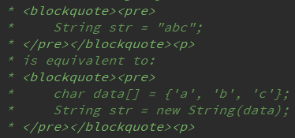

# java方法参数的值传递、引用传递

java方法的参数传递是存在两种方式：
* 值传递
* 引用传递(传递对象的内存地址)


## Java数据类型
* 基本数据类型
* 引用类型

### 基本数据类型

| 数据类型     | 关键字  | 在内存中占用的字节数 | 取值范围                                               | 默认值   |
| ------------ | ------- | -------------------- | ------------------------------------------------------ | -------- |
| 布尔型       | boolean | 1个字节（8位）       | true, false                                            | false    |
| 字节型       | byte    | 1个字节（8位）       | [-128, 127]                                            | 0        |
| 字符型       | char    | 2个字节（16位）      | [0, 2^16-^1]                                           | 'u\0000' |
| 短整形       | short   | 2个字节（16位）      | [-2^15^, 2^15-^1]                                      | 0        |
| 整形         | int     | 4个字节（32位）      | [-2^31^, 2^31-^1]                                      | 0        |
| 长整型       | long    | 8个字节（64位）      | [-2^63^, 2^63-^1]                                      | 0        |
| 单精度浮点型 | float   | 4个字节（32位）      | [1.4013E-45, 3.4028E38] <br>精度为6~7位有十进制效数字  | 0.0F     |
| 双精度浮点型 | double  | 8个字节（64位）      | [4.9E-324, 1.7977E308] <br>精度为15~16位十进制有效数字 | 0.0D     |


### 引用类型

*   类（类引用类型）

    如 集合：List, Map, Set

*   接口（接口引用类型）

*   数组（数组引用类型）


示例

```java
User user;  // 类
java.lang.Runable myThread;  // 接口
int[] intArray;  // 数组
```


## 形参、实参

*   实参：实际参数，调用方法时写的具体参数
*   形参：形式参数，定义方法时写的参数

一般情况下，在数据做为参数传递的时候，

基本数据类型是值传递，

引用数据类型是引用传递（内存地址传递）


## 值传递

示例

```java
public static void main(String[] args) {
    int num1 = 100;
    int num2 = 200;
    take(num1, num2);
    System.out.println("num1 = " + num1);
    System.out.println("num2 = " + num2);
}

public static void take(int a, int b) {
    int temp = a;
    a = b;
    b = temp;
    System.out.println("a = " + a);
    System.out.println("b = " + b);
}
```

运行结果：

```
a = 200
b = 100
num1 = 100
num2 = 200
```

### 流程

1.  主函数进栈，num1、num2初始化。
2.  调用take方法，take()进栈，将num1和num2的值复制一份给a和b。
3.  take方法中对a和b的值进行交换。
4.  take方法运行完毕，a、b的值已经交换。
5.  take方法弹栈。
6.  主函数弹栈。

### 解析

　　在take方法中，a、b的值进行交换，并不会影响到num1和num2。因为a、b中的值只是从num1、num2中复制过来的。

**也就是说a、b相当于num1、num2的副本，副本的内容无论怎么修改，都不会影响到原件本身。**


## 引用传递

示例

```java
public static void main(String[] args) {
    int[] intArray = {1,2,3,4,5};
    change(intArray);
    System.out.println(intArray[0]);
}

public static void change(int[] array) {
    int len = array.length;
    array[0] = 0;
}
```

运行结果：

```
0
```

### 流程

1.  主函数进栈，int[] intArray初始化。
2.  调用change方法，change()进栈，将intArray的**地址值**，复制一份给array。
3.  change方法中，根据地址值，找到堆中的数组，并将第一个元素的值改为0。
4.  change方法运行完毕，数组中第一个元素的值已经改变。
5.  change方法弹栈。
6.  主函数弹栈。

### 解析

　　调用change()的时候，形参array接收的是intArray地址值的副本。并在change方法中，通过地址值，对数组进行操作。change方法弹栈以后，数组中的值已经改变。main方法中，打印出来的intArray[0]也就从原来的1变成了0。

　　无论是主函数，还是change方法，操作的都是同一个地址值对应的数组。 

　　就像你把自己家的钥匙给了一把给保姆，保姆拿到钥匙在你家打扫卫生，结束后走了。等你拿着钥匙回到家以后，家里已经焕然一新。这里的钥匙就相当于地址值，家就相当于数组本身。


### String类型传递

示例

```java
public static void main(String[] args) {
    String str = "ABC";
    change(str);
    System.out.println(str);
}

public static void change(String a) {
	a = "DEF";
}
```

运行结果：

```
ABC
```

这就奇怪了。String是一个类，类是类引用类型，作为参数传递的时候，应该是引用传递。但是从结果看起来却是值传递。

#### 原因

String的Api文档中有这么一句话：


意思是String的值在创建之后不能被改变。

Api中还有一段：



意思是

```
String str = "abc"; 
相当于：
char data[] = {'a', 'b', 'c'}; 
String str = new String(data); 
```

　也就是说对String类型的str的任何修改相当于重新创建一个对象，并将新的地址值赋给str。这样的话，上面的代码就可以写成这样：

#### 流程

1.  主函数进栈，str1初始化。
2.  调用change方法，change()进栈，将str1的地址值复制一份给a。
3.  change方法中，重新创建一个String对象"DEF"，并将a指向了新的地址值。
4.  change方法执行完毕，a指向的地址值已经发生改变。
5.  change方法弹栈。
6.  主函数弹栈。

#### 解析

　　String对象作为参数传递时，走的依然是引用传递，只不过String这个类比较特殊。**String对象一旦创建，内容便不可更改，每一次内容的更改都是重新创建出来的新对象。**当change方法执行完毕时，a所指向的地址值已经发生改变，而a本来的地址值就是复制过来的副本，所以并不能改变str1的值。


### String类型类似情况

```
class User {
    String name;
    public User(String name) {
        this.name = name;
    }
}

public static void main(String[] args) {
    User user = new User("张三");
    change(user);
    System.out.println(user.name);
}

public static void change(User u) {
    User user = new User("李四");
    u = user;
}
```

运行结果：

```
张三
```


## 总结

-   Java基本数据类型传递参数时是值传递；引用类型传递参数时是引用传递。
-   值传递时，将实参的**值**传递一份给形参；引用传递时，将实参的**地址值**传递一份给形参。
-   值传递时，实参把它的**值**传递给对应的形参，函数接收的是原始值的一个拷贝，**此时内存中存在两个相等的基本类型，即实参和形参**，**后面方法中的操作都是对形参这个值的修改，不影响实参的值**。引用传递时，实参的引用(地址，而不是参数的值)被传递给方法中相对应的形参，函数接收的是原始值的内存地址；在方法执行中，形参和实参内容相同，指向同一块内存地址，方法执行中对引用的操作将会影响到实际对象。
-   需要特殊考虑String，以及Integer、Double等几个基本类型包装类，它们都是immutable类型，因为没有提供自身修改的函数，每次操作都是新创建一个对象，所以要特殊对待。因为最后的操作不会修改实参，可以认为是和基本数据类型相似，为值传递。