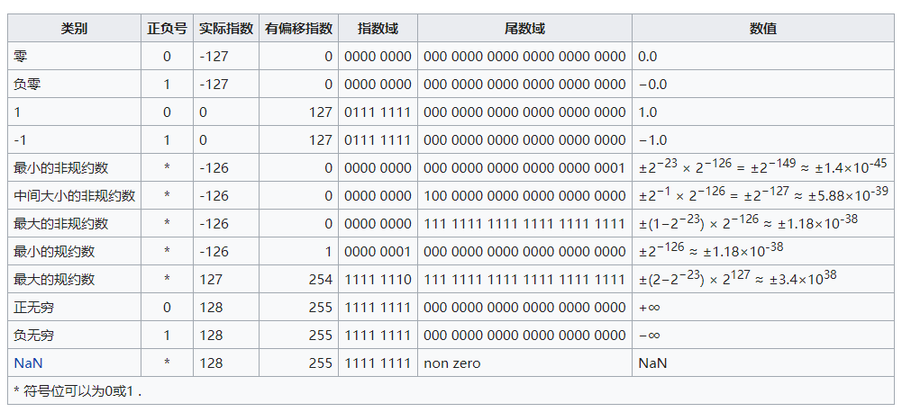

# 二进制浮点数算术标准IEEE-754.md

[参考地址](https://zh.wikipedia.org/wiki/IEEE_754)

## 概述
IEEE二进制浮点数算术标准（IEEE 754）是20世纪80年代以来最广泛使用的浮点数运算标准，为许多CPU与浮点运算器所采用。
这个标准定义了表示浮点数的格式（包括负零-0）与反常值（denormal number），
一些特殊数值（（无穷（Inf）与非数值（NaN）），以及这些数值的“浮点数运算符”；
它也指明了四种数值舍入规则和五种例外状况（包括例外发生的时机与处理方式）。

IEEE 754规定了四种表示浮点数值的方式：单精确度（32位）、双精确度（64位）、
延伸单精确度（43比特以上，很少使用）与延伸双精确度（79比特以上，通常以80位实现）。只有32位模式有强制要求，其他都是选择性的。大部分编程语言都提供了IEEE浮点数格式与算术，但有些将其列为非必需的。例如，IEEE 754问世之前就有的C语言，现在包括了IEEE算术，但不算作强制要求（C语言的float通常是指IEEE单精确度，而double是指双精确度）。


## 指数偏移值
```html
指数偏移值（exponent bias），即浮点数表示法中指数域的编码值，等于指数的实际值加上某个固定的值，
IEEE 754标准规定该固定值为2^(e-1) -1，其中的{\displaystyle e}e为存储指数的比特的长度。

以单精度浮点数为例，它的指数域是8个比特，固定偏移值是2^(8-1) - 1 = 128 - 1 = 127。
此为有号数的表示方式，单精度浮点数的指数部分实际取值是从-126到127（-127和128被用作特殊值处理，见下方“非规约形式的浮点数”和“特殊值”）。

采用指数的实际值加上固定的偏移值的办法表示浮点数的指数，好处是可以用长度为e个比特的无符号整数来表示所有的指数取值，
这使得两个浮点数的指数大小的比较更为容易，实际上可以按照字典序比较两个浮点表示的大小。

这种移码表示的指数部分，中文称作阶码。

```


## 单精度浮点数各种极值情况(float)
  


