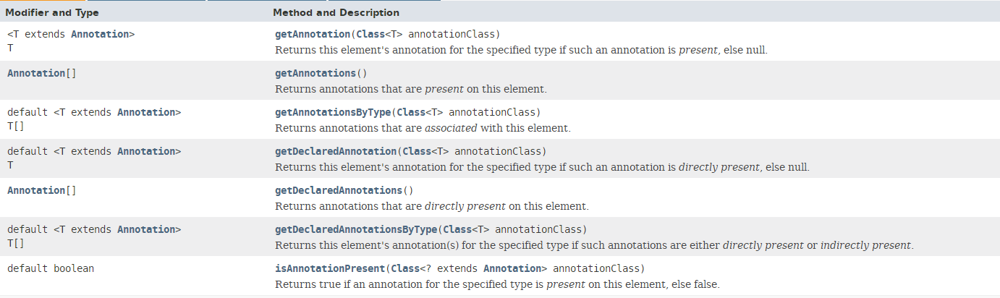

注解Annotation
==

# 注解概述
注解不是注释
* Annotation 其实就是代码里的特殊标记, 这些标记可以在编译, 类加载, 运行时被读取, 并执行相应的处理. 通过使用 Annotation, 程序员可以在不改变原有逻辑的情况下, 在源文件中嵌入一些补充信息
* JDK 1.5开始开始，java增加了Annotation注解，用于对元数据(MetaData)的支持
* Annotation 可以像修饰符一样被使用, 可用于修饰包,类, 构造器, 方法, 成员变量, 参数, 局部变量的声明, 这些信息被保存在 Annotation 的 “name=value” 对中
* Annotation 能被用来为程序元素(类, 方法, 成员变量等) 设置元数据
* 符号：@

# 三个常用的Annotation
* @Override 限定重写父类方法，该注释只能用于方法，显式的指明方法要重写，如果权限修饰、方法名等有错误能有提示
* @Deprecated 用于表示某个程序元素（类，方法等）已经过时，仍能正常正常运行和使用，一般表示有更好的方法，建议使用新方法，生成的doc api中有Deprecated标识
* @SuppressWarnings 抑制编译器警告

示例  
[三个基本注解](../day14/src/com/java/annotation/AnnotationTest.java)

# 自定义注解
* 格式：public @interface MyAnnotation { }
* 定义新的 Annotation 类型使用 @interface 关键字
* Annotation 的成员变量在 Annotation 定义中以无参数方法的形式来声明. 其方法名和返回值定义了该成员的名字和类型.
* 可以在定义 Annotation 的成员变量时为其指定初始值, 指定成员变量的初始值可使用 default 关键字
    ```java
    public @interface MyAnnotation{
        String name() default "atguigu";
    }
    
    ```
* 没有成员定义的 Annotation 称为标记; 包含成员变量的 Annotation 称为元数据 Annotation

示例  
[自定义注解 1](../day14/src/com/java/annotation/MyAnnotation2.java)  
[自定义注解 2](../day14/src/com/java/annotation/MyAnnotation2.java)


# 元注解
JDK 的元注解 用于修饰其他注解 定义  
4个元注解
* @Retention 指定注解的生命周期，可以保留到哪个阶段，  
    >举例：@Retention(RetentionPolicy.RUNTIME)  
    
    @Retention(value) value成员变量必须指定下面中的一个值：
    * RetentionPolicy.SOURCE 编译器直接丢弃这种策略的注释
    * RetentionPolicy.CLASS 编译器将把注释记录在 class 文件中. 当运行 Java 程序时, JVM 不会保留注解。 这是默认值
    * RetentionPolicy.RUNTIME 编译器将把注释记录在 class 文件中. 当运行 Java 程序时, JVM 会保留注释. 程序可以通过反射获取该注释
* @Target 用于修饰 Annotation 定义, 用于指定被修饰的 Annotation 能用于修饰哪些程序元素  
    @Target(value) value可选值(以数组形式传)：
    >TYPE, FIELD, METHOD, PARAMETER, CONSTRUCTOR, LOCAL_VARIABLE, ANNOTATION_TYPE, PACKAGE, TYPE_PARAMETER, TYPE_USE, MODULE
* @Documented 用于指定被该元 Annotation 修饰的 Annotation 类将被 javadoc 工具提取成文档  
定义为Documented的注解必须设置Retention值为RUNTIME
* @Inherited 被它修饰的 Annotation 将具有继承性.如果某个类使用了被 @Inherited 修饰的 Annotation, 则其子类将自动具有该注解

示例  
[自定义注解 1](../day14/src/com/java/annotation/MyAnnotation2.java)  

# 提取 Annotation 信息
* JDK 1.5 在 java.lang.reflect 包下新增了 AnnotatedElement 接口, 该接口代表程序中可以接受注解的程序元素



# 内置注解源码
```java
// SuppressWarnings
@Target({TYPE, FIELD, METHOD, PARAMETER, CONSTRUCTOR, LOCAL_VARIABLE, MODULE})
@Retention(RetentionPolicy.SOURCE)
public @interface SuppressWarnings {
    String[] value();
}


// Override
@Target(ElementType.METHOD)
@Retention(RetentionPolicy.SOURCE)
public @interface Override {
}


// Deprecated
@Documented
@Retention(RetentionPolicy.RUNTIME)
@Target(value={CONSTRUCTOR, FIELD, LOCAL_VARIABLE, METHOD, PACKAGE, MODULE, PARAMETER, TYPE})
public @interface Deprecated {
    String since() default "";
    boolean forRemoval() default false;
}

```