day01_JAVA语言概述与基本语法
==


# JAVA语言概述
## java语言特点
* 面向对象
```
基本概念：类型、对象
三大特性：封闭、继续、多态
```
* 健壮性
* 跨平台性

## java两种核心机制
* java虚拟机(Java Virtal Machine)
* 垃圾收集机制(Garbage Collection)

## .java源文件要求
* 源文件后缀.java
* 源文件中可以有多个class声明的类
* 类中可以有主方法（即main()方法），其格式是固定的：public static void main(String[] args) {}
* main是()方法是程序的入口，方法内是程序的执行部分
* 一个源文件中只能有一个声明为public的类，同时要求此类的类名与源文件名一致
* 每个语句都要以;结尾
* 执行过程 
> 1>编译:javac {-encoding utf8} 源文件名，生效多个.class字节码文件，  
2>运行:java 类名

### 从java源码到运行过程
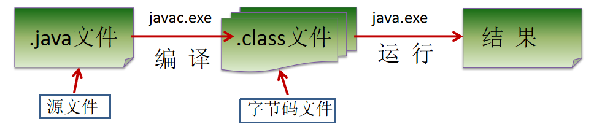

## JDK、JRE、JVM的关系
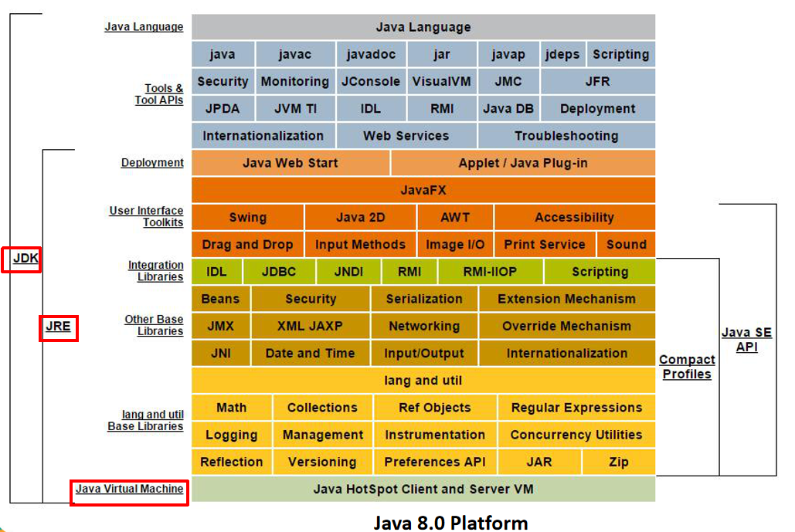  
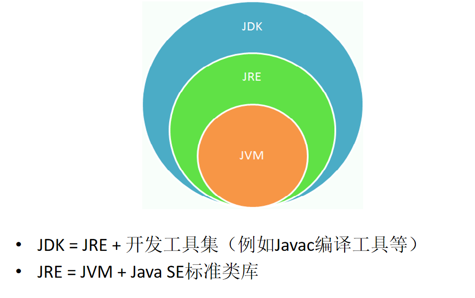    


## 注释
* 单行注释：//
* 多行注释(块注释)：/* 注释文本 */  
多行注释不能嵌套
* 文档注释：/** */  
** 注意：只有文档注释的内容才会添加到JavaDoc生成的文档中 **

```text
// 示例

/**
 * @author  Lee Boynton
 * @author  Arthur van Hoff
 * @author  Martin Buchholz
 * @author  Ulf Zibis
 * @see     java.lang.Object#toString()
 * @see     java.lang.StringBuffer
 * @see     java.lang.StringBuilder
 * @see     java.nio.charset.Charset
 * @since   1.0
 * @jls     15.18.1 String Concatenation Operator +
 */
```
## javadoc生成文档说明
* javadoc格式
```text
javadoc -encoding utf8 -d mydoc -author -version HelloJava.java
-d: 输出文件的目标目录
```
* java源文件的字符集与环境的字符集不一样时（尤其是windows cmd为GBK），这里javac 可指定字符集，如：javac encoding utf8 .java源文件

示例  
[HelloJava](./HelloJava.java)  
[HelloWorld](./HelloWorld.java)  


# 关键字
> 定义：被Java语言赋予了特殊含义，用做专门用途的字符串（单词）
> 特点：关键字中所有字母都为小写

## 定义数据类型的关键字
* class
* interface
* enum
* byte
* short
* int
* long
* float
* bouble
* char
* boolean
* void

## 定义数据类型值的关键字
* true
* false
* null

## 定义流程控制的关键字
* if
* else
* switch
* case
* default
* while
* do
* for
* break
* continue
* return

## 定义权限修饰符的关键字
* private
* protected
* public

## 定义类、函数、变量修饰符的关键字
* abstract
* final
* static
* synchronized

## 定义类与类之间关系的关键字
* extends
* implements

## 定义建立实例及引用实例，判断实例的关键字
* new
* this
* super
* instanceof

## 异常处理的关键字
* try
* catch
* finally
* throu
* throws

## 用于包的关键字
* package
* import

## 其他修饰符关键字
* native
* strictfp
* transient
* volatile
* assert

## 保留字
* byValue
* cast
* future
* generic
* inner
* operator
* outer
* rest
* var
* goto
* const

# 标识符
> java对各种变量、方法和类等要素命名时使用的字符序列称为标识符
>（凡是可以自己起名字的地方都叫做标识符）

## 合法标识符规则
* 由26个英文字母大不写、0-9数字、_、$组成
* 数字不可以开头
* 不可以使用关键字和保留字，但能包含关键字和保留字
* java中严格区分大小写，长度无限制
* 标识符不能包含空格
> 注意：在起名字时，为了提高阅读性，要尽量有意义，“见名知意”

# Java中名称命名规范
>建议遵守，如果不遵守编译也不会报错
* 包名
>多单词组成时所有字母都小写：xxyyzz
* 类名、接口名
>多单词组成时，第一个单词首字母小写，第二单词开始每个单词首字母大写：xxYyZz
* 常量名
>所有字母都大写。多个单词时每个单词用下划线连接：XX_YY_ZZ


# java中变量的声明与使用
# 变量
* 变量概念
```text
* 内存中的一个存储区域
* 该区域有自己的名称(变量名)和类型(数据类型)
* java中每个变量必须先声明，后使用
* 该区域的数据可以在同一个类型范围内不断变化
```

* 使用变量注意
>变量的作用域：一对{ }之间有效

> 初始化值

* 定义变量的格式
>数据类型 变量名 = 初始化值

aa = new int[1]; // 像这样没有指定类型的，虽然可以运行，但会在程序用到该变量时再根据具体情况先判断它的类型，再给它分配空间，不建议使用这种格式

// 可以不指定具体的数据类型，定义的时候用Object
/* Object类是类层次结构的根，Java中所有的类从根本上都继承自这个类, 
Object类是Java中唯一没有父类的类。
其他所有的类，包括标准容器类，比如数组，都继承了Object类中的方法。
所以用Object能够表示所有的类型

*/
Object obj1 = 1;//定义一个整型
Object obj2 = "2323";//定义一个字符串

* 变量是通过使用变量名来访问这块区域的

## 程序的执行过程
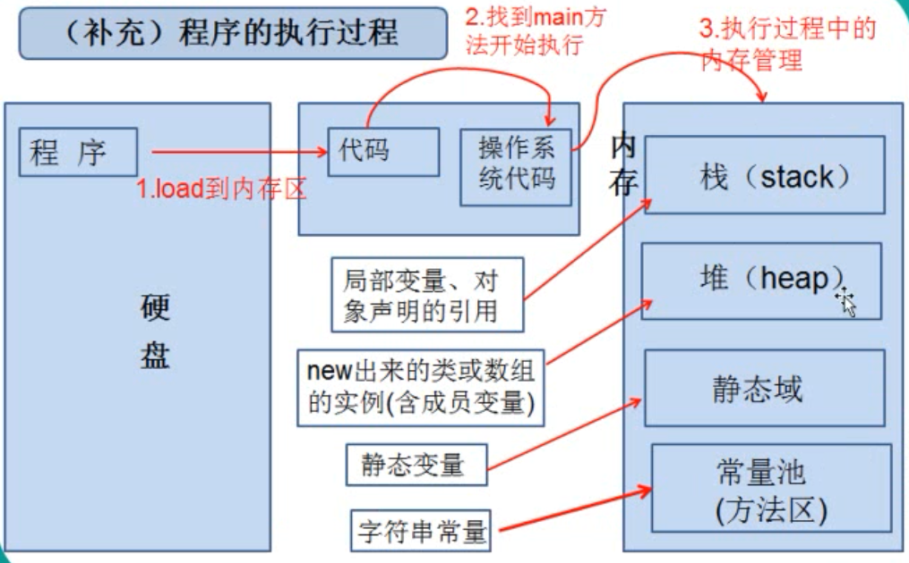

## 变量的分类
```text
基本数据类型
    数值型
        整数类型
            byte, short, int, long
        浮点类型
            float, double
    字符型
        char
    布尔型
        boolean
引用数据类型
    类(class) -- 字符串在这里，String[] 
    接口(interface)
    数组([])

```
### 整数类型
* java各整数类型有固定的表数范围和字段长度，不受具体OS的影响，以保证java程序的可移植性。
* <font color=red>java的整形常量默认是int型，声明long型常量须后加"l" 或"L" </font>
* 正负符号占用了第一个位置

|类型 |占用存储空间 |表数范围| 默认类型 |末尾加标识 |示例 |
|:---|:---|:---|:---|:---|:---|
|byte |1字节(byte)=8bit |-2<sup>7</sup> ~ 2<sup>7</sup>-1 | | |
|short |2字节(16位) |-2<sup>15</sup> ~ 2<sup>15</sup>-1| | |
|int |4字节(32位) |-2<sup>31</sup> ~ 2<sup>31</sup>-1 |默认 | |
|long |8字节(64位)|-2<sup>63</sup> ~ 2<sup>63</sup>-1 | |L 或 l |long lonng1 = 9999999999L

### 浮点型
* 与整型类似，java浮点型也有固定的表数范围和字段长度，不受具体OS的影响。
* java的浮点型常量默认为double型，声明float型常量，须后加"f" 或 "F"
* 浮点型常量有两种表示形式：
>十进制数形式，如5.12,  512.0f,  .512 (必须有小数点)

>科学计数法形式，如 5.12e2, 512E2, 100E-2

|类型 |占用存储空间 |表数范围| 默认类型 |末尾加标识 |示例 |
|:---|:---|:---|:---|:---|:---|
|单精度float |4字节 |(-3.403E38, 3.403E38),<br>即(-2<sup>2^7</sup>, 2<sup>2^7</sup>), <br>精度为6~7位有十进制效数字 | |F 或 f | 5.03F|
|双精度double |8字节 |(-1.798E308, 1.798E308), <br>即(-2<sup>2^10</sup>, 2<sup>2^10</sup>), <br>精度为15~16位十进制有效数字 |默认 | | 5.99|


### 字符类型
* char 型数据用来表示通常意义上的“字符”(2个字节)
* 字符型常量的三种表现形式：
>字符常量是用单引号('')括起来的单个字符，使用双引号将报错，涵盖世界上所有书面语的字符。
例如：char c1 = 'a';
char c2 = '中';
char c3 = '9';

>java中还允许使用转义字符'\'来将其后的字符转变为特殊字符型常量。
例如：char c4 = '\n'; // '\n'表示换行符

>直接使用Unicode值来表示字符型常量
例如：char c5 = '\uXXXX'; // 其中XXXX代表一个十六进制整数，如 \u000a 表示\n

* char类型是可以进行运算的。因为它都对应有Unicode码。

|类型 |占用存储空间 |表数范围| 默认类型 |末尾加标识 |示例 |
|:---|:---|:---|:---|:---|:---|
|char <br>用单引号括起来 |2字节 |任何一个字符 <br>转义字符 <br>Unicode值| | |char c1 = 'a'; <br>char c2 = '字'; <br>char c3 = '$'; <br>char c4 = '\n'; <br>char c5 = '\u000a' |

### 布尔类型boolean
* boolean类型适用于逻辑运算，一般用于程序流程控制：
```
if条件控制语句
while条件控制语句
do-while循环控制语句
for循环控制语句
```
* boolean类型数据只允许取值true 或 false，不能取值null
>不可以用0或非0的整数替代false和true，这点和C语言不同。

|类型 |占用存储空间 |表数范围| 默认类型 |末尾加标识 |示例 |
|:---|:---|:---|:---|:---|:---|
|boolean |1字节 或4字节 <br>使用boolean声明一个基本类型的变量：4字节，是用int类型来代替的 <br>使用boolean声明一个数组类型时：每个数组的元素占1个字节 |只能取值true或false，不能为null | | | |


## 变量之间的运算
* 自动类型转换
```
:>当容量小的数据类型与容量大的数据类型做运算时，容量小的会自动转换为容量大的数据类型：
char, byte, short ==> int ==> long ==> float ==> double
:>当char,byte,short之间做运算时，默认的结果为int类型。
```
* 强制类型转换
```
:>容量大的转换为容量小的。要使用强制转换符：(类型)变量名
:>强制类型转换导致的问题：可能损失精度，它的算是方式就是直接把高位截掉

```

* String 字符串也是一种数据类型，属于引用数据类型。
```
字符串与基本数据类型之间的运算：只能是连接运算：+
得到的结果仍为一个字符串
```
>值null可以赋值给任何引用类型(类、接口，数组)的变量，表示这个引用类型变量中保存的地址为空

>String类属于引用类型，可用null赋值

>String类是一个典型的不可变类，String对象创建出来就不可被改变。创建出来的字符串
将存放在数据区，保证每个字符串常量只有一个，不会产生多个副本。


# 4种整数表达方式
* 二进制
>0,1，满2进1。以0b 或0B开头
* 十进制
>0-9，满10进1
* 八进制
>0-7，满8进1，以数字0开头
* 十六进制
> 0-9及A-F，满16进1，以0x或0X开头。A-F不区分大小写

# 原码、反码、补码
* 所有数字在计算机底层都以二进制形式存在
* 计算机以补码的形式保存所有的整数。
* 正数的原码、反码、补码都相同（三码合一）
* 原码：直接将一个数值转换成二进制数
* 负数反码：符号位除外(符号位为1)，原码各个位取反。对原码按位取反
* 负数补码：它的反码 + 1
* 正数的符号位为0，负数的符号位为1
* 原码、反码、补码中的符号位都不变，即相同


负数的原码、反码、补码展示
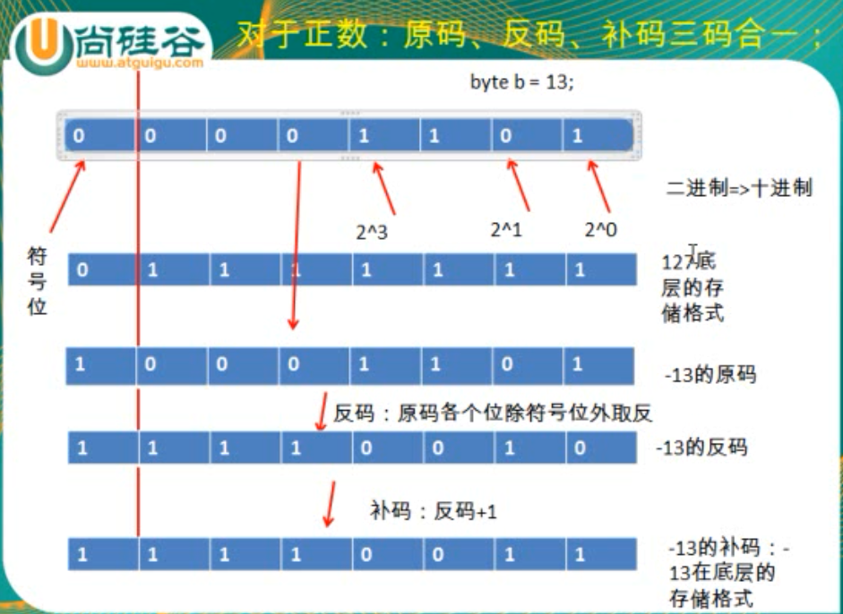
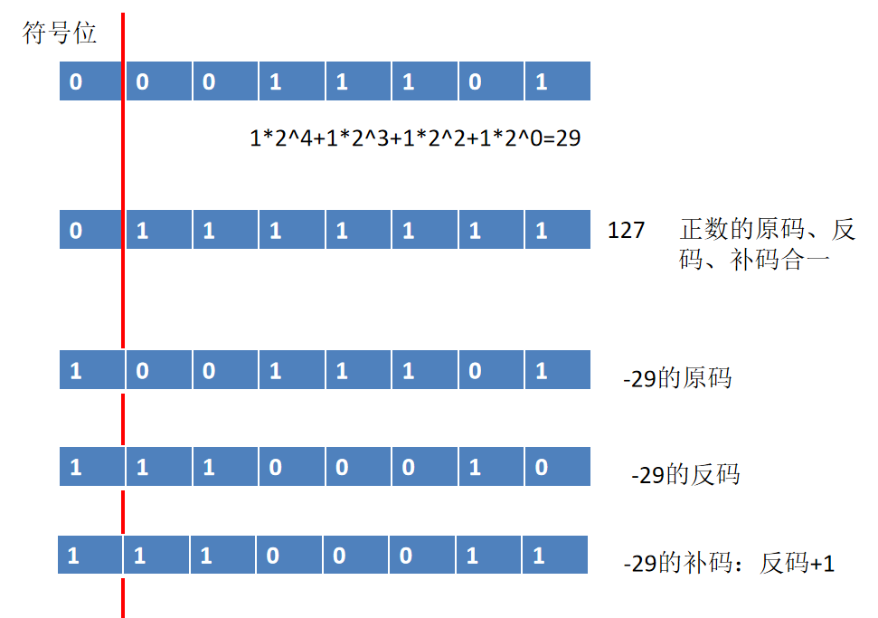

负数补码推算其十进制值
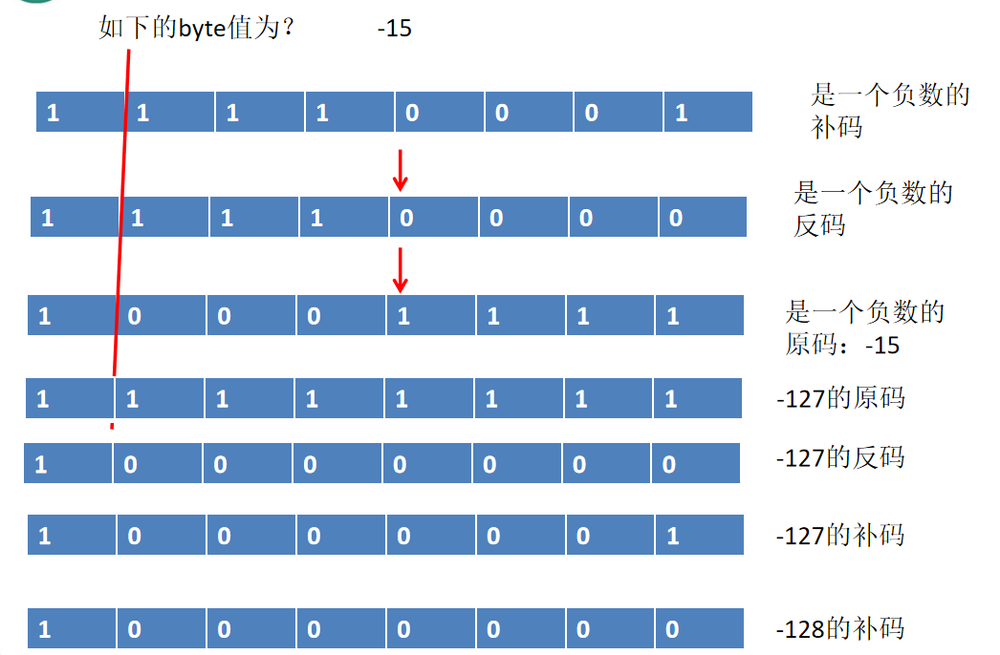

# 进制之间转换
* 十进制转二进制
除2取余，逆序排列
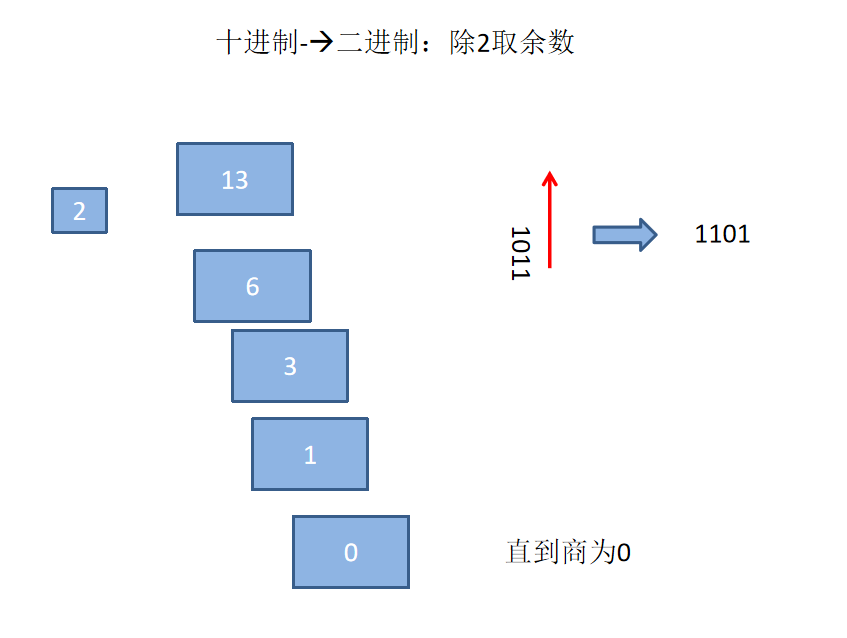  
**十进制转二进制方法**  
    * 整数部分：十进制整数转换成二进制整数采用"除以2取余数"
    * 小数部分：十进制小数转换成二进制小数采用"乘以2取整"
    * 示例：把十进制69.6875转换为二进制
        * 整数部分
            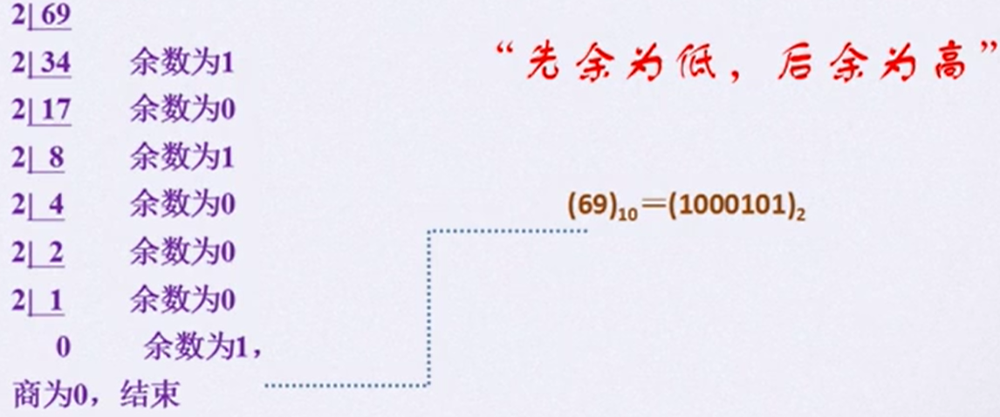  
        * 小数部分
            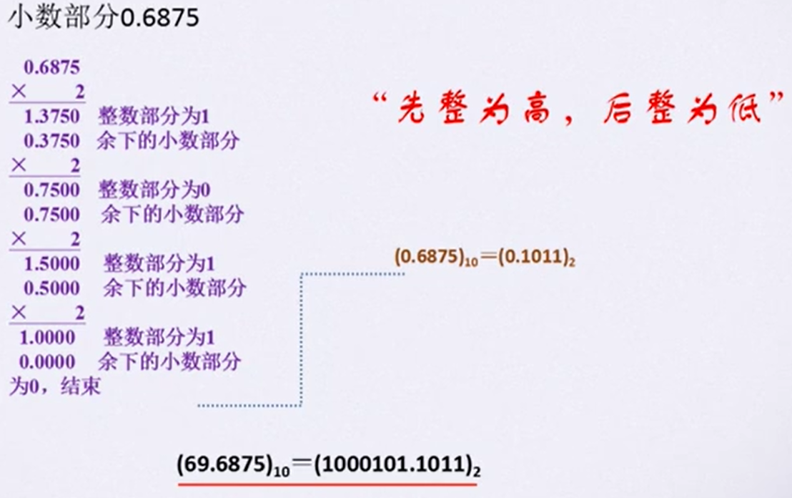  

* 进制之间的转换
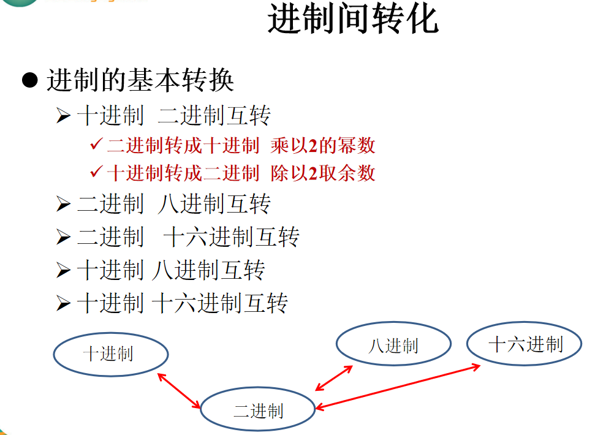
* 二进制与十进制互转
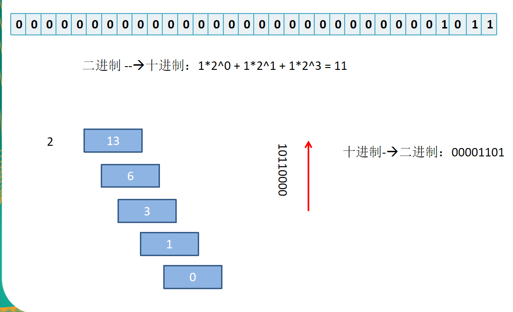
二进制转十进制(按权展开相加)：  
D = b\*2<sup>n-1</sup> + b\*2<sup>n-2</sup> + ... + b\*2<sup>0</sup> + b\*2<sup>-1</sup> + b\*2<sup>-2</sup> + ... + b\*2<sup>-m</sup>
    * D: 转换为十进制的值
    * b: 该位上的二进制数
    * n: 整数部分，小数点左边从右往左第几位
    * m: 小数部分，小数点右边从左往右第几位

* 二进制转8进制或16进制
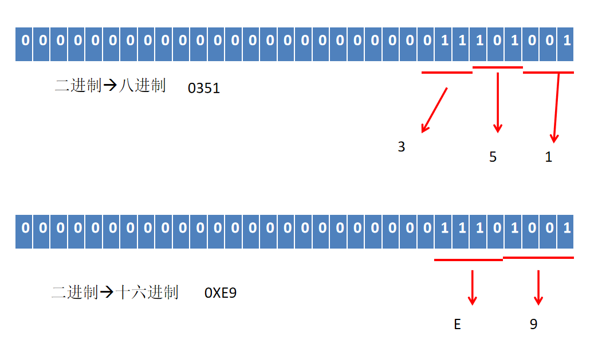  
    **二进制转8进制**  
    * 整数部分：从右到左，每3位一组，最高位不足3位是添0补足
    * 小数部分：从左到右，每3位一组，最低有效位不足3位时添0补足
        
    **二进制转16进制**  
    * 整数部分：从右到左，每4位一组，最高位不足4位是添0补足
    * 小数部分：从左到右，每4位一组，最低有效位不足4位时添0补足

* 8进制或16进制转二进制

    **8进制转二进制**  
    "一分为3"法：以小数点为界，向左或向后，每一位8进制数用相应的3位二进制数代替，然后连接起来即可
    
    **16进制转二进制**  
    "一分为4"法：以小数点为界，向左或向后，每一位16进制数用相应的4位二进制数代替，然后连接起来即可

## 十进制转其它进制内置方法
* 转二进制字符串：Integer.toBinaryString(int i)
* 转八进制字符串：Integer.toOctalString(int i)
* 转十六进制字符串：Integer.toHexString(int i)

# 编码与字符集
## ASCII编码
* 在计算机内部，所有数据都使用二进制表示。每一个二进制位(bit)有0和1两种状态，因此8个位二进制就可以
组合出256种状态，这被称为一个字节(byte)。一个字节一共可以用来表示256种不同的状态，
每一个状态对应一个符号，就是256个符号，从0000 0000到1111 1111

* ASCII码：上个世纪60年代，美国制定了一套字符编码，对英语字符与二进制位之间的关系，做了统一
规定。这被称为ASCII码。ASCII码一共规定了128个字符的编码，比如空格"SPACE"是32（二进制 0010 0000），
大字字母A65(二进制0100 0001)。这128个符号只占用了一个字节的后面7位，最前面的一位统一规定为0

* 缺点
>不能表示所有字符

>相同的编码表示的字符不一样。130在法语编码中代表了é，在希伯来语编码中却代表了字母Gimel (ג)

## Unicode编码
* 一种编码，将世界上所有的符号都纳入其中。每一个符号都分配一个独一无二的编码，使用Unicode没有乱码的问题
* Unicode的缺点
>Unicode只是一个符号集，它只规定了符号的二进制代码，却没有规定这个二进制代码应该如何存储：
无法区别Unicode和ASCII，计算机无法区分三个字节表示一个符号还是分别表示三个符号


### UTF-8
* UTF-8互联网上使用最广的一种Unicode实现方式
* UTF-8是一种变长的编码方式
>它可以使用1-6个字节来表示一个符号，根据不同的符号而变化字节长度。
* UTF-8编码规则
>对于单字节的UTF-8编码，该字节的最高位为0，其余7位用来对应字符进行编码（等同ASCII码）

>对于多字节的UTF-8编码，如果编码包含n个字节，那么第一字节的前n位为1，第一个字节
的第n+1位为0，该字节剩余的位用来对字符进行编码。在第一个字节后的所有字节，最高位
都为"10",其余6位用来对字符进行编码。


