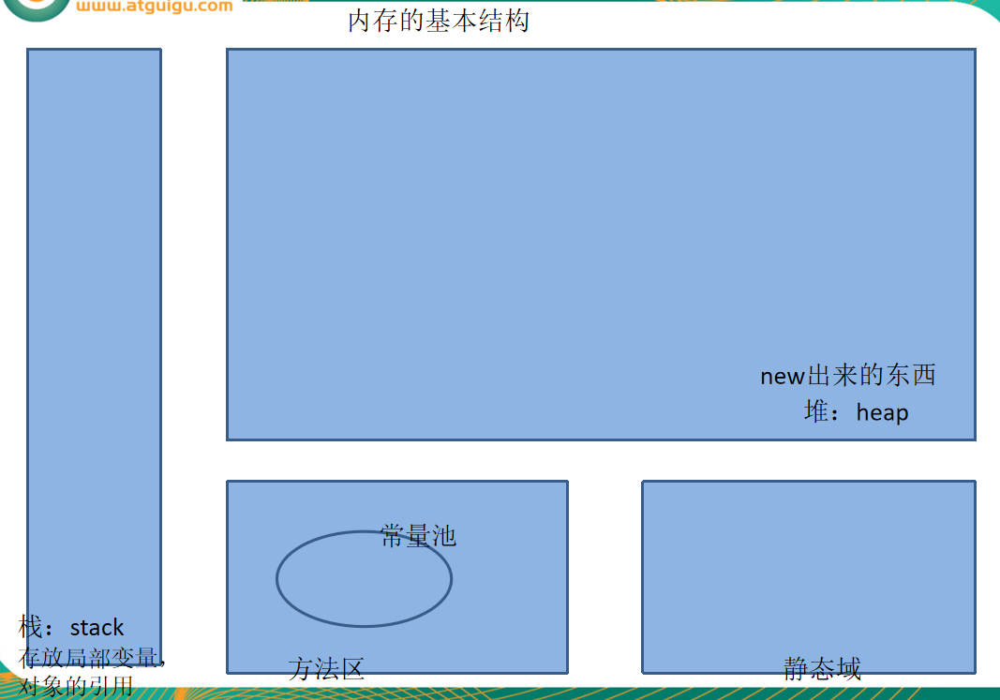
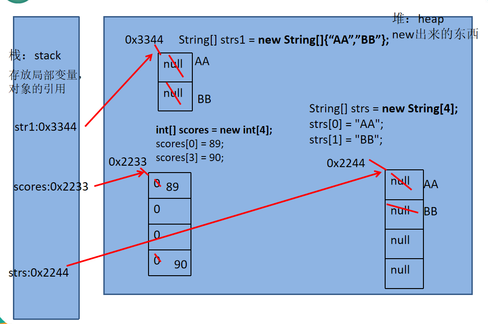

day04
==

# 数组
```text
* 数组是多个相同类型数据的组合，实现对这些数据的统一管理
* 数组中的元素可以是任何数据类型，包括基本数据类型和引用数据类型
* 数组属引用类型，数组型数据是对象（object），数组中的每个元素相当于该对象的成员变量

```

## 数组声明与初始化
* 静态初始化
```java
int[] ii;
ii = new int[]{12, 2, 4, 5};
int[] jj = {33, 12, 10}; // 这种省略形式也是可以，其他方式时，new 类型 不能省

short[] ss = new short[]{3, 999, 7};

byte[] bb = byte[]{127, 1, 5}; // 推荐使用这种格式
byte bb[] = byte[]{127, 1, 5}; // 也可以是这种格式，不推荐


```

* 动态初始化
```java
String[] strs = new String[4];
strs[0] = "AA";
strs[2] = "CC";

int[] ii = new int[3];

```

## 数组元素的默认值
* byte, short, int, long 数组元素默认值：0
* float, double数组元素默认值：0.0
* char 数组元素默认值：空白(即不输出任何东西) '\0'
* boolean数组元素默认值：false
* 引用类型数组元素默认值：null

## java数据的内存基本结构
基本结构


数组在内存的结构
