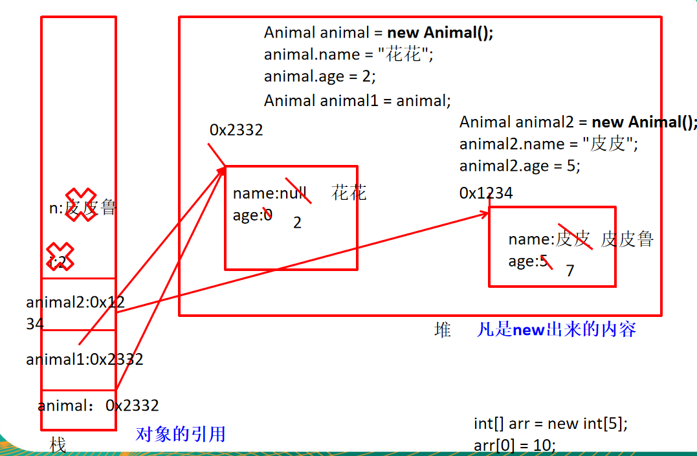
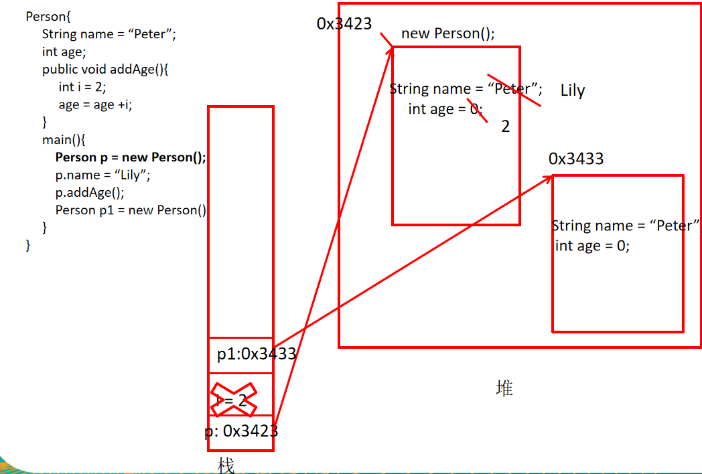
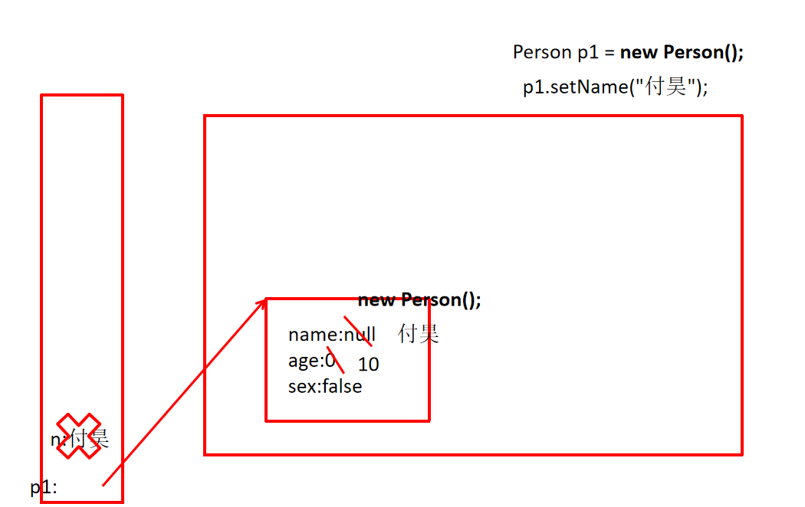
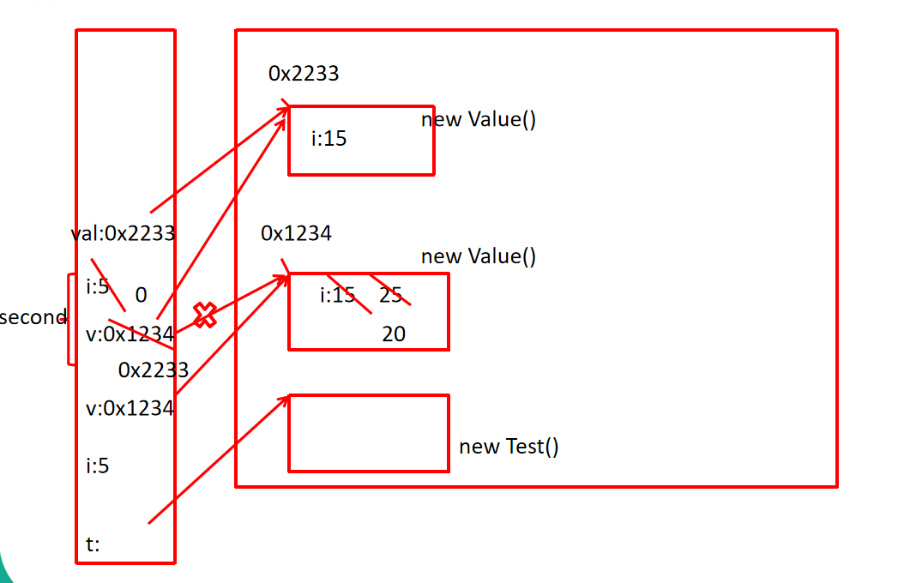
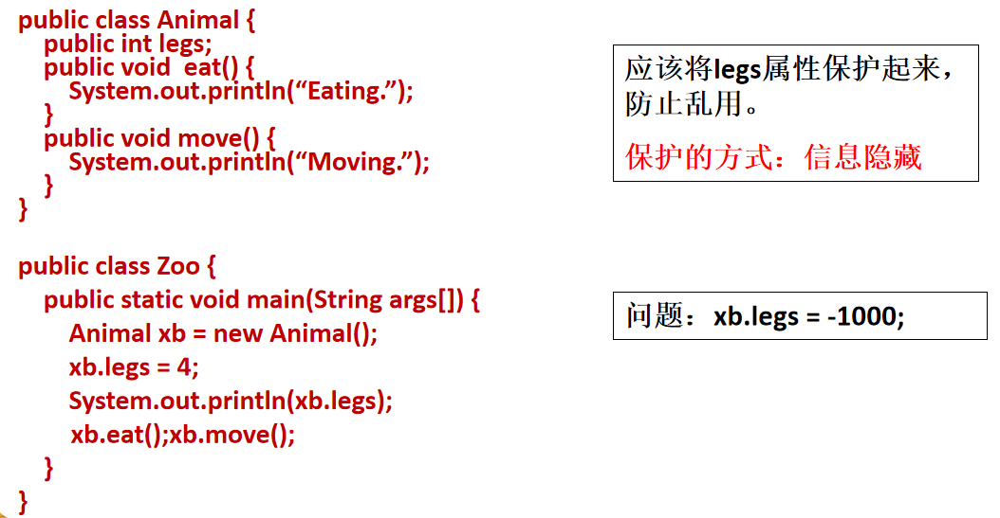

day05
==

# 学习面向对象内容的三条主线
* java类及类的成员
* 面向对象的三大特征（封装、继承、多态、抽象）
* 其他关键字

# 学习的内容
* 面向对象与面向过程
* java语言的基本元素：类和对象
* 类的成员之一：属性(Field)
* 类的成员之二：方法（Method）
* 对象的创建于使用
* 方法
* 面向对象特征之一：封装和隐藏
* 类的成员之三：构造器（构造方法）
* 几个关键字：this, package, import

## 面向对象与面向过程
>二者都是一种思想，面向对象是想对于面向过程而言的。  
面向过程，强调的是功能行为。面向对象，将功能封装进对象，强调具备了功能的对象。

>面向对象的三大特征  
. 封装(Encapsulation)  
. 继承(Inheritance)  
. 多态(Polymorphism)  

## 面向对象的思想概述
* 程序员从执行者转化成了指挥者
* 完成需求时：
>先去找具有所需功能的对象来用

>如果该对象不存在，那么创建一个具有所需功能的对象

>这样简化开发并提高服用

* 类(class)和对象(object)时面向对象的核心概念
>类是对一类事物的描述，是抽象的、概念上的定义

>对象是实际存在的该类事物的每个个体，因而也称实例(instance)

* “万事万物皆对象”

##  class类结构
* Field = 属性 = 成员变量,
* Method = [成员]方法 = 函数

### 类的成员构成 v1.0
```java
class Person {
    
    // 属性(成员变量) --start
    String name;
    int age;
    boolean isMale;
    // 属性(成员变量) --end
    
    //方法(函数) --start
    public void walk() {
        System.out.println("人两腿走路...");
    }
    
    public String showInfo() {
       String info = "名字是:" + name + " 年龄是:" + age + " sex:" + isMale;
       return info;
    }
    //方法(函数) --end
    
}

```

### 类的成员构成 v2.0
```java
class Person {
    // 属性(成员变量)
    String name;
    boolean isMale;
    
    //构造器
    public Person() {}
    public Person(String n, boolean ism) {
        name = n;
        isMale = ism;
    }
    
    // 方法(函数)
    public void walk() {
        System.out.println("人两腿走路...");
    }
    public String showInfo() {
       String info = "名字是:" + name + " 年龄是:" + age + " sex:" + isMale;
       return info;
    }
    
    // 代码块
    {
        name = "Lu meng";
        age = 17;
        isMale = true;
    }
    
    // 内部类
    class pet {
        String name;
        float weight;
    }
    
}

```

# 创建java自定义类
## 类的成员之一：属性
* 语法格式
    修饰符 类型 属性名 = 初始值;
>修饰符private: 该属性智能由该类的方法访问  
修饰符public: 该属性可以被该类以外的方法访问  
类型: 任何类型

* 举例
```java
public class Person {
    private int age;
    public String name = "Lilei";
}

```

## 类中变量分类：成员变量与局部变量
* 成员变量
>在方法外，类体内的变量
* 局部变量
>. 在方法体内声明的变量  
>. 方法中的形参

```text
# 变量
    ## 成员变量
        实例变量（不以static 修饰）
        类变量（以static修饰）  
    ## 局部变量
        形参（方法签名中定义的变量）
        方法局部变量（在方法内定义）
        代码块局部变量（在代码块内定义）
    
# 注意
    * 相同：都有生命周期
    * 异：局部变量除形参外，需要显式初始化。

```

### 成员变量(属性)和局部变量的区别
* 成员变量
>. 成员变量定义在类中，方法外，在整个类中都可以访问  
. 成员变量分为 类成员变量 和 实例成员变量。实例变量存在于对象所在的堆内存  
. 成员变量有默认初始值
. 成员变量的权限修饰符可以根据需要，选择任意一个

* 局部变量
>. 局部变量只定义在局部范围内，如：方法内，代码块内，形参  
. 局部变量存在于栈内存中  
. 作用的范围结束，变量空间会自动释放  
. 局部变量没有默认初始值，没吃必须显示初始化  
. 局部变量声明时不指定权限修饰符

##  类的成员之二：方法
```test
语法格式：
    修饰符 返回值类型 方法名(参数列表) {
        方法体语句;
    }
    
说明：
* 修饰符
    public, private, protected, 缺省
    
* 返回值类型
    return语句返回传递返回值。没有返回值：void
    
举例：
    public class Person {
        private int age;
        public int getAge() {
            return age;
        }
        
        public void setAge(int i) {
            age = i;
        }
    }


```

## 对象的创建和使用
>使用 new 构造器 创建一个新的对象  
使用 对象名.对象成员 的方法访问对象成员（包括属性和方法）  
如果创建了一个类的多个对象，对于类中定义的属性，每个对象都拥有各自的一套副本，且互不干扰


```java
public class Animal {
    public int legs;
    public void eat() {
        System.out.println("Eating ...");
    }
    
    public void move() {
        System.out.println("Moving ...");
    }
    
}

public class Zoo {
    public static void main(String[] args){
      Animal xb = new Animal();
      xb.legs = 4;
      System.out.println(xb.legs);
      xb.eat();
      xb.move();
    }
    
}

```

类的实例化，即创建类的对象






1[一个类的多个实例对象](./images/一个类的多个实例对象.png)

## 类的访问机制
* 同一个类中的访问机制
>类中的方法可以直接访问类中的成员变量  
例外：static 方法访问非static，编译不通过

* 在不同类的访问机制
>先要创建要访问类的对象，在用对象访问类中定义的成员


### 匿名对象
* 我们也可以不定义对象的句柄，二直接调用这个对象的方法。这样的对象叫匿名对象。
```java
// 如
new Person().showInfo();
```
* 使用情况
>如果对于一个对象只需要进行调用一次方法，那么久可以使用匿名对象。这样方便  
我们经常将匿名对象作为实参传递一个方法的调用

## 方法(method)
方法的定义
>. 方法是类或对象行为特征的抽象，也成为函数  
. java里的方法不能独立存在，所有的方法必须定义在类里

格式
```
修饰符 返回值类型 方法名(参数类型 形参1, 参数类型 形参2, ...) {
    程序代码;
    return 返回值;        
}

说明：
* 形式参数
    在方法被调用时用于接受外部传入数据的变量
* 参数类型
    就是该形参的数据类型
* 返回值
    方法在执行完毕后返还给调用它的程序的数据
* 返回值类型
    方法要返回结果的数据类型
* 实参
    调用方法时实际传给函数形式参数的数据
   
* 返回值类型void
    即不返回人户东西，即返回的就空  
    void类型的方法，可以在方法最后写 return; 这也表示不返回任何东西。担显多余
```

### 方法的调用
* 方法只有被调用才会被执行
* 没有具体返回值得情况，返回值类型用void表示，且该方法的return在最后一行时可以省略不写
* 定义方法时，方法的结果应该返回给调用者，交由调用者处理
* 方法中只能调用方法，不可以在方法内部定义方法

## 方法的重载
* 概念
>在同一个类中，允许存在一个以上的同名方法（方法名相同），  
只要它们的参数个数不同  
或者参数类型不同即可（不同类型的排列顺序有关系）

* 作用
>构成重载的方法对外只暴露一个接口，通过传不同的参数来自动选择不同的处理方法（提供不同的处理功能）。  
如System.out.println();  可以打印不同类型的数据

* 重点
>于返回值类型无关，只看参数列表。  
参数列表必须不同  
调用时根据参数列表的不同类区别

```java


```

## 可变个数的形参
* 采用数组形参定义方法
```java
public static void test(int a, String[] books) {
    
}
```
* 可变个数形参定义方法
```java
public void test(int a, String... books) {
    
}
```
>说明  
. 可变参数：方法参数个数可变  
. 声明方式：方法名(参数类型... 参数名)  
. 可变参数方法的使用与数组参数是一致的  
. 方法的参数部分有可变参数时，必须放在形参中的最后一个  
. 个数可以是0个到无数个


## 内存划分的结构
* 栈(stack)
    局部变量，对象的引用名，数组的引用名
* 堆(heap)
    new 出来的对象实例，（对象实体，数组的实体），成员变量
* 方法去
    含字符串变量
* 静态域
    声明为static的变量
    
 ## 方法的参数传递
* 形参
 >方法声明时的参数

* 实参
 >方法调用时实际传给形参的参数值
 
 * java的实参值传入方法
 >java方法里的参数传递方式只有一种：值传递  
 即将实际参数值得副本传入方法内，而参数本身不受影响  
 规则：
 * 形参是基本数据类型：将实参的值传递给形参的基本数据类型的变量  
 * 形参是引用数据类型（类，数组、String）：将实参的引用类型变量的值（对应的堆空间的对象实体的内存首地址）传递给形参的引用类型变量  
 这里主要是跟引用数据类型变量保存的值为堆内存首地址有关系。效果相当于传的是堆对象实体的指针

```java
package com.java.www;

public class Test {
    public static void main(String[] args) {
        Test t = new Test();
        t.first();
    }

    public void first() {
        int i = 5;
        Value v = new Value();
        v.i = 25;
        second(v, i);
        System.out.println(v.i);
    }

    public void second(Value v, int i) {
        i = 0;
        v.i = 20;
        Value val = new Value();
        v = val;
        System.out.println(v.i + " " + i);
    }

}

class Value {
    int i = 15;
}

``` 
 

# 面向对象特征之一：封装和隐藏
使用者对类内部的属性(对象的成员变量)直接操作会导致数据的错误、混乱或安全性问题


## 信息的封装和隐藏
java中通过将数据声明为私有的(private)，再提供公共的(public)方法:getter()和
setter()实现对该属性的操作，以实现下面的目的：
* 隐藏一个类中不需要对外提供实现的细节
* 使用者只能通过事先定制好的方法来访问数据，可以方便地加入控制逻辑，限制对
属性的不合理操作
* 便于修改，增强代码的可维护性

 ```java
// 示例

package com.java.www;

public class EncapsulationAndHiding {
    public static void main(String[] args) {
        Animal dog1 = new Animal();
        dog1.setLegs(4);
        dog1.setLegs(-100); // 不合法的数字
        System.out.println(dog1.getLegs());
    }

}

class Animal {
    private int legs;
    public void setLegs(int i) {
        if (i < 0 || i > 100) {
            System.out.println("输入的数字不合法");
        } else {
            legs = i;
        }
    }

    public int getLegs() {
        return legs;
    }
}
```

## 四种访问权限修饰符

|修饰符 |类内部 |同一个包 |子类 |任何地址 |使用对象 |
|:--- |:--- |:--- |:--- |:--- |:--- |
|private |yes | | | |方法 |
|缺省(即无修饰符) |yes |yes | | |方法、类 |
|protected |yes |yes |yes | |方法 |
|public |yes |yes |yes |yes |方法、类 |

* 对于class的权限修饰只能用public或不写(default缺省)
* public类可以在任何地方被访问
* default类只可以被同一个包内部的类访问


