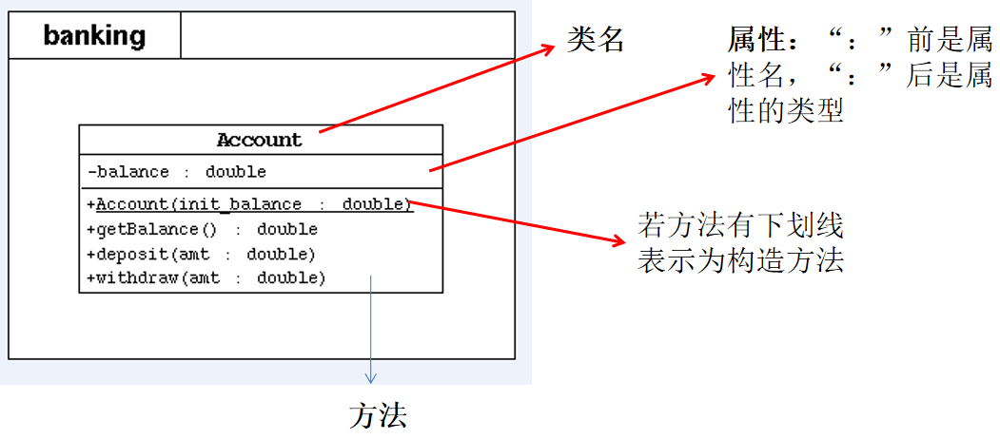

day07
==

# 关键字--this
## this作用
* 在java中，this的作用和其词义相近。
    * 它在方法内部使用，即这个方法所属对象的引用
    * 它在构造器内部使用，表示该构造器正在初始化的对象
* this表示当前对象，可以调用类的属性、方法和构造器
* 什么时候用this关键字
    * 当在方法内需要调用该方法的对象时，就用this
    
* 使用this调用属性、方法
this理解为当前对象或当前正在创建的对象
```java
class Person {
    private String name;
    private int age;
    
    // 构造器
    public Person(String name, int age) {
        this.name = name;
        this.age = age;
    }
    
    // 方法
    public void getInfo() {
        System.out.println("姓名: " + name);
        this.speak();
    }
    
    public void speak() {
        System.out.println("年龄: " + this.age);
    }
    
}

```

* 使用this调用本类的构造器
>this可以作为一个类中，构造器相互调用的特殊格式
```java
class Person {
    private String name;
    private int age;
    
    // 构造器
    public Person() { // 构造器1，无参构造器
        System.out.println("新对象实例化");
    }
    
    public Person(String name) { // 构造器2
        this(); // 调用本类中的构造器1（无参构造器）
        this.name = name;
    }
    
    public Person(String name, int age) {
        this(name); // 调用 构造器2
        this.age = age;
    }
    
    // 方法
    public String getInfo() {
        return "姓名: " + this.name + ", 年龄: " + age;
    }
}

```

* this可表示正在操作本方法的对象，即当前对象
```java
class Person {
    String name;
    
    // 构造器
    Person(String name) {
        this.name = name;
    }
    
   // 方法
   public void getInfo() {
        System.out.println("Person类==>" + this.name);
   }
   
   public boolean compare(Person p) {
        return this.name = p.name;
   }
   
}

public class TestPerson {
    public static void main(String[] args) {
        Person p1 = new Person("张三");
        Person p2 = new Person("李四");
        p1.getInfo();
        p2.getInfo();
        boolean bool = p1.compare(p2);
    }
}


```

## this关键字使用注意事项
* 使用this(形参)必须放在构造器的首行
* 使用this调用本类中其他的构造器，保证至少有一个构造器不是使用this，避免形成死循环

# JavaBean
* JavaBean是一种java语言写成的可重用组件
* 所谓JavaBean，是指符合如下标准的java类
    * 类是公共的(public)
    * 有一个无参的公共构造器
    * 有属性，且有对应的get、set方法
* 用户可以使用JavaBean将功能、处理、值、数据库访问和其他任何可以用java代码创造的对象
进行打包，并且其他的开发者可以通过内部的JSP页面、Servlet、其他JavaBean、applet程序或者
应用来使用这些对象。用户可以认为JavaBean提供了一种随时随地的复制和粘贴的功能，而不用关心
任何改变。

* JavaBean示例
```java
public class TestJavaBean { // 类访问权限为public
    private String name; // 属性 权限修饰符一般为private
    private int age;
    
    // 无参public构造器
    public TestJavaBean() {
        
    }
    
    // 方法(get、set方法)
    public void setName(String name) {
        this.name = name;
    }
    
    public String getName() {
        return name;
    }
    
    public void setAge(int age) {
        this.age = age;
    }
    
    public int getAge() {
        return age;
    }
    
}

```

## UML类图


* 权限表示
    * \+ 表示public
    * \- 表示private
    * \# 表示 protected
* 方法的写法
>方法类型(+、-) 方法名(参数名: 参数类型): 返回值类型

# 关键字--package
package软件包作用
* 包帮助管理大型软件系统：将主义相近的类组织到包中；解决类命名冲突问题
* 包可以包含类和子包
* 例：某航运软件系统包括：一组域对象、GUI和reports子系统


## package的使用
* package语句作为java源文件的第一个语句，指明该文件中定义的类所在的包。
(叵缺省该语句，则指定为无名包)。

* 语法格式为:
>package 顶层包名.子包名;

```java
// pack/Test.java
package pack; // 指定类Test属于包pack

public class Test {
    public void display() {
        System.out.println("in method display()");
    }
}

```
* 包对应文件系统的目录，package语句中，用"."来指明包(目录)的层次
* 包通常用小写单词，类名首字母通常大写
  
    
# 关键字--import
import作用：import语句告诉编译器到哪里去寻找类

* 为使用定义在不同包的java类，需要import语句来引入指定包层次下所需要的类或全部类(.*)
* 语法格式
>import 包名[.子包名...].<类名 |*>

* 应用举例
```java
import pack.Test; // import pack.*; 表示引入pack包中所有的类
public class TestPackage {
    public static void main(String[] args){
        Test t = new Test();
        t.display();
    }
}

```
* 目前不支持 import ... as 语法

## import语句使用注意事项
* 若引入的包为:java.lang,则编译器默认可获取此包下的类，不需要再显式声明。
* import语句出现在package语句之后，类定义之前
* 一个源文件可包含多个import语句
* 可以使用import lee.*;语句，表明导入lee包下的所有类，而lee包下sub子包内的类则不会被 导入。
若要导入sub下的类:import lee.sub.*;
* import 语句还是必须的，可在类里使用类的命名。如java.util.Scanner
* JDK 1.5加入import static语句
>import static 表示导入指定类的static的属性或方法
* 不支持多个.*.*，如import java.util.*.*，这个是不支持

# JDK主要的包介绍
1. java.lang
>包含一些java语言的核心类，如String、Math、Integer、System、Thread，常用功能
* java.net
>包含执行与网络相关操作的类和接口
* java.io
>包括能提供多种输入/输出功能的类
* java.util
>包含一些实用工具类，如定义系统特性、接口的集合框架类、与日期日历相关的函数
* java.text
>包含了一些java格式化相关的类
* java.sql
>包含了java进行JDBC数据库编程相关的类/接口
* java.awt
>包含了构成抽象窗口工具集(abstract windows toolkits)的类，这些类被用来构建和管理
应用程序的图形用户界面(GUI)
* java.applet
>包含applet运行所需的类

