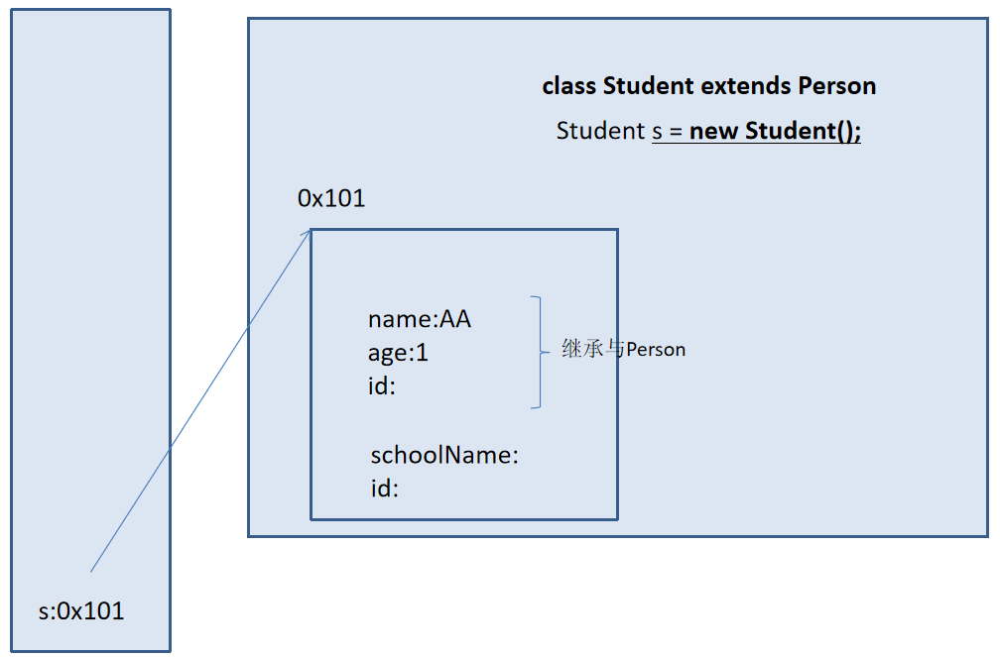
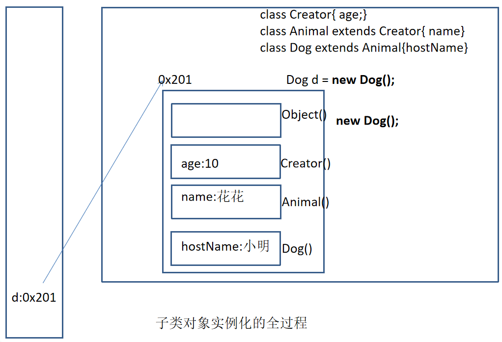

day08
==

# 四种访问权限修饰符
java权限修饰符private、缺省(不写)、protected、public置于类成员前面，用来限定对象对该
类对象成员的访问权限。

修饰符 |类内部 |同一个包 |子类 |任何地方 | 可修饰的成员
:---|--- |--- |--- |--- |--- 
private |yes | | | |属性、方法、构造器
default(缺省,不写)|yes |yes | | |属性、方法、构造器、<br><br>类
protected|yes |yes |yes | |属性、方法、构造器
public |yes |yes |yes |yes |属性、方法、构造器、<br><br>类

* 可以修饰class(类)的只有public、default
* public类可以在任何地方被访问
* default类只能被同一个包内部的类访问


# super关键字
super: 可以用来修饰属性、方法、构造器
* 当子类与父类中有相同的属性时，可以通过"super.属性" 显示的调用父类中声明的属性，
  若想调用子类的同名属性"this.属性" 或直接调用 属性
* 当子类重写了父类的方法后，在子类中需要调用父类中被重写的方法，使用"super.方法名"
* 构造器中使用super()
    * 在子类中使用"super(形参列表)" 显式的调用父类中指定的构造器
    * 构造器内，super(形参列表) 必须写在首行
    * 同一个构造器，"super(形参列表)" 或 "this(形参列表)" 只能出现一个！！！
    * 构造器中，不显式的调用"this(形参列表)" 或 "super(形参列表)"，默认调用的时父类空参的构造器，即super();
    * 建议设计一个类时，尽量要提供一个空参的构造器！

* 注意
    * 当子父类出现同名成员时，可以使用super进行区别
    * super可追溯到Object根类
    * super和this的用法相像，this表示本类对象的引用，  
    super表示父类内存空间的表示
    
## 调用父类的构造器
* 子类中所有的构造器默认都会访问父类中的空参构造器
* 当父类中没有空参的构造时，子类的构造其必须通过this(形参列表) 或 super(形参列表)语句指定调用
本类或父类中相应的构造其，且必须放在构造其的第一行
* 如果子类构造其中没有显示调用父类或本类的构造器，并且父类中也没有无参的构造器，则编译出错

# this 和 super的区别
区别 |this |super
:--- | --- |---
访问属性|访问本类中的属性，如果本类中没有此属性则从父类中继续查找 |访问父类中的属性(可继续找到跟类)
调用方法 |访问本类中的方法 | 直接访问父类中的方法
调用构造器 |调用本类构造器，必须放在构造器的首行| 调用父类构造器，必须放在子类构造器的首行
特殊 |表示当前对象 |无此概念 


super


子类对象实例化的过程



# 面向对象特征之三：多态性
* 多态性，是面向对象中最重要的概念，在java中有两种体现
    * 方法的重载(Overload) 和 重写(Overrides)
    * 对象的多态性。这种特性可以直接应用在抽象类和接口上

* java引用变量有两个类型
    * 编译时类型
    >编译时类型由声明该变量时使用的类型决定。看左边的类型
    * 运行时类型
    >运行时类型由实际赋给该变量的对象决定。看右边的对象实体
    
* 若编译时类型和运行时类型不一致，就出现了多态（polymorphism）

* 因对象的多态，子类中的对象可以替代父类的对象来使用
    * 一个变量只能有一种确定的数据类型
    * 一个引用类型变量可能指向(引用)多种不同类型的对象
```java
Person p = new Student();
Object o = new Person(); // Object类型的变量o，指向Person类型的对象
o = new Student(); // Object类型的变量o,指向Student类型的对象
```

* 子类可以看作是特殊的父类，所以父类类型的引用可以指向子类的对象：向上转型（upcasting）
* 一个引用类型变量如果声明为父类的类型，实际引用的是子类对象实体，那么该变量就不能再访问子类中
添加的属性和方法

## 虚拟方法调用(Virtual method invocation)
* 正常的方法调用 
```java
        Person p = new Person();
        p.getInfo();
        
        Student s = new Student();
        s.getInfo();

```
* 虚拟方法调用(多态情况下)
 ```java
        Person p = new Student();
        p.getInfo(); // 调用Student类的getInfo()方法

```

* 编译时类型 和 运行时类型
>编译时p为Person类型，而方法的调用是在运行时确定的，所以调用的是Student类的getInfo()方法。  
这也是叫 动态绑定

## 多态小结
* 前提条件
    * 需要存在继承或实现关系 
    * 需要覆盖操作
* 成员方法
    * 编译时，要查看引用变量所性的类中是否有所调用的方法
    * 运行时，调用实际对象所属的类中的重写方法
* 成员变量
    * 不具备多态性，只看引用变量所属的类

## 子类继承父类
* 若子类重写了父类方法，就意味着子类里定义的方法彻底地覆盖了父类里的同名方法，系统将不可能把父类里的 
方法转移到子类中
* 对于属性则不存在这样的现象，即使子类里定义了与父类完全相同的属性，这个实例属性依然不能覆盖父类中
定义的属性

```java
// 类的多态特性应用示例

package com.java.polymorphism;

public class TestAnimal {
    public static void main(String[] args) {
        Animal an1 = new Dog();
        an1.eat();
        an1.jump();
//        an1.bark(); // 不能直接调用

        System.out.println();
        Animal an2 = new Cat("卢布朵");
        an2.eat();
        an2.jump();

        System.out.println();
        TestAnimal t = new TestAnimal();
        t.call(an1);
        t.call(an2);
        t.hobby(an1);
        t.hobby(an2);


    }

    // 利用instanceof判断实例所属类，再强制转换
    // 正是有了类的多态才能写一个方法就能适应多个不种的子类
    void call(Animal animal) {
        if (animal instanceof Dog) {
            Dog an = (Dog)animal;
            an.call();
        } else if (animal instanceof Cat) {
            Cat an = (Cat)animal;
            an.call();
        }
    }

    public void hobby(Animal animal) {
        if (animal instanceof Dog) {
            Dog dd = (Dog)animal;
            dd.call();
        } else if (animal instanceof Cat) {
            Cat cc = (Cat)animal;
            cc.fishFarming();
        }
    }
}

class Animal {
    protected String name;

    // constructor
    public Animal() {

    }

    public Animal(String name) {
        setName(name);
    }

    // method
    public void eat() {
        System.out.println("进食");
    }

    public void jump() {
        System.out.println("跳");
    }

    public String getName() {
        return name;
    }

    public void setName(String name) {
        this.name = name;
    }
}

class Dog extends Animal {


    public void eat() {
        System.out.println("狗吃肉");
    }

    public void jump() {
        System.out.println("狗急跳墙");
    }

    public void call() {
        // 狗吠叫
        System.out.println("汪汪汪...");
    }
}

class Cat extends Animal {

    // constructor
    public Cat() {
        super();
    }

    public Cat(String name) {
        super(name);
    }

    // method
    public void eat() {
        System.out.println("猫吃鱼");
    }

    public void jump() {
        System.out.println("猫跳上墙");
    }

    public void fishFarming() {
        // 种鱼
        System.out.println("猫种鱼");
    }

    public void call() {
        System.out.println("猫喵喵叫...");
    }

}


```

# instanceof 操作符
x instanceof A  
检验对象实体x 是否为类A的对象，返回值为boolean类型。是返回true，不是返回false   
可以看上面的例子

* 如果x属于类A的子类的对象实体，那么 x instanceof A 的值为true  


# 对象类型转换(Casting)
* 基本数据类型的转换
    * 自动类型转换
    >小的数据类型可以自动转换成大的数据类型  
    // 如:  
    long g = 20;  
    double d = 12.0F
    
    * 强制类型转换
    >可以把大的数据类型强制转换成小的数据类型  
    // 如:  
    float f = (float)12.0;  
    int a = (int)1200L;  

* 对java对象的强制类型转换叫做造型
    * 从子类到父类的类型转换可以自动进行
    * 从父类到子类的类型转换必须通过造型实现（即强制转换）
    * 无继承关系的引用类型间的转换是非法的
    * 在造型之前可以使用instanceof操作符判断该对象的类型，从而决定是否要造型
    
类的造型(类强制转换)
.png)