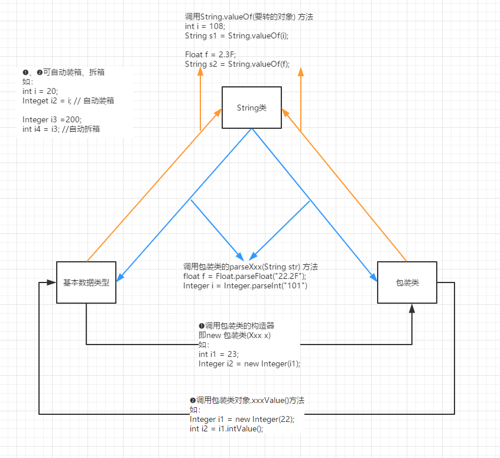
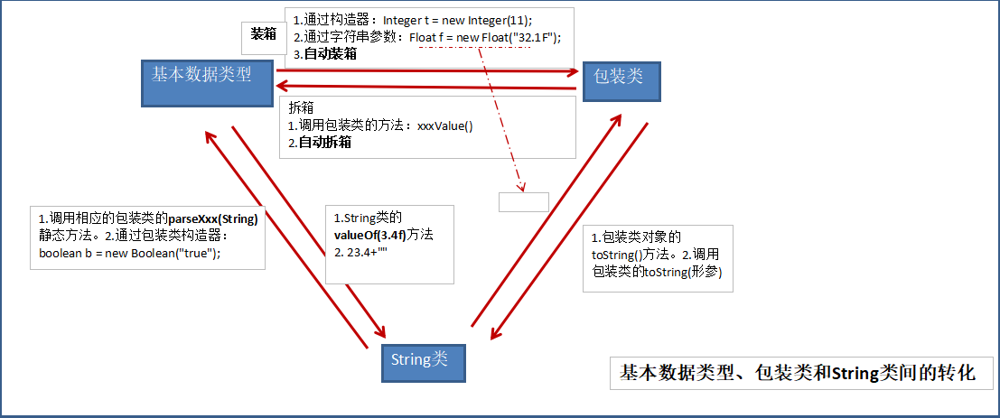
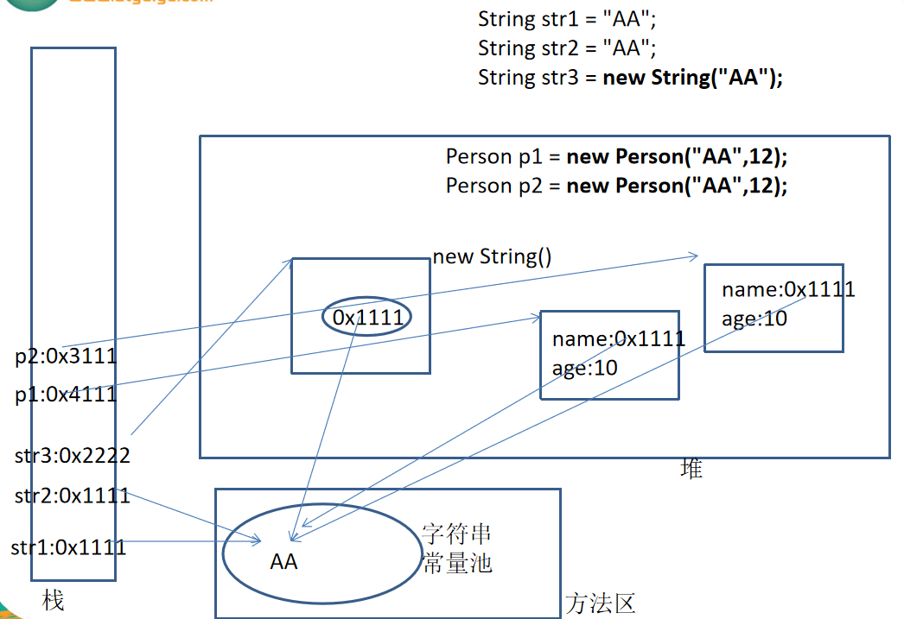
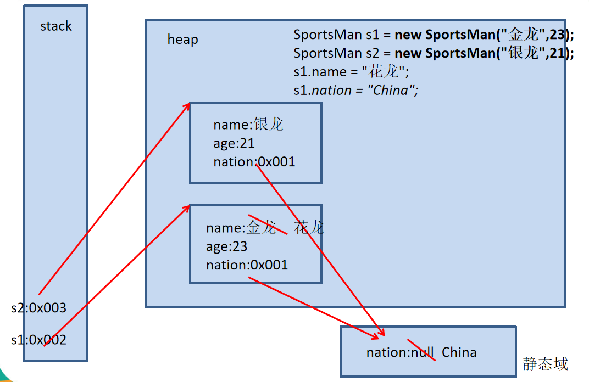

day09 高级特性1
==

# toString()方法
* toString()方法在Object类中定义，其返回值是String类型，返回类名和它的引用地址
* 在进行String与其他类型数据的连接操作时，自动调用toString()方法
```java
    Date now = new Date();
    System.out.println("now = " + now);
    System.out.println("now = " + now.toString()); 
```
* 可以根据需要在用户自定义的类中重写toString()方法
```java
// 如String类重写了toString()方法，返回字符串的值
s1 = "hello";
System.out.println(s1); // 相当于System.out.println(s1.toString());

```
* 基本数据类型转换为String类型时，调用了对应包装类的toString()方法
    >int a = 10;  
    System.out.println("a = " + a);
    
* String, 包装类, File, Date等类默认就已经重写了toString()方法


    
# 包装类(Wrapper)
* 针对8种基本定义相应的引用类型（包装类，或叫封装类）
* 有了类的特点，就可以调用类中的方法

基本数据类型 |包装类 |备注
:--- |--- |---
boolean |Boolean |
byte |Byte |
short |Short |
int |Integer |
long |Long |
char |Character
float |Float |
double |Double |


* 基本数据类型包装成包装类，叫做 装箱
    *  通过包装类的构造器实现
    ```java
    int i = 500;
    Integer t = new Integer(i);
  
    ````
    * 通过字符串参数构造器包装类对象
    ```java
    Float f = new Float("4.56");
    Float f2 = new Float(3.14);
    Long l = new Long("abc") // 编译时报NumberFormatException
  
    Boolean b1 = new Boolean("true"); // true
    System.out.println(b1);
    Boolean b2 = new Boolean(false);
    System.out.println(b2);
    Boolean b3 = new Boolean("true100"); // false，只要写的不是true，则都是false,能正常编译和运行
    System.out.println(b3);
    ```
* 获得包装类对象中包装的基本类型变量，叫做 拆箱
    * 调用包装类对象的.xxValue()方法
    ```java
    Boolean obj = new Boolean(true);
    boolean b = obj.booleanValue();
    ```
* JDK 1.5之后，支持自动装箱，自动拆箱。但类型必须匹配
```java
        // JDK 1.5后，自动装箱、拆箱
        int i61 = 18;
        Integer i62 = i61; // 自动装箱
        System.out.println(i62.toString());
        Boolean b63 = false;

        Integer i66 = new Integer(15);
        int i67 = i66; // 自动拆箱
        System.out.println(i66);
```

* 字符串转换成基本数据类型
    * 通过包装类的构造器实现
    ```java
    int i = new Integer("12");
    ```
    * 通过包装类的parseXx(String s)静态方法
    ```java
    Float f = Float.parseFloat("12.1");
    ```
* 基本数据类型转换成字符串
    * 调用String类重载的valueOf()方法
    ```java
    String ftr = String.valueOf(2.34F);
    ```
    * 字符串拼接的方式
    String intString = 5 + "";
    
* 包装类的实际开发中用的最多是将字符串转变为 基本数据类型
```java
String str1 = "30";
String str2 = "30.3";

int x Integer.parseInt(str1); // 将字符串转变为int型
float f = Float.parseFloat(str2); // 将字符串转变为float型

```

## 基本数据类型、包装类、String类三者之间的互转




String相关的变量在内存的结构  



# static关键字
当我们编写一个类时，其实就是在描述其对象的属性和行为，而并没有产生实质上的对象，
只有通过new关键字才会产生出对象，这时系统才会分配内存空间给对象，其方法才可以供外部调用。  
们有时候希望无论是否产生了对象或无论产生了多少对象的情况下，某些特定的数据在内存空间里只有一份，
例如所有的中国人都有个国家名称

* static可以修饰 属性、方法、代码块、内部类
* static修饰的属性（类变量）
    * 有该类创建的所有对象，都共用这个变量
    * 当其中一个对象修改了此属性，其他属性访问到该属性的结果也会改变。
    * 类变量在类加载时加载到内存，且只有一份数据
    * 静态的变量（类变量）访问方法之一："类.类变量"  ，建议使用这种，当"类.实例变量" 访问时会报错的
    * 类变量访问方法二："对象.类变量"
    * 类变量的加载早于对象
    * 访问权限允许时，可以不创建对象，直接被调用

* 实例变量
    非static修饰的属性变量
* 类变量
    static修饰的属性变量

* static修饰的方法（类方法）
    * 类方法在类在加载时一起加载
    * 可以通过"类.类方法" 调用，也可以"对象.类方法"，建议使用第一种
    * 静态方法可以可以调用静态属性和静态方法，但不能调用非静态的属性和非静态的方法
    * 重载的方法需要同时为static或者非static
    
* 注意
    静态的结构(static的属性、方法、代码块、内部类)的生命周期要早于非静态的结构，被回收的时间要晚于非静态的结构
    静态方法里不能有this、super关键字

## 类属性、类方法的设计思想
* 类属性作为该类各个对象之间共享的变量。在设计类时,分析哪些类属性不因对象的不同而改变，将这些属性设置为类属性。相应的方法设置为类方法。
* 如果方法与调用者无关，则这样的方法通常被声明为类方法，由于不需要创建对象就可以调用类方法，从而简化了方法的调用


示例
<details>
<summary>展开示例</summary>

```java

class SportMan {
    // 实例变量
    private String name;
    private int age;

    // 类变量
    static String nationality; // 国籍

    // 构造器
    public SportMan() {
        super();
    }

    public SportMan(String name, int age) {
        super();
        this.name = name;
        this.age = age;
    }

    // 方法
/*    @Override
    public String toString() {
        return "SportMan{" +
                "name='" + name + '\'' +
                ", age=" + age +
                '}';
    }*/

    @Override
    public String toString() {
        return "SportMan{" +
                "name='" + name + '\'' +
                ", age=" + age +
                ", nationality='" + nationality + '\'' +
                '}';
    }

    public String getName() {
        return name;
    }

    public void setName(String name) {
        this.name = name;
    }

    public int getAge() {
        return age;
    }

    public void setAge(int age) {
        this.age = age;
    }

    public static String getNationality() {
        return nationality;
    }

    public static void setNationality(String nationality) {
        SportMan.nationality = nationality;
    }

    public void showAddress() {
        System.out.println("家住石沟");
    }

    public static void showInfo() {
//        System.out.println("name: " + this.name); // 编译报错，这时由于name属性的生命周期决定的
//        showAddress(); //
        System.out.println(nationality);
        System.out.println("绝招技能");
        drive();
    }

    public static void drive() {
        System.out.println("drive car");
    }
}
```
</details>




