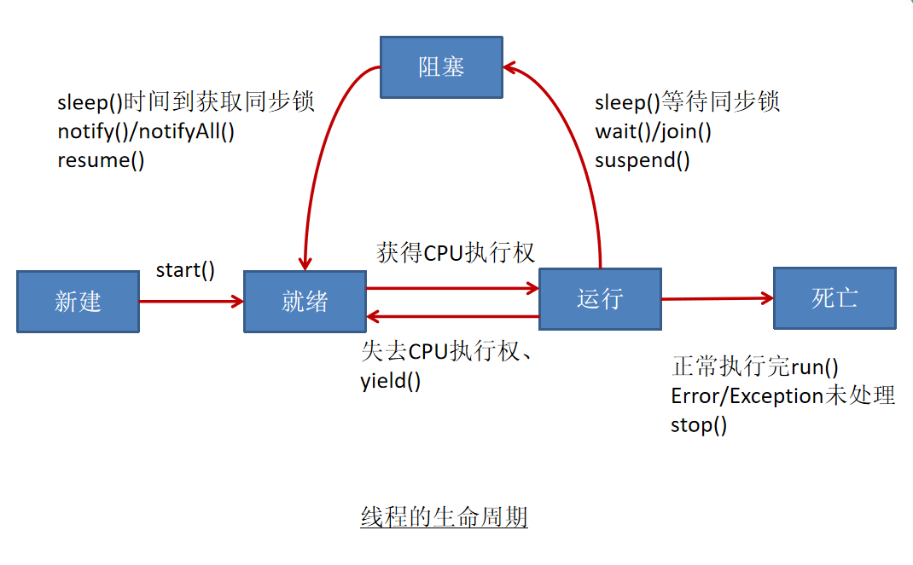

day17 多线程
==

# 本章内容
* 程序、进程、线程的概念
* 多线程的创建和使用
    * 继承Thread类 和 实现Runnable接口
    * Thread类的主要方法
    * 线程的调度与设置优先级
* 线程的生命周期
* 线程的同步
* 线程的通信


# 程序、进程、线程概念
* 程序(program)
    >是为完成特定的任务、用某种语言编写的一组指令的集合。即指一段静态的代码
* 进程(process)
    >是程序的一次执行过程，或是正在运行的一个程序。动态过程：有它自身的产生、存在和消亡的过程
   
* 线程(thread)
    >进程可以进一步细化为线程，是一个进程内部的一条执行路径  
    若一个程序可以在同一时间执行多个线程，就是支持多线程的
    * 每个java程序都有一个隐含的主线程：main()方法
    

# 多线程使用场景
* 程序需要同时执行多个任务
* 程序要实现一些需要等待的任务时。如用户输入、文件读写操作、网络操作、搜索等
* 需要一些后台运行的程序时

## 多线程的创建和启动
* JVM允许程序运行多个线程，它通过java.lang.Thread类来实现
* Thread类的特点
    * 每个线程都是通过某个特定Thread对象的run()方法来完成操作的，run()方法的主体称为线程体
    * 通过该Thread对象的start()方法启动这个线程，调用这个线程里的run()方法
    
# Thread类
* 构造器
    * Thread() 创建Thread对象
    * Thread(String threadname) 创建线程并指定线程名
    * Thread(Runnable target) 指定创建线程的目标对象，目标对象已经实现了Runnable接口中的run()方法
    * Thread(Runnable target, Strig name)  指定创建线程的实现了Runnable接口目标对象，并指定线程名
    

## 创建线程(类)的两种方法
* 继承Thread类
    1. 定义子类继承Thread类
    2. 子类中重写Thread类中的public void run()方法
    3. 创建Thread子类对象，即创建了线程对象
    4. 调用线程对象start()方法：启动线程;调用run()方法

示例  
[ThreadTest 继承Thread类方式](../day16/src/com/java/www/ThreadTest.java)

* 实现Runnable接口
    1. 定义类，实现Runnable接口
    2. 子类中实现Runnable接口中的 public void run() 方法
    3. 新建Runnable接口的子类对象
    4. 通过Thread类含参数构造器创建线程对象，将Runnable接口的子类对象作为形参传递给Thread类的构造器
    5. 调用Thread类对象的start()方法：启动线程;调用Runnable接口的子类对象run()方法

示例  
[ImplementsRunnable 实现Runnable接口方式](../day16/src/com/java/www/ImplementsRunnable.java)

    
## 继承Thread方式和实现Runnable方法的联系与区别
* 区别
    * 继承Thread类：线程代码放在Thread子类run()方法中
    * 实现Runnable接口：线程代码放在了接口的子类run()方法中
* 实现Runnable接口方式的优点
    * 避免了继承的单重继承局限性
    * 多个线程可以共用同一个接口实现类的对象，非常适合多个相同线程来处理同一份资源
    

## Thread构造器

* Thread()
>Allocates a new Thread object. 分配一个新的线程对象
* Thread(Runnable target) 
>Allocates a new Thread object. 
* Thread(Runnable target, String name)
>Allocates a new Thread object.
* Thread(String name)
>Allocates a new Thread object.
* Thread(ThreadGroup group, Runnable target)
>Allocates a new Thread object.
* Thread(ThreadGroup group, Runnable target, String name)
>Allocates a new Thread object so that it has target as its run object, has the specified name as its name, and belongs to the thread group referred to by group.
* Thread(ThreadGroup group, Runnable target, String name, long stackSize)
>Allocates a new Thread object so that it has target as its run object, has the specified name as its name, and belongs to the thread group referred to by group, and has the specified stack size.
* Thread(ThreadGroup group, String name)
>Allocates a new Thread object.


## Thread常用方法
* void start() 启动这个线程；调用该线程里的run()方法
* void run() 子线程要执行的代码放入run()方法中
* void stop() // Deprecated 停止当前线程，本质上是不安全的
* void stop(Throwable obj) // Deprecated
* static void sleep(long millis) 显式的让当前线程休眠millis毫秒
* static void sleep(long millis, int nanos) 让当前线程休眠millis毫秒加nanos纳秒
* void setDeamon(boolean on) 将此线程标记为守护进程线程或用户线程
* boolean isAlive() 测试此线程是否存活
* boolean isDaemon() 测试此线程是否为守护线程
* String getName() 返回线程名
* int getPriority() 返回线程的优先级
* void setName(String name) 设置此线程的名字
* void setPriority(int newPriority) 设置此线程的优先级，优先级范围[1-10]，值越大越优先，默认值5，优先级大的线程抢到CPU执行权概率要大，不是绝对的
* static void yield() 调用此方法的线程释放当前CPU的执行权
    >暂停当前正在执行的线程，把执行机会让给优先级相同或更高的线程  
    若队列中没有同优先级的线程，忽略此方法
* void join() 等待这个线程执行到结束
    在A线程中调用B线程的join()方法，则当前线程到此线程方法时（被阻塞），A线程暂停执行，
    直到B线程执行完毕，A线程再接着B.join()之后的代码
* void join(long millis) 最多等millis毫秒来等待这个线程执行结束
* void 	join(long millis, int nanos) 最多等millis毫秒加nanos纳秒来等待这个线程执行结束
* Thread.State getState() 返回此线程的状态
* static Thread currentThread() // 返回当前正在执行的线程对象的引用(即当前线程对象)，调用当前的线程


* static int activeCount() 返回当前线程组及其子级中活动线程数的估计值
* void checkAccess()
* protected Object clone()
* int countStackFrames() // Deprecated
* void destroy()
* static void dumpStack()
* static int enumerate(Thread[] tarray)
* static Map<Thread,StackTraceElement[]> getAllStackTraces()
* ClassLoader getContextClassLoader()
* static Thread.UncaughtExceptionHandler getDefaultUncaughtExceptionHandler()
* long getId()
* StackTraceElement[] getStackTrace()
* ThreadGroup getThreadGroup()
* Thread.UncaughtExceptionHandler getUncaughtExceptionHandler()
* static boolean holdsLock(Object obj)
* void interrupt()
* static boolean interrupted()
* boolean isInterrupted()
* void resume() // Deprecated
* void setContextClassLoader(ClassLoader cl)
* static void setDefaultUncaughtExceptionHandler(Thread.UncaughtExceptionHandler eh)
* void setUncaughtExceptionHandler(Thread.UncaughtExceptionHandler eh)
* void suspend() // Deprecated
* String toString()

示例  
[Thread2Test](../day16/src/com/java/www/Thread2Test.java)


# 线程的调度
* 调度策略
    * 时间片
    * 抢占式：优先级大的抢占CPU概率大
* java的调度方式
    * 同优先级的线程组成先进先出队列（先到先服务），使用时间片策略
    * 对高优先级，使用优先调度的抢占策略
    
# 线程的优先级
* 线程优先级范围：[1, 10],默认5
    * MAX_PRIORITY      10
    * MIN_PRIORITY      1
    * NORM_PRIORITY     5
    
* 线程优先级相关方法
    * int getPriority() 返回线程优先级值
    * void setPriority(int newPriority) 改变线程的优先级
* 线程创建时继承父线程的优先级


# 使用多线程的优点
* 提高线程的响应。对图形化界面更有意义，可增强用户体验
* 提高计算机系统CPU的利用率
* 改善程序结构。将长又复杂的进程分为几个多线程，独立运行，利于理解和修改


# 线程的分类
* 守护线程
* 用户线程
* 这两者几乎是相同的，唯一不同的就是在JVM中的生命周期，何时从JVM离开
* 守护线程是用来服务用来用户线程
* 把用户线程设置为守护线程，在start(方法调用前，调用 Thread对象.setDaemon(true) 
* java垃圾回收就是一个典型的守护线程
* 若JVM中都是守护线程，当前JVM将推出

与子进程关系.png)

# 线程的生命周期
JDK中用Thread.State枚举类表示了线程的几种状态  
要想创建多线程，必须在主线程中创建新的线程对象。使用Thread类及其子类的对象来表示线程，  
一个线程完整生命周期有以下5种状态 
* 新建(NEW)   当一个Thread类或其子类的对象被生命并创建时，新的线程对象处于新建状态
* 就绪(RUNNABLE)  处于新建状态的线程执行start()后，将进入线程队列等待CPU时间片
* 运行(WAITING)   当就绪的线程被调度并获得处理器资源时,便进入运行状态， run()方法定义了线程的操作和功能
* 阻塞(BLOCKED)   在某种特殊情况下，被人为挂起或执行输入输出操作时，让出 CPU 并临时中止自己的执行，进入阻塞状态
* 休眠状态(TIMED_WAITING)
* 死亡(terminated)    线程完成了它的全部工作或线程被提前强制性地中止   




# 线程的同步
在同一时间有多个线程操作共享数据时存在的问题
* 多个线程执行的不确定性引起执行结果的不稳定
* 多个线程对共享数据的操作，会造成操作的不完整性，会破坏数据，出现不正常的结果

* 多线程出现安全问题原因
>一个线程有多条语句在操作同一个共享数据时，当多条语句只执行了部分，还没有执行完，
另外一个线程参与进行执行。导致共享数据的错误
* 解决方法
>对多条操作共享数据的语句，同一时间只能让一个线程多条语句都执行完，在执行过程中，  
其他线程不能参与执行


# synchronized 线程同步使用方法
* java对于多线程的安全问题提供了专门的解决方式：同步机制，关键字synchronized

## synchronized线程同步机制的两种实现方式
线程同步达到的目的：保证一个线程在执行多条操作共享数据语句的整个过程不会有其他线程进来参与，等这个线程多条操作  
共享数据完成了，其他线程才能参与进来。就像上厕所一样，每次厕所进去一个人，只有等这个人上完厕所出来，下一个人才能进来。
* 同步代码块
```text
// 格式
Object obj = new Object(); // 任意一个类对象都可以做为锁(也可以叫 同步监视器)，多个线程的锁必须是同一个锁 
synchronized(obj) {
    // 需要被同步的代码，即操作共享数据的代码
}


    1. 共享数据：多个线程共同操作的同一个数据（变量）
    2. 同步监视器：有任意一个类的对象来充当。哪个线程获取到此监视器，谁就执行{ } 内被同步的代码。俗称：锁
    3. 要求所有的线程共用一把锁，

    注意：在实现的多线程方式中，线程同步，可以使用this充当锁。但是在继承的方式慎用this，要考虑对象只有一个

    静态方法中：可以使用类本身充当锁（类.class）

```

示例  
[Windows3Test](./src/com/java/www/Windows3Test.java)  
[Windows1Test](./src/com/java/www/Windows1Test.java)

* 同步方法  
将操作共享数据的方法声明为 synchronized, 此方法为同步方法。  
能够保证当一个线程在执行时，其他线程在外登台此线程执行完此方法
    * 非静态的同步方法的锁：this，这是默认的，也无法手动指定
    * 静态的同步方法的锁：当前类本身，无法手动指定
    
```text
格式：
synchronized void show() {
    // 需要被同步的代码，即操作共享数据的代码
}


```

# 互斥锁
java中引入了对象互斥锁的概念，用来保证共享数据操作的完整性
* 每个对象都应对有一个可称为"互斥锁"的标记，这个标记用来保证任何时刻，只能有一个线程访问该对象
* 关键字synchronized与对象的互斥锁联系。当某个对象用synchronized修饰时，表明该对象在任一时刻只能有一个线程访问
* 线程同步弊端：效率降低了，因为同一时间只能有一个线程访问共享数据。
* 只有需要操作共享数据的常才需要考虑线程的同步，如果没有则不需要

## 懒汉式单例模式线程安全问题修复
示例  
[Singleton Test](./src/com/java/www/SingletonTest.java)


# 释放锁的操作
* 当前线程的同步代码、同步方法块执行结束
* 当前线程在同步代码块、同步方法中遇到break、return终止了该代码块、该方法的继续执行
* 当前线程在同步代码块、同步方法中出现了Error或未处理的Exception，导致异常结束
* 当前线程在同步代码块、同步方法中执行了线程对象的wait()方法，当前线程暂停，并释放锁


# 不会释放锁的操作
* 线程执行同步代码块、同步方法时，程序调用Thread.sleep()、Thread.yield() 方法暂停当前线程的执行
* 线程执行同步代码块时，其他线程调用了该线程的suspend()方法将该线程挂起，该线程不会释放锁（同步监视器）
* 应尽量避免使用suspend()和resume()来控制线程

# 线程的死锁问题
* 死锁形成原因
>不同的线程分别占用对方需要的同步资源不放弃，都在等待对方放弃自己需要的同步资源，就形成了线程的死锁
* 死锁问题解决方法
    * 专门的算法、原则
    * 尽量减少同步资源的定义

示例  
[ThreadDeadLock](./src/com/java/www/ThreadDeadLock.java)

# 线程通信
三个线程间通信方法
* wait() 令当前线程挂起并放弃CPU、同步资源，使别的线程可访问并修改共享资源，而当前线程排队等待再次对资源的访问
    * 在当前线程中调用方法：对象名.wait()     wait()则是this.wait()
    * 使当前线程（或指定对象）进入等待状态，直接到另一个线程对该对象发出notfiy或notifyAll为止
    * 调用此方法的必须条件：当前线程必须是具有对该对象的监控权(加锁)
    * 调用此方法后，当前线程将释放锁，然后进入等待
    * 在当前线程被notify后，要重新获得锁，然后从断点处继续执行代码
* notify() 唤醒正在排队等待同步资源的线程优先最大者结束等待（wait的线程）
    * 唤醒等待该对象监控权的一个线程(wait()线程)
* notifyAll() 唤醒正在排队等待资源的所有线程结束等待
    * 唤醒所有等待当前这把锁的wait()线程

* java.lang.Object提供的这三个方法只能在synchronized方法或synchronized代码块中使用，否则报java.lang.IllegalMonitorStateException异常
* notify()/notifyAll()特点
    * 在当前线程中调用方法：对象名.notify() / 对象名.notifyAll() ,没有对象名则表示this
    * 调用此方法的必须条件：当前线程必须是具有对该对象的监控权(加锁)


示例  
[ThreadCommunication Test](./src/com/java/www/ThreadCommunicationTest.java)


线程通信应用示例  
[生产者/消费者问题](./src/com/java/www/ProductorConsumerTest.java)
