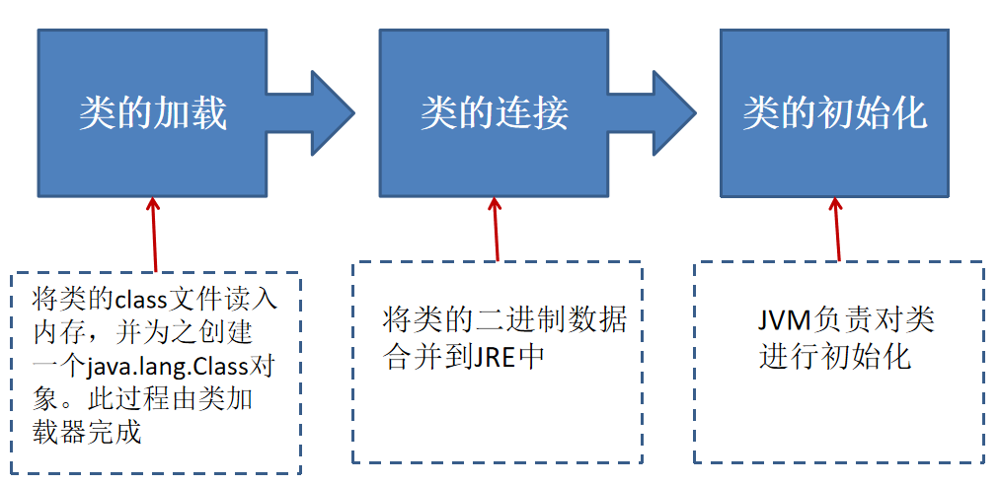
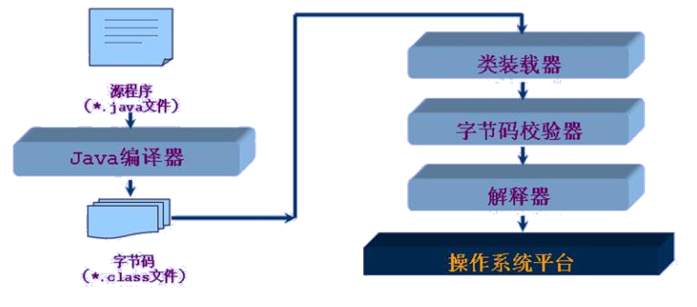
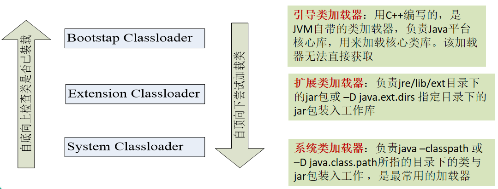
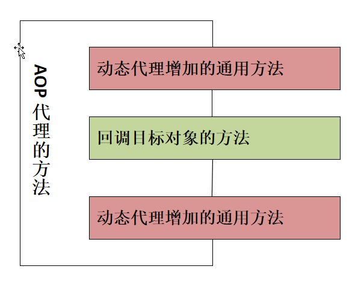

day19 java反射机制
==

# 本章内容
* 理解Class类、实例化Class类对象、运行时类
* 创建运行时类的对象，获取该类的完整结构
* 通过反射调用类的指定方法、属性
* 动态代理、AOP


# java reflection
reflection(反射)被视为动态语言的关键，反射机制允许程序员在执行期间借助于reflection API
取得任何类的内部信息，并能直接操作任意对象的内部属性、方法

## 反射机制提供的功能
* 在运行时判断任意一个对象所属的类
* 在运行时构造任意一个类的对象
* 在运行时判断任意一个类所具有的成员变量和方法
* 在运行时调用任意一个对象的成员变量和方法
* 生成动态代理


## 反射相关的主要API
* java.lang.Class 一个类
* java.lang.reflect.Method 类的方法
* java.lang.reflect.Field 类的成员变量
* java.lang.reflect.Constructor 类的构造器

## Class类
* Object 类是所有类的根类，Object定义了下面这个方法
    >public final Class getClass()
* Class类是java反射的源头

* 正常方式
    >引入需要的"包类"名称 -> 通过 new实例化 -> 取得实例化的对象
* 反射方式
    >实例化对象 -> 对象.getClass() -> 得到完整的"包类"名称
* Class也是一个类
* Class对象只能有系统创建对象
* 一个类在JVM中有且只有一个Class实例
* 一个Class对象对应的是一个加载到JVM中的一个.class文件
* 每个类的实例都会记录自己是有哪个Class实例生成的
* 通过Class可以完整的得到一个类的完整结构

## Class类主要方法
* static Class forName(String name) 返回指定类名name的Class对象
* Object newInstance() 调用空参(或缺省)的构造器，返回Class对象的一个实例
* String getName() 返回此Class对象所表示的实体名称(类、接口、数组、基本类型或void)
* Class getSuperClass() 返回此Class对象的父类的Class对象
* ClassLoader getClassLoader() 返回此类的加载器
* Class getSuperclass() 返回此Class所表示的实体超类的Class
* Constructor[] getConstructors() 返回此对象对应类的所有构造器，以数组形式返回
* Field[] getDeclaredFields() 返回此对象对应类的声明的属性，Field[]
* Method getMethod(String name, Class... paramTypes) 返回此对象对象类形参为paramTypes 的方法

示例  
[Reflection2Test](./src/com/java/www/Reflection2Test.java)


## 获取类的Class实例的4种方法
* 通过运行时类的对象，调用 对象.getClass()
```text
        Person p1 = new Person();
        // 获取对象的运行时类
        Class clazz = p1.getClass();
```
* 通过运行时类，调用 类.class
>Class<String> clazz2 = String.class;
* 通过Class的静态方法，调用 public Class Class.forName(String className),className必须是完整路径的
```text
        String className = "com.java.www.Person";
        Class clazz3 = null;
        try {
            clazz3 = Class.forName(className);
        } catch (ClassNotFoundException e) {
            e.printStackTrace();
        }
        System.out.println(clazz3.getName());
```
* 类加载器
```text
        ClassLoader loader = this.getClass().getClassLoader();
        try {
            Class clazz5 = loader.loadClass("java.lang.Math");
            System.out.println(clazz5);
        } catch (ClassNotFoundException e) {
            e.printStackTrace();
        }
```
示例  
[ReflectionTest test3](./src/com/java/www/ReflectionTest.java)


# JAVA类加载过程
当程序主动使用某个类时，如果该类还未被加载到内存中，则系统会通过如下三个步骤来对该类进行初始化。

  
  

## ClassLoader
类加载器是用来把类(class)装载进内存的。JVM规范定义了两种类型的类加载器：启动类加载器(bootstrap)和
用户自定义加载器(user-define class loader)。JVM在运行时回产生3个类加载器组成的初始化加载器层次结构，如下：

Bootstrap ClassLoader 引导类加载器：用C++编写，是JVM自带的类加载器，负责java平台核心库，用来加载核心类库。访加载器无法直接获取  
Extension ClassLoader 扩展类加载器：负责jre/lib/ext 目录下的jar包或-D java.ext.dirs指定目录下的jar包载入工作库  
System ClassLoader 系统类加载器：负责java -classpath 或 -D java.class.path所指定的目录下的类与jar包载入工作，是最常用的加载器  

  

示例  
[ReflectionTest test4](./src/com/java/www/ReflectionTest.java)

### 类加载器一个主要方法
利用类加载器访问包内的文件，非根路径下的

[ReflectionTest test5](./src/com/java/www/ReflectionTest.java)


# 通过反射调用类的完整结构
Field、Method、Constructor、Supperclass、实现的Interface、Annotation、方法的Exception信息、内部类  
先获取类的Class实例

* 获取实现的接口
    ```text
    public Class<?>[] getInterfaces()
    获取此对象所表示的类或接口实现的接口
  
    ```
* 获取所继承的父类
    ```text
    public Class<? Super T> getSuperclass()
    返回此Class所表示的实体(类、接口、基本数据类型)的父类的Class
    ```

* 获取全部的构造器
    * public Constructor<T>[] getConstructors()
    >返回此Class对象所表示的类的所有public构造器
    * public Constructor<T>[] getDeclaredConstructors()
    >返回此Class对象表示的类中声明的所有构造器，包括私有的
    
    ```text
    Constructor类中：
    取得修饰符：public int getModifiers()
    取得方法名称：public String getName()
    取得参数的类型：public Class<?>[] getParameterTypes()
    ```
    
* 获取全部的方法
    * public Method[] getDeclaredMethods()
    >返回此Class对象所表示的类或接口的全部方法
    * public Method[] getMethods()
    返回此Class对象所表示的类或接口的public方法
    ```text
    Method类中：
    * public Class<?> getReturnType() 取得方法全部的返回值
    * public Class<?>[] getParameterTypes() 获取方法全部的参数
    * public int getModifiers() 取得方法修饰符
    * public Class<?>[] getExceptionTypes() 获取方法异常信息
  
    ```

* 获取全部的属性(Field)
    * public Field[] getFields()
    >返回此Class对象所表示的类或接口的public的Field
    * public Field[] getDeclaredFields()
    >返回此Class对象所表示的类或接口的全部Field，包括private修饰的属性
    ```text
    Field类中：
    * public int getModifiers() 以整数形式返回此Field的修饰符
    * public Class<?> getType() 返回Field的属性类型
    * public String getName() 返回Field名称
    
    ```
* 获取注解(Annotation)
    * public Annotation[] getAnnotations() 获取此Class对象所表示的类或接口的public修饰的注解
    * public Annotation[] getDeclaredAnnotations() 获取此Class对象所表示的类或接口的全部注解
    
* 泛型相关
    * Type getGenericSuperclass() 获取带泛型的父类
    * 获取父类的泛型
    ```text
    Class clazz = Person.class;
    Type type1 = clazz.getGenericSuperclass();
    ParameterizedType parameterizedType = (ParameterizedType) type1;
    Type[] args = parameterizedType.getActualTypeArguments(); //获取实际的泛型类型参数数组
    Class firstArg = (Class) args[0];
    System.out.println(firstArg.getName());
    ```

* 获取类所在的包
    >public Package getPackage()
    
* 获取内部类
    >public Class[] getDeclaredClasses()

* 数字形式修饰符转String修饰符
```text
int i = f.getModifiers();
String modifier = Modifier.toString(i); 
```

示例  
[Reflection2Test test1 - test10](./src/com/java/www/Reflection2Test.java)


## 通过反射调用类中指定的方法、属性、构造器
* 调用指定的方法
    1. 通过Class类的getMethod(String name, Class... parameterTypes) 方法获得一个Method对象，并设置此方法操作是需要的参数
    2. 再使用Object invoke(Object obj, Object[] args) 进行调用，并向方法中传递要设置的obj对象的参数信息
    3. 说明
        * Object对应原方法的返回值，若原方法无返回值，此时返回null
        * 若原方法为static静态方法，此时形参Object obj可为null
        * 若原方法形参列表为空，则Object[] args 为null, 可比传此参数
        * 若原方法权限修饰符为private，则需要在调用invoke()方法前，显式的调用方法对象的setAccessible(true)方法，这样就能访问private的方法了，其他的构造、属性等也是类似的
        
        
示例  
[Reflection2Test test13](./src/com/java/www/Reflection2Test.java)

* 调用指定的属性
    * public Field getField(String name) 返回此Class对象表示的类或接口指定的public的Field
    * public Field getDeclaredField(String name) 返回此Class对象表示的类或接口指定的Field，包括private的
    ```text
    Field中：
    public Object get(Object obj) 获取指定对象obj上此Field的属性内容
    public void set(Object, Object value) 设置指定对象obj上此Field的属性内容值  

    ```

示例  
[Reflection2Test test12](./src/com/java/www/Reflection2Test.java)


* 调用指定的构造器
>public Constructor<T> getDeclaredConstructor(Class<?>... parameterTypes)  

示例  
[Reflection2Test test14](./src/com/java/www/Reflection2Test.java)


# JAVA动态代理
* 动态代理是指客户通过代理类来调用其它对象的方法，并且是在程序运行时根据需要动态创建目标类的代理对象
* 动态代理的使用场景
    * 调试
    * 远程方法调用
* 代理设计模式的原理
>使用一个代理将对象包装起来, 然后用该代理对象取代原始对象. 任何对原始对象的调用都要通过代理. 代理对象决定是否以及何时将方法调用转到原始对象


* Proxy：专门完成代理的操作类，是所有动态代理的父类。通过此类为一个或多个接口动态地生成实现类
* 提供用于创建动态代理类和动态代理对象的静态方法
    * static Class<?> getProxyClass(ClassLoader loader, Class<?>... interfaces) 创建一个动态代理类序所对应的Class对象
    * static Object newProxyInstance(ClassLoader loader, Class<?>[] interfaces, InvocationHandler h) 直接创建一个动态代理对象
    ```text
    loader: 类加载器
    interfaces: 得到全部的接口
    h: 得到InvocationHandler接口的子类实例

    ```
* 动态代理步骤
    1. 创建一个实现接口InvocationHandler的类，它必须实现invoke方法，以完成代理的具体操作
    ```text
    @Override
    public Object invoke(Object proxy, Method method, Object[] args) throws Throwable {
        // 当通过代理类的对象发起对被重写方法的调用时，都会转为对invoke方法的调用
    
        Object returnVal = method.invoke(obj, args);
        System.out.println("实现的invoke方法被调用了");
        return returnVal;
    }
        
    /*
    proxy: 被代理的对象
    method：要调用的方法
    args: 方法调用时需要的参数
    **/    
    
    ```
    2. 创建被代理的类以及接口
    ```text
    // 示例
    interface Factory {
        void make();
    }
    
    class HuaweiFactory implements Factory {
    
        // 构造器
        public HuaweiFactory() {
            super();
        }
    
        // 方法
        @Override
        public void make() {
            System.out.println("华为松山湖生产基地生产了100000 部手机");
        }
    
    }
  
    ```
    3. 通过Proxy的静态方法 public Object newProxyInstance(ClassLoader loader, Class[] interfaces, InvocationHandler h)创建一个相应的接口代理
    ```text
    // 示例
    public Object getProxyInstance(Object obj) {
        /*
        本方法作用：
        1. 给被代理的对象实例化
        2. 返回一个代理类的对象

        * */

        this.obj = obj;
        // 使用反射，根据被代理类动态生成代理对象
        Object proxy = Proxy.newProxyInstance(obj.getClass().getClassLoader(), obj.getClass().getInterfaces(), this);
        return proxy;
    }
    
    ```
    4. 通过代理调用被代理类的方法
    ```text
    // 示例
    // 1. 创建被代理类对象
    HuaweiFactory huawei = new HuaweiFactory();
    // 2. 创建一个 实现了 InvocationHandler接口的对象
    MyInvocationHandler handler = new MyInvocationHandler();

    // 调用getProxy获取 动态生成代理类对象
    Object obj = handler.getProxyInstance(huawei);
    Factory haproxy = (Factory) obj;
    haproxy.make(); // 转到对动态代理类对象的invoke()方法的调用
    System.out.println();
    ```


静态代理示例  
[StaticProxyTest](./src/com/java/proxy/StaticProxyTest.java)

动态代理示例  
[DynamicProxyTest](./src/com/java/proxy/DynamicProxyTest.java)  


# 动态代理与AOP(Aspect Orient Programming面向切面编程)
AOP动态代理功能类似于python中的装饰器
* 使用Proxy生成一个动态代理时，往往并不会凭空产生一个动态代理。通常都是为指定的目标对象生成动态代理
* 这种动态代理在AOP中称为AOP代理，AOP代理可代替目标对象，AOP代理包含了目标对象的全部方法。  
但AOP代理中的方法与目标对象的方法存在差异：AOP代理中的方法可以在执行目标方法之前、之后插入一些通用处理


AOP代理示例  
[AOP代理 Test](./src/com/java/proxy/AOPTest.java)  


