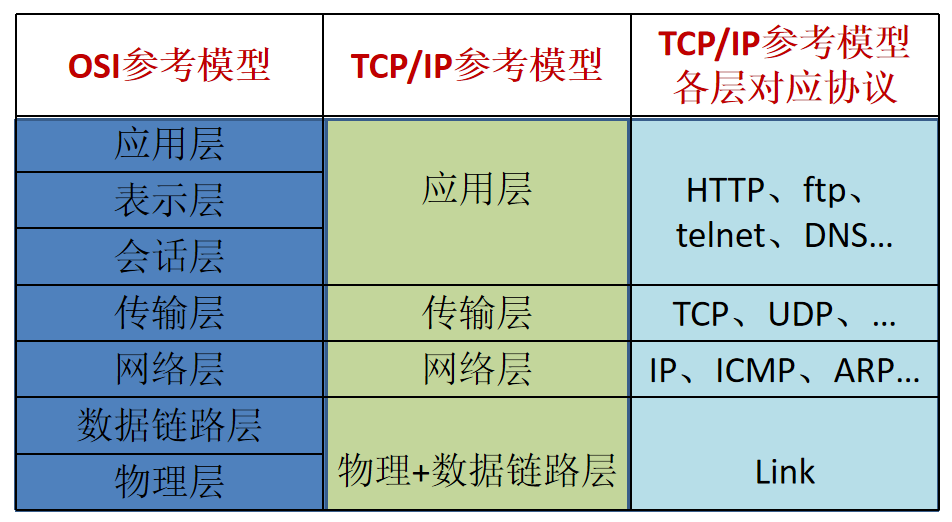
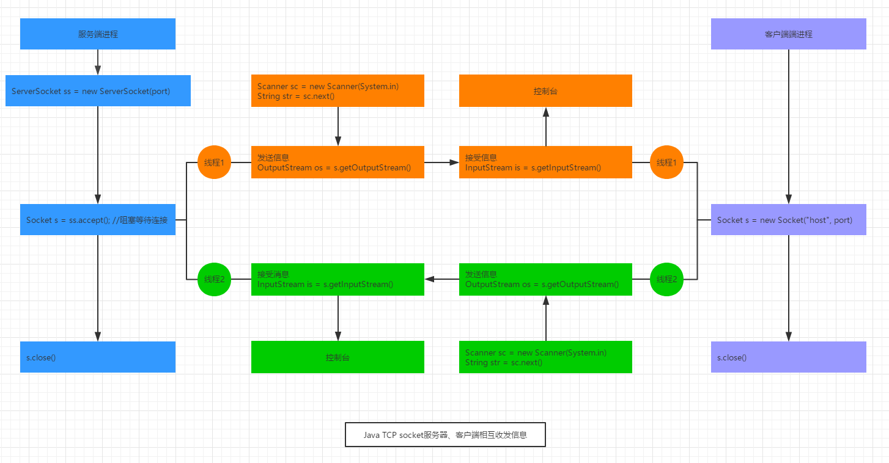

day20_网络编程
==

# 主要内容
* 网络编程概述
* 通讯要素
    * IP和端口
    * 网络通信协议
* InetAddress类
* TCP socket网络编程
* UDP socket网络编程
* URL socket网络编程


# 网络编程概述
* Java提供的网络类库，可以实现无痛的网络连接，联网的底层细节被隐藏在 Java 的本机安装系统里，由 JVM 进行控制。
并且 Java 实现了一个跨平台的网络库，程序员面对的是一个统一的网络编程环境。

# 网络基础
* 计算机网络
```text
把分布在不同地理区域的计算机与专门的外部设备用通信线路互连成一个规模大、功能强的网络系统，
从而使众多的计算机可以方便地互相传递信息、共享硬件、软件、数据信息等资源。

```

* 网络编程的目的
>直接或间接地通过网络协议与其他计算机进行通讯

* 网络编程中主要的两个问题
    * 如何准确地定位网络上的一台或多台主机
    * 找到主机后如何可靠高效地进行数据传输

* 实现网络中主机互相通信的机制
    * 通信双方地池
    * 一定的规则(主要有两套参考模型)
        * OSI 7层参考模型：模型过于理想或，未能在互联网上进行广泛推广
        * TCP/IP 4层参考模型：事实上的国际标准

* 通信要素:网络通信协议
   
    
* 通信要素:IP和端口
* IP地址：InetAddress
    * 唯一的标识Internet上的计算机
    * 本地回环地址：127.0.0.1,主机名：localhost
    * 不易记忆
* 端口：标识正在计算机上运行的进程(程序)
    * 不同的进程有不同的端口
    * 被规定为一个16二进制整数，端口可使用范围：(0-65535]
* IP与端口的组合得出一个socket


# InetAddress类
* 主机地址的两种表示形式
    * 域名(hostName)，如：www.baidu.com
    * IP地址(hostAddress)，如：223.5.5.5
* InetAddress类主表示IP地址  
两个子类
    * Inet4Address
    * Inet6Address
* InetAddress对象含有一个Internet主机的域名和IP地址
* 域名易于记忆，通信前需要把域名解析成IP地址

## 构造器
// 跨包后调用不了此构造器
protected InetAddress() {
        holder = new InetAddressHolder();
}

## 方法
* 创建InetAddress对象
static InetAddress getByName(String host)
static InetAddress getByAddress(byte[] addr)
static InetAddress getByAddress(String host, byte[] addr)
static InetAddress[] getAllByName(String host) 获取到域名解析出来的多个IP

* 获取相关属性
String getHostName()
String getHostAddress()
byte[] getAddress()
String getCanonicalHostName()
static InetAddress getLocalHost()
static InetAddress getLoopbackAddress()

[InetAddress使用示例 ](./src/com/java/www/InetAddressTest.java)  


# 通信要素2：网络通讯协议
* 通信协议
```text
计算机网络中实现通信必须有一些约定，
即通信协议，对速率、传输代码、代码结构、传输控制步骤、出错控制等制定标准。

```

* 通信协议分层思想
```text
由于结点之间联系很复杂，在制定协议时，把复杂成份分解成一些简单的成份，再将它们复合起来。
最常用的复合方式是层次方式，
即同层间可以通信、上一层可以调用下一层，
而与再下一层不发生关系。
各层互不影响，利于系统的开发和扩展。
```

## TCP/IP协议簇
* 传输协议中两个重要的协议
    * TCP(Transmission Control Protocol) 传输控制协议
    * UDP(User Datagram Protocol) 用户数据报协议

* TCP/IP 以其两个主要协议
>传输控制协议(TCP)和网络互联协议(IP)而得名，  
实际上是一组协议，包括多个具有不同功能且互为关联的协议。  

* IP(Internet Protocol)协议是网络层的主要协议，支持网间互连的数据通信
* TCP/IP协议模型从更使用的角度出发，形成了高效地四层体系，  
即 物理链路层、IP层(网络层)、传输层、应用层

## TCP和UDP
* TCP协议
    * 使用TCP协议签，必须建立TCP连接，形成传输的通道
    * 传输前，采用"三次握手"方式，是可靠的
    * TCP协议进行通信的两个应用进程：服务端、客户端，先启动服务端
    * 在已经建立了连接的连接中可进行大数据的传输
    * 传输完毕，采用"四次挥手"方式释放已建立的连接，效率低
* UDP协议
    * 将数据、源地址、目的地址封装成数据报，不需要建立连接
    * 每个数据报的大小限制在64K内
    * 因无需连接，故是不可靠的
    * 发送数据结束时无需释放资源，速度快


# Socket
* 利用套接字(Socket)开发网络应用程序早已被广泛的采用，以至于成为事实上的标准
* 通信的两端都要有Socket，是两台机器间通信的端点
* 网络通信其实就是Socket间的通信
* Socket允许程序把网络连接当成一个流，数据在两个Socket间通过IO传输
* 一般主动发起通信的应用程序属客户端，等待通信请求的为服务端
个人觉得Socket翻译成链流口更合适

基于TCP的socket通信  
  


# Socket类
## 构造器
```text

public Socket() 创建一个未绑定IP、端口等的Socket对象
public Socket(InetAddress address, int port) throws IOException 创建一个流Socket对象(即TCP socket)，并绑定IP、端口
public Socket(String host, int port) throws UnknownHostException, IOException 创建一个流Socket对象(即TCP socket)，并绑定IP、端口
public Socket(InetAddress address, int port, InetAddress localAddr, int localPort) throws IOException 创建一个Socket对象，指定连接远端的IP和端口，同时绑定本地的IP和端口
public Socket(String host, int port, InetAddress localAddr, int localPort) throws IOException 创建一个Socket对象，指定连接远端的IP和端口，同时绑定本地的IP和端口

public Socket(InetAddress host, int port, boolean stream) throws IOException // Deprecated. 创建一个绑定了IP和端口的流Socket对象(TCP)或数据报Socket对象(UDP)，stream为true时创建流Socket对象，stream为false时创建数据报Socket
public Socket(String host, int port, boolean stream) throws IOException // Deprecated. 创建一个绑定了IP和端口的流Socket对象(TCP)或数据报Socket对象(UDP)，stream为true时创建流Socket对象，stream为false时创建数据报Socket

public Socket(Proxy proxy) 创建一个未连接的代理Socket，使用代理的设置，如调用代理的IP、端口，
    示例：
    Socket s = new Socket(Proxy.NO_PROXY);  will create a plain socket ignoring any other proxy configuration.
    Socket s = new Socket(new Proxy(Proxy.Type.SOCKS, new InetSocketAddress("socks.mydom.com", 1080))); will create a socket connecting through the specified SOCKS proxy server.

protected Socket(SocketImpl impl) throws SocketException 创建一个由用户实现的SocketImpl且未连接的Socket对象。

```

## 方法
```text
void bind(SocketAddress bindpoint) 绑定SocketAddress，即IP和端口
void close() 关闭此socket
void connect(SocketAddress endpoint) 连接此socket到服务器
void connect(SocketAddress endpoint, int timeout) 连接此socket到服务器，并指定连接超时时间
SocketChannel getChannel() 返回唯一的SocketChannel 对象，如果存在的话
InetAddress getInetAddress() 返回此socket连接到远端的IP
InputStream getInputStream() 获取此socket的InputStream输入流，此InputStream.read()、InputStream.read(byte[] b) 都是是阻塞的
boolean getKeepAlive() 测试SO_KEEPALIVE 是否开启，返回此socket是否开启回话保持
InetAddress getLocalAddress() 获取此socket绑定的本地IP
int getLocalPort() 获取此socket绑定的本地端口
SocketAddress getLocalSocketAddress() 获取此socket绑定的本地SocketAddress信息，即绑定的本地IP、本地端口
boolean getOOBInline() 获取此socket的SO_OOBINLINE是否开启
OutputStream getOutputStream() 获取此socket的OutputStream输出流，此OutputStream.write(byte[] b) 非阻塞的
int getPort() 返回此socket连接的远端端口
int getReceiveBufferSize() 获取此socket的SO_RCVBUF值
SocketAddress getRemoteSocketAddress() 返回此socket连接着远端的SocketAddress信息(IP、port)
boolean	getReuseAddress() 获取SO_REUSEADDR是否可重用
int getSendBufferSize() 获取此socket的SO_SNDBUF返送缓冲大小
int getSoLinger() 获取 SO_LINGER值
int getSoTimeout() 获取此socket的SO_TIMEOUT设置的值
boolean getTcpNoDelay() 获取此socket的TCP_NODELAY是否开启，关闭Nagle算法，即要发送到网络的数据不缓冲
int getTrafficClass() 从发送的IP头包里获取traffic跟踪类或服务类型
boolean isBound() 返回此socket是绑定状态
boolean isClosed() 返回此socket是关闭状态
boolean isConnected() 返回此socket是连接状态
boolean isInputShutdown()  在此socket输入流读取过程中，返回此socket连接是否为是关闭状态，是关闭则返回true
boolean isOutputShutdown()  在此socket输出流读取过程中，返回此socket连接是否为是关闭状态，是关闭则返回true
void sendUrgentData(int data) 发送一个字节的紧急数据到此socket
void setKeepAlive(boolean on) 设置此suocket的SO_KEEPALIVE值，即socket TCP的超时时间
void setOOBInline(boolean on)
void setPerformancePreferences(int connectionTime, int latency, int bandwidth) 设置此Socket性能偏好：
                connectionTime：连接保持时间，对于短链接来说此参数相对重要
                latency：延迟时间，对于要求低延迟的连接，此参数相对重要
                bandwidth：带宽，如要求带宽比较高的，此参数比较重要
void setReceiveBufferSize(int size) 设置此socket的SO_RCVBUF值
void setReuseAddress(boolean on) 设置address是否可重用
void setSendBufferSize(int size) 设置SO_SNDBUF值
static void	setSocketImplFactory(SocketImplFactory fac)
void setSoLinger(boolean on, int linger) 开启/关闭 SO_LINGER，指定linger时间为linger，单位s
void setSoTimeout(int timeout) 设置此socket超时时间(单位ms)，以timeout为0时无限超时，read()将一直阻塞，如果timeout > 0,在read()时做多阻塞timeout 毫秒，超时后抛出java.net.SocketTimeoutException异常
void setTcpNoDelay(boolean on) 设置此socket的TCP_NODELAY 值
void setTrafficClass(int tc)
void shutdownInput() 关闭此socket的InputStream流，在read socket InputStream时，调用此方法后，InputStream的read()方法返回-1，其他可用方法都将返回0，不可恢复
void shutdownOutput() 关闭此socket的OutputStream流。对于TCP，调用此方法前需要发送的数据还未完成发送的将继续正常的连接终止顺序发送，不可恢复
String toString() //"Socket[addr=" + getImpl().getInetAddress() +
                    ",port=" + getImpl().getPort() +
                    ",localport=" + getImpl().getLocalPort() + "]";
                    
```

## 注意
* 调用socket.close() 或者socket.shutdownOutput()方法，都会结束客户端socket，且不可恢复。
* socket.close() 将socket关闭连接，那边如果有服务端给客户端反馈信息，此时客户端是收不到的。
* socket.shutdownOutput() 是将输出流关闭，此时，如果服务端有信息返回，则客户端是可以正常接受的
* inputStream.readAllBytes()，只有等对端的socket关闭了，才能读取完成，是阻塞的


# ServerSocket类
## 构造器(没有特殊说明时，都是public构造器)
```text
ServerSocket() 创建未绑定IP、端口等的ServerSocket对象
ServerSocket(int port) 创建服务器端的ServerSocket对象，指定要绑定的监听端口，绑定所有IP(即0.0.0.0)，端口范围：[0, 65535]，0：自动分配端口，下同; 请求连接队列的最大长度为50
ServerSocket(int port, int backlog) 建服务器端的ServerSocket对象，指定要绑定的监听端口，绑定所有IP(即0.0.0.0)，指定请求连接队列的最大长度
ServerSocket(int port, int backlog, InetAddress bindAddr) 建服务器端的ServerSocket对象，指定要绑定的监听端口，指定请求连接队列的最大长度，指定绑定的IP(InetAddress对象)
```

## 方法(没有特殊说明，都是public方法)
```text

Socket accept() 创建并返回一个Socket对象，开始侦听该socket并接收请求连接，阻塞的，直到有请求连接进来
void bind(SocketAddress endpoint)  绑定SocketAddress，即绑定IP和端口，如 ServerSocket对象.bind(new InetSocketAddress(InetAddress.getByName("hostName")), 端口)
void bind(SocketAddress endpoint, int backlog)  绑定SocketAddress，并指定请求连接队列的最大长度
void close() 关闭此socket
ServerSocketChannel getChannel() 返回此ServerSocket对象相关的唯一的ServerSocketChannel 对象
InetAddress	getInetAddress() 获取此socket的IP信息
int	getLocalPort() 获取侦听的端口
SocketAddress getLocalSocketAddress() 获取绑定的IP信息
int	getReceiveBufferSize()
boolean	getReuseAddress() 获取请求客户端的address信息
int	getSoTimeout() 获取socket 超时设置值
protected void implAccept(Socket s) 重写accept()方法
boolean isBound() 返回ServerSocket是否已经绑定
oolean isClosed() 返回ServerSocket是否已关闭
void setPerformancePreferences(int connectionTime, int latency, int bandwidth) 设置此ServerSocket性能偏好：
                connectionTime：连接保持时间，对于短链接来说此参数相对重要
                latency：延迟时间，对于要求低延迟的连接，此参数相对重要
                bandwidth：带宽，如要求带宽比较高的，此参数比较重要
void setReceiveBufferSize(int size)  重置socket接收缓存的大小，默认的大小将被修改
void setReuseAddress(boolean on) 开启/关闭 SO_REUSEADDR socket 选项，当需要使用多进程时，需要开启address重用
static void	setSocketFactory(SocketImplFactory fac)
void setSoTimeout(int timeout) 设置socket的超时时间，单位ms，0：表示不超时
String toString()

```

# 基于Socket的TCP编程
* 客户端Socket的工作过程包含以下四个基本的步骤
    * 创建 Socket
    ```text
    根据指定服务端的 IP 地址或端口号构造 Socket 类对象。
    若服务器端响应，则建立客户端到服务器的通信线路。
    若连接失败，会出现异常
    ```
    * 打开连接到 Socket 的输入流/输出流
    ```text
    使用 getInputStream()方法获得输入流，其read()会阻塞
    使用 getOutputStream()方法获得输出流，进行数据传输
    ```
    * 按照一定的协议对 Socket 进行读/写操作
    ```text
    通过输入流读取服务器放入线路的信息（但不能读取自己放入线路的信息），
    通过输出流将信息写入线程
    ```
    * 关闭socket
    ```text
    断开客户端到服务器的连接，释放链路
    ```
    示例  
    [TCPSocketTest1 client](./src/com/java/www/TCPSocketTest1.java)
    
* 服务端TCP socket编程
    * 调用 ServerSocket(int port)
    ```text
    创建一个服务器端套接字，并绑定到指定端口上。用于监听客户端的请求
    ```
    * 调用 accept()
    ```text
    监听连接请求，如果客户端请求连接，则接受连接，返回通信套接字对象。
    这里会发生阻塞，知道有请求连接进来
    ```
    * 调用 该Socket类对象的 getOutputStream() 和 getInputStream()
    InputStream.read(byte[] b)方法也会发生阻塞，等待读取内容，需要自行判断结束
    ```text
    获取输出流和输入流，开始网络数据的发送和接收
    ```
    * 关闭ServerSocket和Socket对象
    ```text
    客户端访问结束，关闭通信套接字
    ```
    示例  
    [TCPSocketTest1 server](./src/com/java/www/TCPSocketTest1.java)  


# 其他
## java lambda表达式
符号：() -> { }
即一个匿名类的匿名方法

```text
// 如： 
Runnable runnable = () -> {
    // 方法内容
    ...
}
```

## InputStream判断数据已经读取结束的解决方法
* 让发送端发送完数据后，关闭连接。 这个在Http的操作时很常见。
* 约定发送的数据长度，比如 http的 keepAlive 就是必须依赖这个的 Content-Length 
* 设置超时的时间，根据我的经验，只有在Socket级别设置才有效. 
Socket socket = new Socket(host,port); 
socket.setSoTimeout(100); // 如果超过100毫秒还没有数据，则抛出 SocketTimeoutException


