java 9新特性
==

# 新特性概览
```text
java 9 发布于2017-9-21
java 9 提供了超过150项新功能特性，
包括备受期待的模块化系统、
可交互的 REPL 工具：jshell，
JDK 编译工具，
Java 公共 API 和私有代码，
以及安全增强、扩展提升、性能管理改善等。
可以说 Java 9 是一个庞大的系统工程，完全做了一个整体改变
```

## 本章内容
* 模块华系统
* jShell命令
* 多版本兼容jar包
* 接口的私有化方法
* 钻石操作符(<>箭头操作符)的使用升级
* 语法改进:try语句
* 下划线使用限制
* String存储结构变更
* 便利的集合特性:of()
* 增强的Stream API
* 多分辨率图API
* 全新的HTTP客户端API
* Deparated的相关API
* 智能java编译工具
* 统一的JVM日志系统
* javadoc的HTML5支持
* javascript引擎升级:Nashorn
* java的动态编译器

# JDK和JRE的改变
  

## jdk9目录结构
[JDK9目录结构](images/JDK9目录结构.png)

```text
没有jre子目录了
bin: 包含所有命令。在windows平台上，它继续包含了系统的运行时动态链接库
conf: 包含用户可编辑的配置文件，例如以前位于jre/lib目录中的.properties和.policy文件
include: 包含编译本地代码使用的C/C+=头文件。它只存在于JDK中
jmods: 包含JMOD格式的平台模块。创建自定义运行时映像时需要它。它只存在于JDK中
legal: 包含法律声明
lib: 包含非windows平台上的动态链接本地库。其子目录和文件不应由开发员直接编辑或使用

```

# 模块化系统
Jigsaw项目后改名为Modularity，目的让java模块独立、化繁为简
模块化，使代码组织上更安全，因为它可以指定哪些部分可以暴露，其他部分隐藏

* 模块(module)，本质就是在package外在包一层

## 模块使用示例
<details>
<summary>模块使用示例</summary>

* 需求
```text
如下图：模块结构
module有：core、main、pages
把core模块下的包com.java.www 暴露给外部调用，
测试，模块pages中能访问到core模块下的包com.java.www下的Person类
```
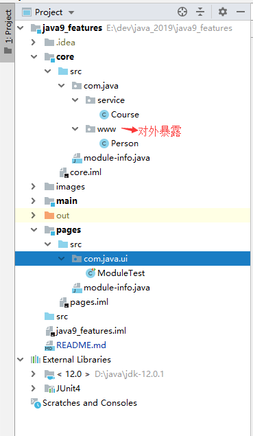  

* 新建多个不同的模块  
** 默认情况下，每个模块都只能访问到本模块下的类、接口等，无法跨模块去访问 **
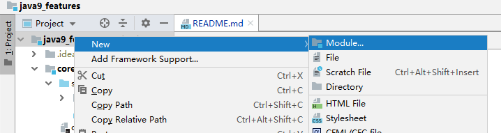  

* 在每个模块下创建module-info.java文件
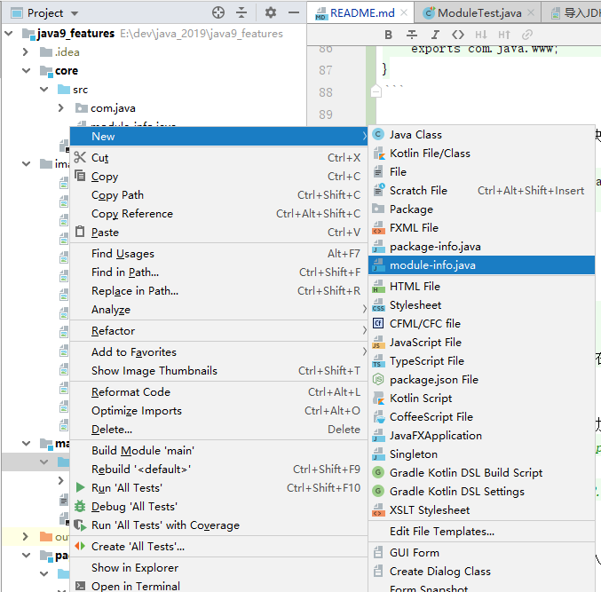  

* 设置模块core下的com.java.www包导出
```text
编辑模块core的src目录下的module-info.java文件，添加如下内容：
    exports com.java.www;
具体如下
```

```text
module core {
    // 导出包
    exports com.java.www;
}
```

* 设置模块pages中导入需要的模块
```text
编辑模块pages的src目录下的module-info.java文件，添加如下内容：
    requires core;
具体如下
```

```text
module pages {
    // 导入模块
    requires core; // 光标放这在这行，Alt + Enter键，选择Add dependency on module 'xxx'
}
```
注意添加了这行内容后，要执行添加依赖模块操作，执行后的变化
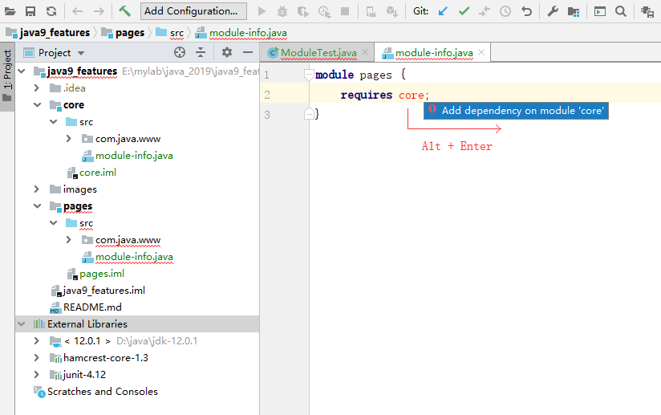  

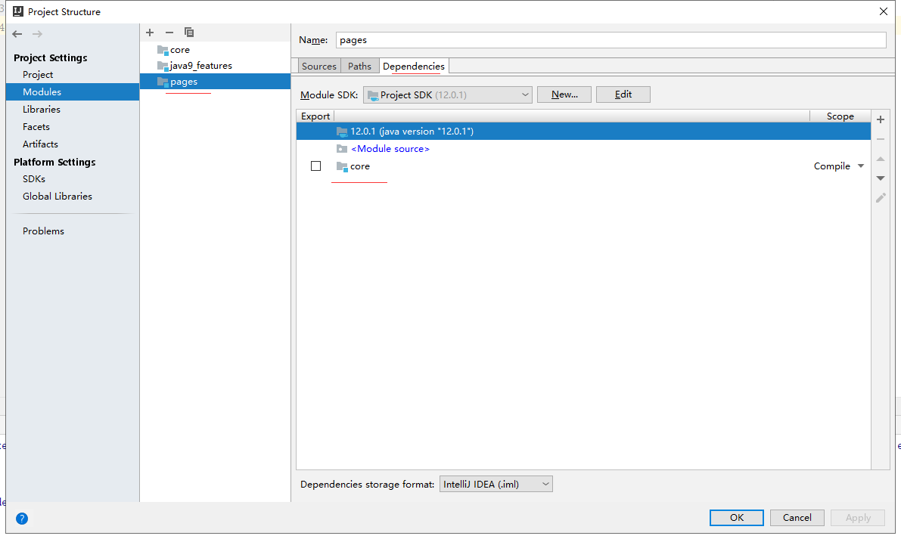  


* 注意:本模块中的包名不能与导入的包名不能相同
* 测试
[ModuleTest](./pages/src/com/java/ui/ModuleTest.java)
</details>

## 在模块中导入JKD内部的模块
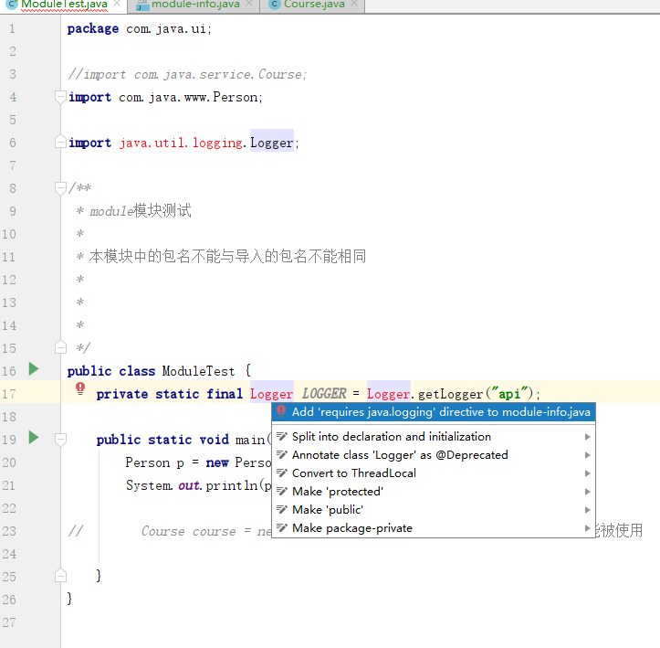  

此时在相应的module-info.java文件中自动添加了配置
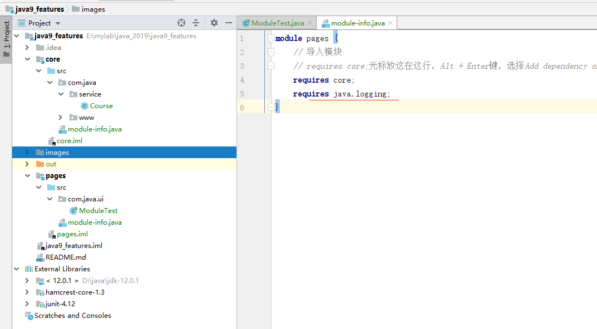  

## 模块中导入jUnit模块
<details>
<summary>模块中导入jUnit模块</summary>

  
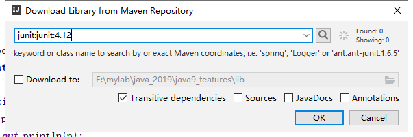  
  
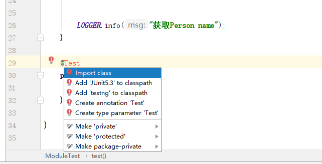  
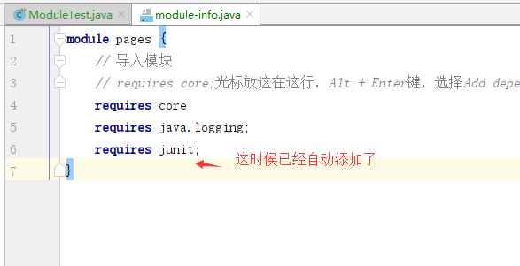  
  

</details>

# REPL工具:jShell
REPL：read-evaluate-print-loop.
jShell在命令行下就可以执行java命令和程序了

* tab自动补齐
* 自定添加分号

##  jShell使用示例
<details>
<summary>jShell使用示例</summary>

* 调出jShell
在cmd窗口执行 jshell
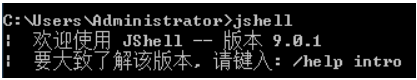  

* /help 帮助
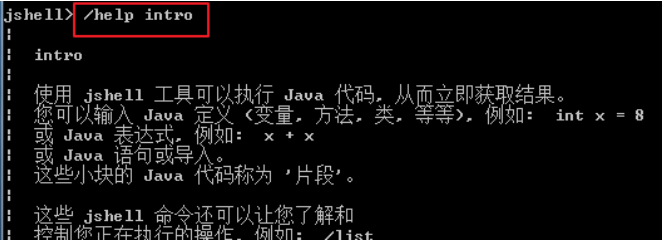  

* 基本使用
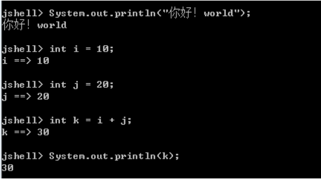  

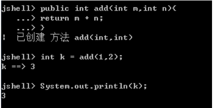  

* 导入指定的包
  

* /imports查看已导入的包
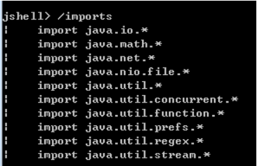  

* tab补齐代码
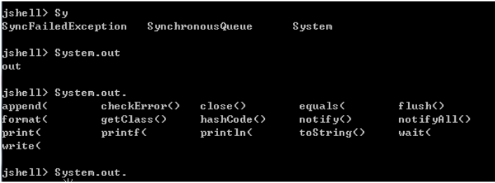  

* 列出当前会话里有效的代码片段
  

* /var列出当前会话里创建了的变量
  

* /methods查看已创建的方法
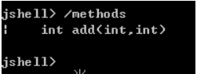  

* 加载并执行外部的源代码文件
  

* /edit使用pad文本编辑器
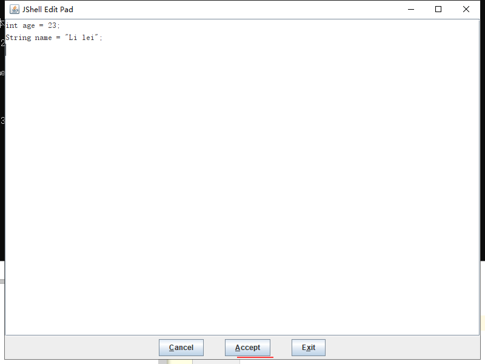  

</details>


