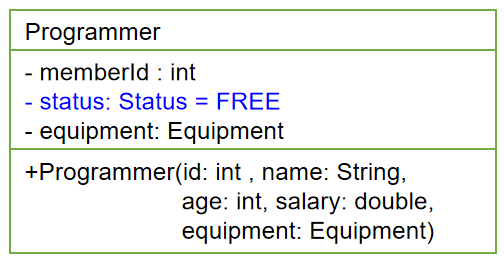
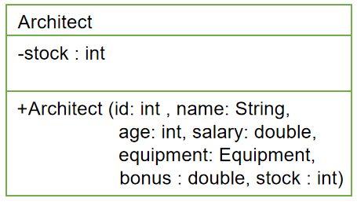
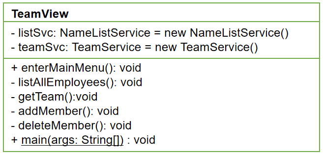

开发团队人员调度软件_改进版
==

# 目标
* 模拟实现一个基于文本界面的《开发团队调度软件》
* 熟悉Java面向对象的高级特性，进一步掌握编程技巧和调试技巧
* 主要涉及以下知识点
    * 类的继承性和多态性
    * 对象的值传递、接口
    * static和final修饰符
    * 特殊类的使用：包装类、抽象类、内部类
    * 异常处理

# 需求说明
## 该软件实现以下功能
* 软件启动时，从java文件中加载员工、设备、团队数据。
* 退出程序时自动保存数据，以java文件的String数组常量保存数据。用了比较另类的读取 和保存数据方法
* 根据菜单提示，基于现有的公司成员，组建一个开发团队以开发一个新的项目
* 组建过程包括将成员插入到团队中，或从团队中删除某成员，还可以列出团队中现有成员的列表
* 开发团队成员包括架构师、设计师和程序员
* 开发团队人员组成要求：
    * 最多一名架构师
    * 最多两名设计师
    * 最多三名程序员
* 可新建团队
* 可修改团队中成员结构

## 操作过程中数据的检测，可抛出异常
异常举例
```text
	失败信息包含以下几种：
    - 成员已满，无法添加
    - 该成员不是开发人员，无法添加
    - 该员工已在本开发团队中
    - 该员工已是某团队成员 
    - 该员正在休假，无法添加
    - 团队中至多只能有一名架构师
    - 团队中至多只能有两名设计师
    - 团队中至多只能有三名程序员
    ...
```

## 菜单示例

* 主菜单
```text
-----------------团队调度软件-----------------

a 团队管理
b 列出所有员工信息
c 招聘员工
d 员工领取设备
e 员工办理离职
f 员工休假
g 员工结束休假/重新入职
h 列出所有设备
i 添加设备
q 退       出

请选择操作项：
```

* 列出所有员工信息
```text
请选择操作项：b
-------------------------------------团队调度软件--------------------------------------

ID  	姓名              	性别  	年龄  	工资(￥)       	职位        	状态      	奖金(￥)       	股票      	领用设备
3   	马云              	男   	22  	3000.00     	普通员工      	正常      	            		       	NoteBooke{ sn: 3, model: '联想T4' }, Printer{ sn: 5, name: '39 }, 
2   	马化腾             	男   	32  	18000.00    	架构师       	已入团队    	15000.00    	2000    	
1   	李彦宏             	男   	23  	7000.00     	程序员       	已离职     	            		       	
4   	刘强东             	男   	24  	7300.00     	程序员       	已离职     	            		       	
6   	雷军              	男   	28  	10000.00    	设计师       	休假中     	5000.00     		       	
5   	任志强             	男   	22  	6800.00     	程序员       	正常      	            		       	
7   	柳传志             	男   	29  	10800.00    	设计师       	正常      	5200.00     		       	
8   	杨元庆             	男   	30  	19800.00    	架构师       	正常      	15000.00    	2500    	
9   	史玉柱             	男   	26  	9800.00     	设计师       	正常      	5500.00     		       	
10  	丁磊              	男   	21  	6600.00     	程序员       	已入团队    	            		       	
11  	张朝阳             	男   	25  	7100.00     	程序员       	已入团队    	            		       	
12  	董明珠             	女   	27  	9600.00     	设计师       	正常      	4800.00     		       	

-----------------团队调度软件-----------------

a 团队管理
b 列出所有员工信息
c 招聘员工
d 员工领取设备
e 员工办理离职
f 员工休假
g 员工结束休假/重新入职
h 列出所有设备
i 添加设备
q 退       出

请选择操作项：
```

* 列出所有设备
```text
请选择操作项：h
-----------------列出设备-----------------

SN   	状态          	使用者         	描述
3    	使用中         	马云          	NoteBooke{ sn: 3, model: '联想T4' }
1    	待用          	            	PC{ sn: 1, model: '戴尔' }
2    	待用          	            	PC{ sn: 2, model: '戴尔' }
5    	使用中         	马云          	Printer{ sn: 5, name: '39 }
4    	待用          	            	PC{ sn: 4, model: '华硕' }
6    	待用          	            	PC{ sn: 6, model: '华硕' }
7    	待用          	            	Printer{ sn: 7, name: '39 }
8    	待用          	            	NoteBooke{ sn: 8, model: '惠普m6' }
9    	待用          	            	PC{ sn: 9, model: '戴尔' }
10   	待用          	            	PC{ sn: 10, model: '华硕' }
11   	已作废         	            	NoteBooke{ sn: 11, model: '惠普m6' }
```

* 团队管理
```text
请选择操作项：a
-----------------团队管理-----------------

a 团队人力资源调度
b 列出所有团队
c 新建团队
d 删除团队
q 退出

选择操作项(回车退出)：
```

* 团队调度管理相关操作
```text
请选择操作项：a
-----------------团队管理-----------------

a 团队人力资源调度
b 列出所有团队
c 新建团队
d 删除团队
q 退出

选择操作项(回车退出)：a
-----------------共2个团队-----------------

ID    	团队名
1     	DevelopmentTeam
2     	全能队

-----------------团队调度管理-----------------

选择团队id (回车退出)：1
-----------------团队调度管理(DevelopmentTeam)-----------------
a 列出成员
b 添加成员
c 删除成员
d 查看成员结构
e 调整岗位成员预招人数
f 团队增加一个岗位
g 团队删除一个岗位
q 退出

选择操作项(回车退出)：
```

* 团队
```text
选择团队id (回车退出)：1
-----------------团队调度管理(DevelopmentTeam)-----------------
a 列出成员
b 添加成员
c 删除成员
d 查看成员结构
e 调整岗位成员预招人数
f 团队增加一个岗位
g 团队删除一个岗位
q 退出

选择操作项(回车退出)：d
-----------------DevelopmentTeam团队成员结构-----------------

岗位          	预编(个)       	实编(个)       
程序员         	5           	1           
设计师         	2           	0           
架构师         	1           	1           


-----------------团队调度管理(DevelopmentTeam)-----------------
a 列出成员
b 添加成员
c 删除成员
d 查看成员结构
e 调整岗位成员预招人数
f 团队增加一个岗位
g 团队删除一个岗位
q 退出

选择操作项(回车退出)：a
-----------------DevelopmentTeam团队成员-----------------

ID  	姓名              	性别  	年龄  	职位    	状态    
2   	马化腾             	男   	32  	架构师   	已入团队  
11  	张朝阳             	男   	25  	程序员   	已入团队  

-----------------团队调度管理(DevelopmentTeam)-----------------
a 列出成员
b 添加成员
c 删除成员
d 查看成员结构
e 调整岗位成员预招人数
f 团队增加一个岗位
g 团队删除一个岗位
q 退出

选择操作项(回车退出)：b
-------------------------------------团队调度软件--------------------------------------

ID  	姓名              	性别  	年龄  	工资(￥)       	职位        	状态      	奖金(￥)       	股票      	领用设备
3   	马云              	男   	22  	3000.00     	普通员工      	正常      	            		       	NoteBooke{ sn: 3, model: '联想T4' }, Printer{ sn: 5, name: '39 }, 
2   	马化腾             	男   	32  	18000.00    	架构师       	已入团队    	15000.00    	2000    	
1   	李彦宏             	男   	23  	7000.00     	程序员       	已离职     	            		       	
4   	刘强东             	男   	24  	7300.00     	程序员       	已离职     	            		       	
6   	雷军              	男   	28  	10000.00    	设计师       	休假中     	5000.00     		       	
5   	任志强             	男   	22  	6800.00     	程序员       	正常      	            		       	
7   	柳传志             	男   	29  	10800.00    	设计师       	正常      	5200.00     		       	
8   	杨元庆             	男   	30  	19800.00    	架构师       	正常      	15000.00    	2500    	
9   	史玉柱             	男   	26  	9800.00     	设计师       	正常      	5500.00     		       	
10  	丁磊              	男   	21  	6600.00     	程序员       	已入团队    	            		       	
11  	张朝阳             	男   	25  	7100.00     	程序员       	已入团队    	            		       	
12  	董明珠             	女   	27  	9600.00     	设计师       	正常      	4800.00     		       	

选择要添加成员的id (-1或回车退出)：3
本团队暂未设普通员工岗位，无法添加

-----------------团队调度管理(DevelopmentTeam)-----------------
a 列出成员
b 添加成员
c 删除成员
d 查看成员结构
e 调整岗位成员预招人数
f 团队增加一个岗位
g 团队删除一个岗位
q 退出

选择操作项(回车退出)：
```


# 软件设计

## 软件设计结构
该软件由以下几个模块组成
  

### 包和模块结构
* com.java.view  
模块为主控模块，负责菜单的显示，负责员工、设备、团队操作等操作提供前端展示
    * TeamView为菜单展示模块
    * TeamDispatchSystem 程序入口
    
* com.java.service  
模块为实体对象的管理模块
NameListService和TeamService类分别用各自的数组来管理公司员工和开发团队成员对象
    * EmployeesService 员工管理操作
        * 保存所有的员工信息
        * 提供员工的相关操作
    * EquipmentRepository 设备管理操作
        * 设备仓库，保存所有设备信息
        * 提供设备的相关操作
    * TeamsService 团队管理操作
        * 保存所有的团队信息
        * 提供团队的相关操作
    * Data 保存员工、设备、团队等数据
    * Storage 数据存取
        * 从文件加载数据，解析文本数据。文件类型为java，数据已 String数组常量保存
        * 从程序保存数据到文件，把程序中的数据写入到 java文件，数据已 String数组常量形式保存
    
* com.java.domain  
模块为Employee、Equipment、Team、及其他们的子类等JavaBean类所在的包

* com.java.utils  
工具模块
    * GetInput 获取输入指令
    * Magic 魔法工具

* test.com.java  
Junit单元测试

  
* com.atguigu.team.domain模块中包含了所有实体类
* 其中程序员(Programmer)及其子类，均会领用某种电子设备(Equipment)

## 第1步--创建项目基本组件
1. 完成以下工作：
    * 创建TeamSchedule项目
    * 按照设计要求，创建所有包
    * 将项目提供的几个类复制到相应的包中
	(view包中：TSUtility.java;   service包中：Data.java)
* 按照设计要求，在com.atguigu.team.domain包中，创建Equipment接 
    口及其各实现子类代码
* 按照设计要求，在com.atguigu.team.domain包中，创建Employee类
    及其各子类代码
* 检验代码的正确性

### 键盘访问的实现
* 项目view包中提供了TSUtility.java类，可用来方便地实现键盘访问。
* 该类提供了以下静态方法
```text
public static char readMenuSelection() 
	用途：该方法读取键盘，如果用户键入’1’-’4’中的任意字符，则方法返回。返回值为用户键入字符。
public static void readReturn() 
	用途：该方法提示并等待，直到用户按回车键后返回。
public static int readInt() 
	用途：该方法从键盘读取一个长度不超过2位的整数，并将其作为方法的返回值。
public static char readConfirmSelection() ：
	用途：从键盘读取‘Y’或’N’，并将其作为方法的返回值。
```

### Equipment接口及其实现子类的设计
  
* 说明
    * model 表示机器的型号
    * display 表示显示器名称
    * type 表示机器的类型
* 根据需要提供各属性的get/set方法以及重载构造器
* 实现类实现接口的方法，返回各自属性的信息

### Status类
* Status枚举类位于com.atguigu.team.service包中，封装员工的状态
```text
// Status枚举类(自定义枚举类)
package com.atguigu.team.service;

public class Status {
    private final String NAME;
    private Status(String name) {
        this.NAME = name;
    }
    public static final Status FREE = new Status("FREE");
    public static final Status VOCATION = new Status("VOCATION");
    public static final Status BUSY = new Status("BUSY");
    
    public String getNAME() {
        return NAME;
    }
    
    @Override
    public String toString() {
        return NAME;
    }
}

```

或参考 [Status类](src/com/java/domain/EmployeeStatus.java)  

### Employee类及其子类的设计
  


  
* 说明
    * memberId 用来记录成员加入开发团队后在团队中的ID
    * Status是项目service包下自定义的类，声明三个对象属性，分别表示成员的状态。
    * FREE-空闲
    * BUSY-已加入开发团队
    * VOCATION-正在休假
    * equipment 表示该成员领用的设备
* 可根据需要为类提供各属性的get/set方法以及重载构造器

  
  
* 说明
    * bonus 表示奖金
    * stock 表示公司奖励的股票数量
* 可根据需要为类提供各属性的get/set方法以及重载构造器


## 第2步--实现service包中的类
1. 按照设计要求编写NameListService类
* 在NameListService类中临时添加一个main方法中，作为单元测试方法。
* 在方法中创建NameListService对象，然后分别用模拟数据调用该对象的各个方法，以测试是否正确。
>注：测试应细化到包含了所有非正常的情况，以确保方法完全正确
* 重复1-3步，完成TeamService类的开发

### NameListService类的设计
  

* 功能：负责将Data中的数据封装到Employee[]数组中，同时提供相关操作Employee[]的方法。
* 说明
    * employees用来保存公司所有员工对象
    * NameListService()构造器：
        * 根据项目提供的Data类构建相应大小的employees数组
        * 再根据Data类中的数据构建不同的对象，
            >包括Employee、Programmer、Designer和Architect对象，以及相关联的Equipment子类的对象
        * 将对象存于数组中
        * Data类位于com.atguigu.team.service包中

    * 方法
    ```text
    getAllEmployees ()方法：获取当前所有员工
      返回：包含所有员工对象的数组
  
    getEmployee(id : int)方法：获取指定ID的员工对象
      参数：指定员工的ID
      返回：指定员工对象
      异常：找不到指定的员工
    ```
    * 在service子包下提供自定义异常类：TeamException
    * 另外，可根据需要自行添加其他方法或重载构造器

### TeamService类的设计
  

* 功能：关于开发团队成员的管理：添加、删除等。
* 说明
```text
counter：用来为开发团队新增成员自动生成团队中的唯一ID，即memberId为静态变量。（
            提示：应使用增1的方式）
            
MAX_MEMBER：表示开发团队最大成员数

team数组：用来保存当前团队中的各成员对象 

total：记录团队成员的实际人数
```

* 方法
```text
getTeam()方法：返回当前团队的所有对象
    返回：包含所有成员对象的数组，数组大小与成员人数一致
    
addMember(e: Employee)方法：向团队中添加成员
    参数：待添加成员的对象
    异常：添加失败， TeamException中包含了失败原因

removeMember(memberId: int)方法：从团队中删除成员
    参数：待删除成员的memberId
    异常：找不到指定memberId的员工，删除失败
    另外，可根据需要自行添加其他方法或重载构造器
```

## 第3步--实现view包中类
* 按照设计要求编写TeamView类，逐一实现各个方法，并编译
* 执行main方法中，测试软件全部功能

### TeamView类的设计


说明：
listSvc和teamSvc属性：供类中的方法使用
enterMainMenu ()方法：主界面显示及控制方法。
以下方法仅供enterMainMenu()方法调用：
listAllEmployees ()方法：以表格形式列出公司所有成员
getTeam()方法：显示团队成员列表操作
addMember ()方法：实现添加成员操作
deleteMember ()方法：实现删除成员操作


