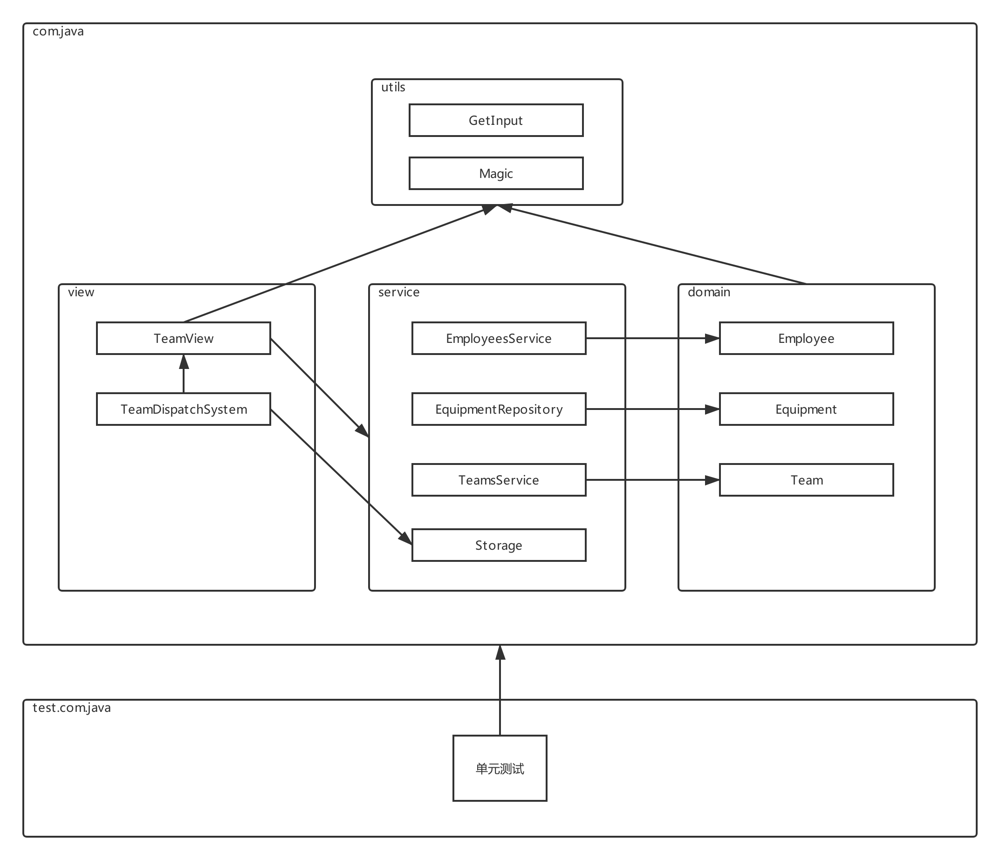
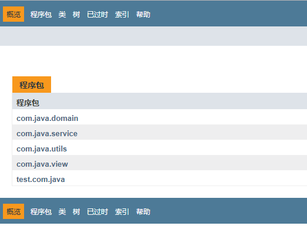
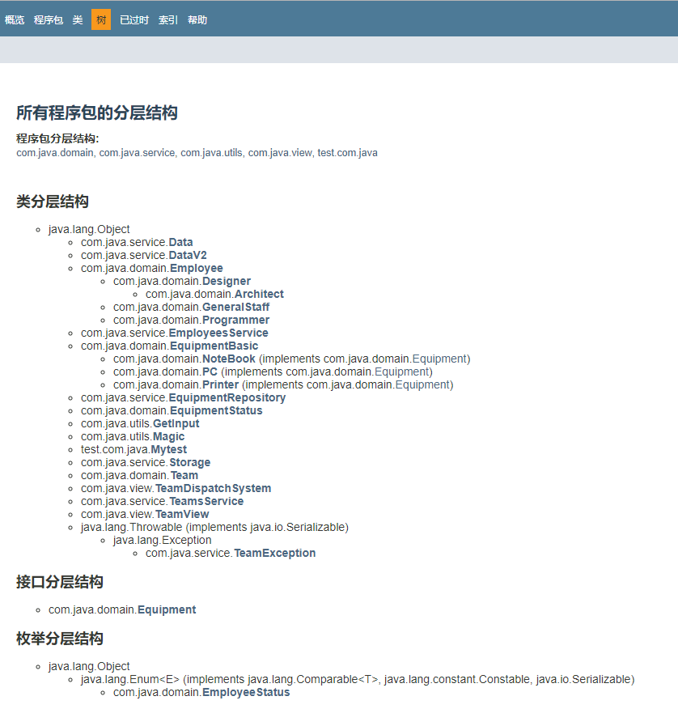
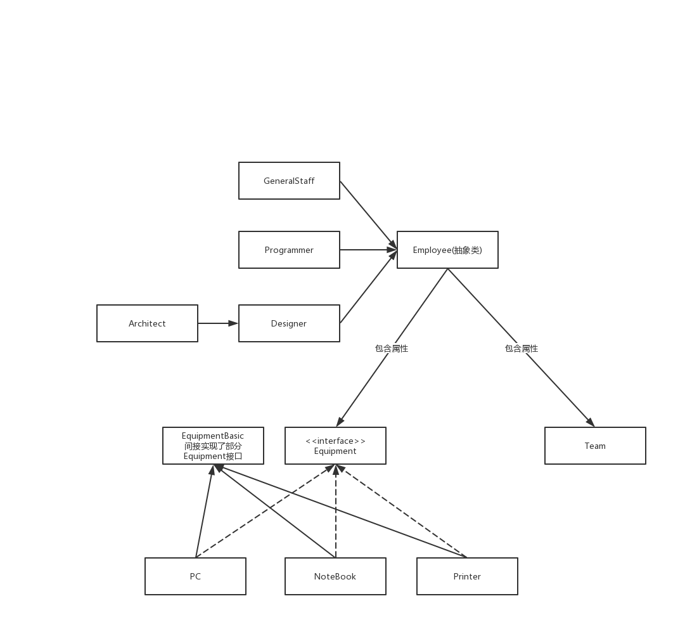

开发团队人员调度软件_改进版
==

# 目标
* 模拟实现一个基于文本界面的《开发团队调度软件》
* 熟悉Java面向对象的高级特性，进一步掌握编程技巧和调试技巧
* 主要涉及以下知识点
    * 类的继承性和多态性
    * 对象的值传递、接口
    * static和final修饰符
    * 特殊类的使用：包装类、抽象类、内部类
    * 异常处理

# 需求说明
## 该软件实现以下功能
* 软件启动时，从java文件中加载员工、设备、团队数据。
* 退出程序时自动保存数据，以java文件的String数组常量保存数据。用了比较另类的读取 和保存数据方法
* 根据菜单提示，基于现有的公司成员，组建一个开发团队以开发一个新的项目
* 组建过程包括将成员插入到团队中，或从团队中删除某成员，还可以列出团队中现有成员的列表
* 开发团队成员包括架构师、设计师和程序员
* 开发团队人员组成要求：
    * 最多一名架构师
    * 最多两名设计师
    * 最多三名程序员
* 可新建团队
* 可修改团队中成员结构

## 操作过程中数据的检测，可抛出异常
异常举例
```text
	失败信息包含以下几种：
    - 成员已满，无法添加
    - 该成员不是开发人员，无法添加
    - 该员工已在本开发团队中
    - 该员工已是某团队成员 
    - 该员正在休假，无法添加
    - 团队中至多只能有一名架构师
    - 团队中至多只能有两名设计师
    - 团队中至多只能有三名程序员
    ...
```

## 菜单示例

* 主菜单
```text
-----------------团队调度软件-----------------

a 团队管理
b 列出所有员工信息
c 招聘员工
d 员工领取设备
e 员工办理离职
f 员工休假
g 员工结束休假/重新入职
h 列出所有设备
i 添加设备
q 退       出

请选择操作项：
```

* 列出所有员工信息
```text
请选择操作项：b
-------------------------------------团队调度软件--------------------------------------

ID  	姓名              	性别  	年龄  	工资(￥)       	职位        	状态      	奖金(￥)       	股票      	领用设备
3   	马云              	男   	22  	3000.00     	普通员工      	正常      	            		       	NoteBooke{ sn: 3, model: '联想T4' }, Printer{ sn: 5, name: '39 }, 
2   	马化腾             	男   	32  	18000.00    	架构师       	已入团队    	15000.00    	2000    	
1   	李彦宏             	男   	23  	7000.00     	程序员       	已离职     	            		       	
4   	刘强东             	男   	24  	7300.00     	程序员       	已离职     	            		       	
6   	雷军              	男   	28  	10000.00    	设计师       	休假中     	5000.00     		       	
5   	任志强             	男   	22  	6800.00     	程序员       	正常      	            		       	
7   	柳传志             	男   	29  	10800.00    	设计师       	正常      	5200.00     		       	
8   	杨元庆             	男   	30  	19800.00    	架构师       	正常      	15000.00    	2500    	
9   	史玉柱             	男   	26  	9800.00     	设计师       	正常      	5500.00     		       	
10  	丁磊              	男   	21  	6600.00     	程序员       	已入团队    	            		       	
11  	张朝阳             	男   	25  	7100.00     	程序员       	已入团队    	            		       	
12  	董明珠             	女   	27  	9600.00     	设计师       	正常      	4800.00     		       	

-----------------团队调度软件-----------------

a 团队管理
b 列出所有员工信息
c 招聘员工
d 员工领取设备
e 员工办理离职
f 员工休假
g 员工结束休假/重新入职
h 列出所有设备
i 添加设备
q 退       出

请选择操作项：
```

* 列出所有设备
```text
请选择操作项：h
-----------------列出设备-----------------

SN   	状态          	使用者         	描述
3    	使用中         	马云          	NoteBooke{ sn: 3, model: '联想T4' }
1    	待用          	            	PC{ sn: 1, model: '戴尔' }
2    	待用          	            	PC{ sn: 2, model: '戴尔' }
5    	使用中         	马云          	Printer{ sn: 5, name: '39 }
4    	待用          	            	PC{ sn: 4, model: '华硕' }
6    	待用          	            	PC{ sn: 6, model: '华硕' }
7    	待用          	            	Printer{ sn: 7, name: '39 }
8    	待用          	            	NoteBooke{ sn: 8, model: '惠普m6' }
9    	待用          	            	PC{ sn: 9, model: '戴尔' }
10   	待用          	            	PC{ sn: 10, model: '华硕' }
11   	已作废         	            	NoteBooke{ sn: 11, model: '惠普m6' }
```

* 团队管理
```text
请选择操作项：a
-----------------团队管理-----------------

a 团队人力资源调度
b 列出所有团队
c 新建团队
d 删除团队
q 退出

选择操作项(回车退出)：
```

* 团队调度管理相关操作
```text
请选择操作项：a
-----------------团队管理-----------------

a 团队人力资源调度
b 列出所有团队
c 新建团队
d 删除团队
q 退出

选择操作项(回车退出)：a
-----------------共2个团队-----------------

ID    	团队名
1     	DevelopmentTeam
2     	全能队

-----------------团队调度管理-----------------

选择团队id (回车退出)：1
-----------------团队调度管理(DevelopmentTeam)-----------------
a 列出成员
b 添加成员
c 删除成员
d 查看成员结构
e 调整岗位成员预招人数
f 团队增加一个岗位
g 团队删除一个岗位
q 退出

选择操作项(回车退出)：
```

* 团队
```text
选择团队id (回车退出)：1
-----------------团队调度管理(DevelopmentTeam)-----------------
a 列出成员
b 添加成员
c 删除成员
d 查看成员结构
e 调整岗位成员预招人数
f 团队增加一个岗位
g 团队删除一个岗位
q 退出

选择操作项(回车退出)：d
-----------------DevelopmentTeam团队成员结构-----------------

岗位          	预编(个)       	实编(个)       
程序员         	5           	1           
设计师         	2           	0           
架构师         	1           	1           


-----------------团队调度管理(DevelopmentTeam)-----------------
a 列出成员
b 添加成员
c 删除成员
d 查看成员结构
e 调整岗位成员预招人数
f 团队增加一个岗位
g 团队删除一个岗位
q 退出

选择操作项(回车退出)：a
-----------------DevelopmentTeam团队成员-----------------

ID  	姓名              	性别  	年龄  	职位    	状态    
2   	马化腾             	男   	32  	架构师   	已入团队  
11  	张朝阳             	男   	25  	程序员   	已入团队  

-----------------团队调度管理(DevelopmentTeam)-----------------
a 列出成员
b 添加成员
c 删除成员
d 查看成员结构
e 调整岗位成员预招人数
f 团队增加一个岗位
g 团队删除一个岗位
q 退出

选择操作项(回车退出)：b
-------------------------------------团队调度软件--------------------------------------

ID  	姓名              	性别  	年龄  	工资(￥)       	职位        	状态      	奖金(￥)       	股票      	领用设备
3   	马云              	男   	22  	3000.00     	普通员工      	正常      	            		       	NoteBooke{ sn: 3, model: '联想T4' }, Printer{ sn: 5, name: '39 }, 
2   	马化腾             	男   	32  	18000.00    	架构师       	已入团队    	15000.00    	2000    	
1   	李彦宏             	男   	23  	7000.00     	程序员       	已离职     	            		       	
4   	刘强东             	男   	24  	7300.00     	程序员       	已离职     	            		       	
6   	雷军              	男   	28  	10000.00    	设计师       	休假中     	5000.00     		       	
5   	任志强             	男   	22  	6800.00     	程序员       	正常      	            		       	
7   	柳传志             	男   	29  	10800.00    	设计师       	正常      	5200.00     		       	
8   	杨元庆             	男   	30  	19800.00    	架构师       	正常      	15000.00    	2500    	
9   	史玉柱             	男   	26  	9800.00     	设计师       	正常      	5500.00     		       	
10  	丁磊              	男   	21  	6600.00     	程序员       	已入团队    	            		       	
11  	张朝阳             	男   	25  	7100.00     	程序员       	已入团队    	            		       	
12  	董明珠             	女   	27  	9600.00     	设计师       	正常      	4800.00     		       	

选择要添加成员的id (-1或回车退出)：3
本团队暂未设普通员工岗位，无法添加

-----------------团队调度管理(DevelopmentTeam)-----------------
a 列出成员
b 添加成员
c 删除成员
d 查看成员结构
e 调整岗位成员预招人数
f 团队增加一个岗位
g 团队删除一个岗位
q 退出

选择操作项(回车退出)：
```


# 软件设计

## API JavaDOC文档
[API文档](./apiDoc/index.html)

## 软件设计结构
该软件由以下几个模块组成
  

### 包和模块结构
  


  

* com.java.view  
模块为主控模块，负责菜单的显示，负责员工、设备、团队操作等操作提供前端展示
    * TeamView为菜单展示模块
    * TeamDispatchSystem 程序入口
    
* com.java.service  
模块为实体对象的管理模块
NameListService和TeamService类分别用各自的数组来管理公司员工和开发团队成员对象
    * EmployeesService 员工管理操作
        * 保存所有的员工信息
        * 提供员工的相关操作
    * EquipmentRepository 设备管理操作
        * 设备仓库，保存所有设备信息
        * 提供设备的相关操作
    * TeamsService 团队管理操作
        * 保存所有的团队信息
        * 提供团队的相关操作
    * Data 保存员工、设备、团队等数据
    * Storage 数据存取
        * 从文件加载数据，解析文本数据。文件类型为java，数据已 String数组常量保存
        * 从程序保存数据到文件，把程序中的数据写入到 java文件，数据已 String数组常量形式保存
    
* com.java.domain  
模块为Employee、Equipment、Team、及其他们的子类等JavaBean类所在的包

* com.java.utils  
工具模块
    * GetInput 获取输入指令
    * Magic 魔法工具

* test.com.java  
Junit单元测试


# 类继承和实现关系  
  

## 第1步--test.com.java包创建单元测试
创建测试类Mytest

## 第2步--创建项目基本组件
1. 完成以下工作：
    * 创建TeamSchedule项目
    * 按照设计要求，创建所有包
    
* 按照设计要求，在com.java.domain包中，  
创建Equipment接口及其各实现子类代码
* 按照设计要求，在com.atguigu.team.domain包中，  
创建Employee类及其各子类代码
* 检验代码的正确性

### 键盘访问的实现
* 项目utils包中提供了GetInput.java类，可用来方便地实现键盘访问。
* 该类提供了以下静态方法
```text
static int	getAge()	 
                获取年龄
static int	getAge​(String s)	 
                字符串转成年龄
static String	getEmail()	 
                获取邮箱地址
static String	getEmail​(String s)	 
                字符串转成邮箱地址
static boolean	getIsYes()	 
                获取是否为确定命令
static String	getName()	 
                获取名字    
static int	getNumber()	
                获取数字 
static int	getNumber​(String s)	 
                字符串转成数字
static String	getRaw()	 
                获取原生输入的字符，返回的结果做了去除首尾空格处理
static boolean	getSex()	 
                获取性别
static boolean	getSex​(String s)	 
                字符串转成性别
static boolean	isDigital​(String s)	 
                判断指定的字符串是否为数字
static boolean	isExit​(String s)
                判断指定的字符串是退出指令

```

### Equipment接口及其实现子类的设计

|\<\<interface>> |
|:---|
|+ getDescription():String <br>+ getSn():int <br>+ getStatus():EquipmentStatus <br>+ getUser():Employee <br>+ setStatus​(EquipmentStatus status):void <br>+ setUser​(Employee employee):void    |


| PC |
| :--- |
| - model:String <br>- display:String |
| + PC(model:String, display:String) <br>+ PC(sn:int, model:String, display:String, status:EquipmentStatus) throws TeamException |

| NoteBook |
| :--- |
| - model:String <br>- price:double |
| + PC(model:String, display:String) <br>+ PC(sn:int, model:String, display:String, status:EquipmentStatus) throws TeamException |

| Printer |
| :--- |
| - name:String <br>- type:String |
| + Printer(name:String, type:String) <br>+ Printer(sn:int, name:String, type:String, status:EquipmentStatus) throws TeamException |


* 说明
    * model 表示机器的型号
    * display 表示显示器名称
    * type 表示机器的类型
* 根据需要提供各属性的get/set方法以及重载构造器
* 实现类实现接口的方法，返回各自属性的信息

### EmployeeStatus类
* EmployeeStatus类枚举类位于com.java.domain包中，封装员工的状态
```text
// EmployeeStatus类(自定义枚举类)
package com.java.domain;

public enum EmployeeStatus {
    // 类实例，且是类常量
    FREE("FREE", "正常"), // 正常，未加入团队
    BUSY("BUSY", "已入团队"), // 已经加入团队
    VOCATION("VOCATION", "休假中"), // 休假中
    RESIGNED("RESIGNED", "已离职"); // 已离职

    // 属性
    private final String NAME;
    private final String DISCRIPTION;

    // 构造器
    EmployeeStatus(String name, String discription) {
        this.NAME = name;
        this.DISCRIPTION = discription;
    };

    // 方法
    public String getName() {
        return NAME;
    }

    public String getDiscription() {
        return DISCRIPTION;
    }

    @Override
    public String toString() {
        return NAME;
    }
}

```

或参考 [EmployeeStatus类](src/com/java/domain/EmployeeStatus.java)  

### Employee类及其子类的设计

| Employee (abstract类) |
|:---  |
| - age: int <br>- equipment: LinkedList<Equipment> <br>- id: int   <br>- static init: int  <br>- name: String  <br>- salary: double <br>- sex: boolean  <br>- status: EmployeeStatus = FREE   <br>- team: Team |
| + Employee()	 <br>+ Employee​(id:int, name:String, sex:boolean, age:int, salary:double)	 <br>+ Employee​(name:String, sex:boolean, age:int, salary:double)	 <br>+ Employee​(name:String, age:int, salary:double) |
| + equals​(Object o):boolean  <br> + getAge(): int  <br> + abstract getDescription(): String  <br> + getEquipment(): LinkedList<Equipment>  <br> + getEquipmentIdToString(): String  <br> + getFields(): String  <br> + getId(): int  <br> + static getInit(): int  <br> + getName(): String  <br> + getPost():String  	 <br> + getSalary(): double  	 <br> + getSex(): boolean  	 <br> + getStatus(): EmployeeStatus  	 <br> + getTeam(): Team  	 <br> + hashCode(): int  	 <br> - initIncrement(): void  	 <br> + joinTeam​(Team team): boolean  	 <br> + listEquipment(): String  	 <br> + quitTeam(): void  	 <br> + receiveEquipment​(Equipment aEquipment): boolean  <br> + recycleEquipment​(Equipment aEquipment): boolean  <br> + resignation(): boolean   <br> + resumeToWork(): boolean  <br> + setAge​(int age): void  	 <br> + static setInit​(int init): void  	 <br> + setName​(String name): void  <br> + setSalary​(double salary): void  <br> + setSex​(boolean sex): void  <br> + setStatus​(EmployeeStatus status): void  <br> + setTeam​(Team team): void  <br> + sexString(): String  <br> + toString(): String  <br> + vocation(): boolean  |  


| GeneralStaff |
|:---  |
| . |
| + GeneralStaff​(int id, String name, boolean sex, int age, double salary)	 <br> + GeneralStaff​(name:String, sex:boolean, age:int, salary:double)	 <br> + GeneralStaff​(name:String, age:int, salary:double) |
| + getDescription(): String |


| Programmer |
|:---  |
| -	skill: String |
| + Programmer​(int id, String name, boolean sex, int age, double salary, String skill)	 <br> + Programmer​(name:String, sex:boolean, age:int, salary:double)	 <br> + Programmer​(name:String, sex:boolean, age:int, salary:double, skill:String)	 <br> + Programmer​(name:String, age:int, salary:double)|
| + getDescription(): String |

| Designer |
|:--- |
| - bonus: double |
| + Designer​(id:int, name:String, sex:boolean, age:int, salary:double, bonus:double)	 <br> + Designer​(name:String, sex:boolean, age:int, salary:double)	 <br> + Designer​(name:String, sex:boolean, age:int, salary:double, bonus:double)	 <br> + Designer​(name:String, age:int, salary:double) |
| + getBonus(): double	 <br> + getDescription(): String	 <br> + setBonus​(double bonus): void	 <br> + toString(): String  |

| Architect |
|:--- |
| - stock: int |
| + Architect​(int id, name:String, sex:boolean, age:int, salary:double, bonus:double, stock:int)	 <br> + Architect​(name:String, sex:boolean, age:int, salary:double, bonus:double, stock:int)	 <br> + Architect​(name:String, sex:boolean, age:int, salary:double)	 <br> + Architect​(name:String, age:, salary:double) |
| + getDescription(): String	 <br> + getStock(): int	 <br> + setStock​(int stock): void	 <br> + toString(): String |


* 说明
    * EmployeeStatus是项目domain包下自定义的类，声明三个对象属性，分别表示成员的状态。
    * FREE-空闲
    * BUSY-已加入开发团队
    * VOCATION-正在休假
    * equipment 表示该成员领用的所有设备
    * 可根据需要为类提供各属性的get/set方法以及重载构造器
    * bonus 表示奖金
    * stock 表示公司奖励的股票数量


### Team类的设计
| Team |
| :--- |
| -	id: int	 <br> - static init: int	 <br> - members: LinkedList<Employee>	 <br> - membersStructor: LinkedHashMap<Class,​HashMap>	 <br> - name: String |
| + Team()	 <br> + Team​(id:int, name:String, membersStructor:LinkedHashMap<Class,​HashMap>)	 <br> + Team​(name:String)	 <br> + Team​(name:String, membersStructor:LinkedHashMap<Class,​HashMap>) |
| + addMember​(int memberId): boolean	 <br> + addMember​(Employee member): boolean	 <br> + addPostToMmbersStructor​(Class post, HashMap postRequirements): boolean	 <br> + deletePostFromMmbersStructor​(Class post): boolean	 <br> + equals​(Object o): boolean	 <br> + getId(): int	 <br> + static getInit(): int	 <br> + getMembers(): LinkedList<Employee>	 <br> + getMembersCount(): int	 <br> + getMembersStructor(): LinkedHashMap<Class,​HashMap>	 <br> + getName(): 	 <br> + getPostRequirements​(Class post): HashMap	 <br> + hashCode(): int	 <br> + idProcess(): void	 <br> + modifyPostMembersStructor​(Class post, HashMap postRequirements): boolean	 <br> + modifyTeamPostMax​(Class post, int num): boolean	 <br> + postCheck​(Employee member): int	 <br> + removeMember​(int memberId): boolean	 <br> + removeMember​(Employee member): boolean	 <br> + static setInit​(int init): void	 <br> + setMembersStructor​(LinkedHashMap<Class,​HashMap> membersStructor): void	 <br> + setName​(String name): void	 <br> + showMembers(): String	 <br> + showMembersStructor(): String	 <br> + toString(): String |


## 第3步--实现service包中的类
1. 按照设计要求编写EmployeesService类
* 在单元测试中创建EmployeesService对象，然后分别用模拟数据调用该对象的各个方法，以测试是否正确。
>注：测试应细化到包含了所有非正常的情况，以确保方法完全正确
* 重复1-3步，完成EmployeesService类的开发

### EmployeesService类的设计

| EmployeesService |
|:--- |
| - static employees: LinkedList\<Employee> |
| + EmployeesService() |
| + static addEmployee​(Employee employee): boolean	 <br> + static getAllEmployees(): LinkedList<Employee>	 <br> + static getEmployee​(int id): Employee	 <br> + static getEmployee​(String name): Employee[]	 <br> + static getEmployees(): LinkedList<Employee>	 <br> + receiveEquipment​(int employeeId, int equipmentId): void	 <br> + receiveEquipment​(Employee employee, Equipment equipment): void	 <br> + static resignation​(int employeeId): void	 <br> + static resignation​(Employee employee): void  |


* 功能：负责将Data中的数据封装到Employee[]数组中，同时提供相关操作Employee[]的方法。
* 说明
    * employees用来保存公司所有员工对象
    * 在service子包下提供自定义异常类：TeamException
    * 另外，可根据需要自行添加其他方法或重载构造器

### TeamsService类的设计

| TeamsService |
| :--- |
| - static teams: LinkedList<Team> |
| + TeamsService() |
| + addTeam​(Team team): boolean	 <br> + deleteTeam​(int teamId): boolean	 <br> + deleteTeam​(Team team): boolean	 <br> + getTeam​(int teamId): Team	 <br> + getTeams(): LinkedList<Team>		 <br> + getTeamsCount(): int |


* 功能：
    * 保存所有团队信息，
    * 提供对团队的管理操作


* 方法
```text
addTeam​(Team team): boolean 方法：添加指定的团队
    返回：本次操作的状态，true/false
    异常：当team为null是，报传入的team无效
    
deleteTeam​(int teamId): boolean 方法：删除指定id的团队
    参数：指定id的团队
    异常：删除失败， TeamException中包含了失败原因
    
deleteTeam​(Team team): boolean 方法：删除指定团队
    参数：指定的团队
    异常：删除失败， TeamException中包含了失败原因

getTeam​(int teamId): Team 方法：获取指定id的团队
        参数：指定id的团队
        异常：删除失败， TeamException中包含了失败原因

getTeams(): LinkedList 方法：获取保存团队信息的teams

getTeamsCount(): int 方法：获取teams保存的客户数量
    

```

### Storage类的设计
* 功能
    1. 从文件加载数据，解析文本数据。文件类型为java，数据已 String数组常量保存
    * 从程序保存数据到文件，把程序中的数据写入到 java文件，数据已 String数组常量形式保存
    
| Storage |
| :--- |
| - static documentHead: String	 <br> - static documentTail: String	 <br> - static equipmentRepository: EquipmentRepository	 <br> - static filePath: String	 <br> - static listService: EmployeesService	 <br> - static teamsService: TeamsService |
| Storage() |
| - static employeeGeneralFieldToString​(Employee e): String	 <br> + static read(): void	 <br> - static readEmployees(): void	 <br> - static readEquipment(): void	 <br> - static readTeams(): void	 <br> - static receiveEquipment​(String equipmentString, Employee employee): void	 <br> - static restoreEmployee​(Employee employee, int teamId, String equipmentString, EmployeeStatus status): void	 <br> + static save(): void	 <br> - static saveEployees(): String	 <br> - static saveEquipment(): String	 <br> - static saveTeams(): String	 <br> - static teamMembersStructorToString​(Team team): String |

## 第3步--实现view包中类
* 按照设计要求编写TeamView类，逐一实现各个方法，并编译
* 执行TeamDispatchSystem的main方法中，测试软件全部功能

### TeamView类的设计

| TeamView |
| :--- |
| - static equipmentRepository: EquipmentRepository	 <br> - static listService: EmployeesService	 <br> - static teamsService: TeamsService |
| + TeamView() |
| + addEquipment(): void	 <br> + addMemberToTeam​(Team team): void	 <br> + addTeam(): void	 <br> + addTeamPost​(Team team): void	 <br> + checkTeamIsNull​(Team team): boolean	 <br> + deleteMemterFromTeam​(Team team): void	 <br> + deleteTeam(): void	 <br> + deleteTeamPost​(Team team): void	 <br> + enterMainMenu(): void	 <br> - listAllEmployees(): void	 <br> + listAllEquipment(): void	 <br> + listAllTeams(): void	 <br> + listAteamMembers​(Team team): void	 <br> + listTeamMembersStructor​(Team team): void	 <br> + modifyTeamPostMax​(Team team): void	 <br> + printMainMenu(): void	 <br> + printTeamMenu​(Team team): void	 <br> + receiveEquipment(): void	 <br> + recruitingStaff(): void	 <br> + resignation(): void	 <br> + resumeToWork(): void	 <br> + teamDispatch(): void	 <br> + teamsMenu(): void	 <br> + vocation(): void	 |

* 说明：
    * 属性listService：员工管理服务，保存了所有的员工信息
    * 属性equipmentRepository: 设备管理服务，保存了所有的设备信息
    * 属性teamsService: 团队管理服务，保存了所有的团队信息
    * enterMainMenu(): void 方法：主界面显示及控制方法。
    * listAllEmployees(): void 方法：以表格形式列出公司所有成员
    * listAteamMembers​(Team team): void 方法：显示团队成员列表操作
    * teamDispatch(): void 方法：团队调度操作
    * vocation(): void 方法：员工休假

