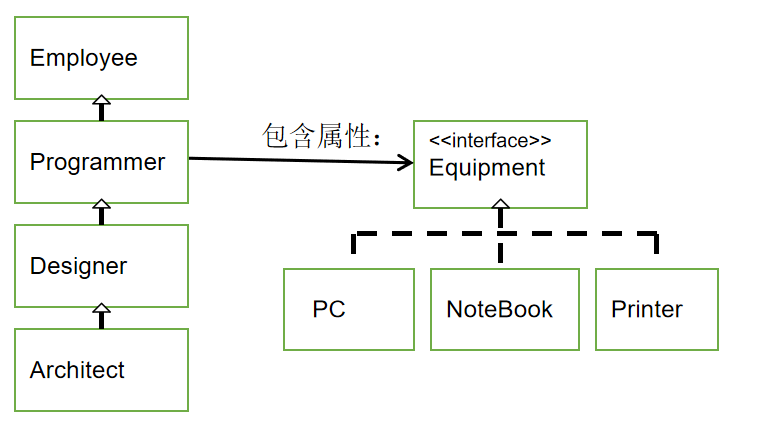
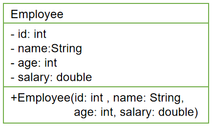
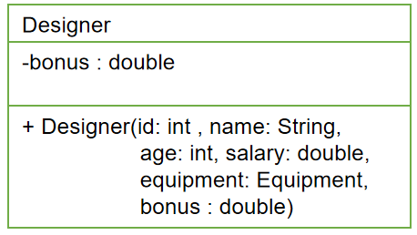
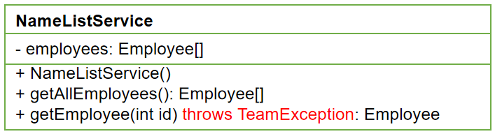
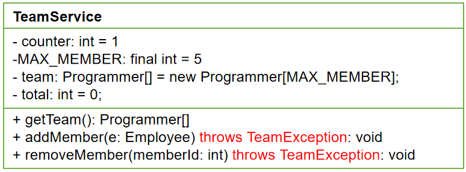

开发团队人员调度软件
==

# 目标
* 模拟实现一个基于文本界面的《开发团队调度软件》
* 熟悉Java面向对象的高级特性，进一步掌握编程技巧和调试技巧
* 主要涉及以下知识点
    * 类的继承性和多态性
    * 对象的值传递、接口
    * static和final修饰符
    * 特殊类的使用：包装类、抽象类、内部类
    * 异常处理

# 需求说明
## 该软件实现以下功能
* 软件启动时，根据给定的数据创建公司部分成员列表（数组）
* 根据菜单提示，基于现有的公司成员，组建一个开发团队以开发一个新的项目
* 组建过程包括将成员插入到团队中，或从团队中删除某成员，还可以列出团队中现有成员的列表
* 开发团队成员包括架构师、设计师和程序员
* 开发团队人员组成要求：
    * 最多一名架构师
    * 最多两名设计师
    * 最多三名程序员
## 功能详情
* 本软件采用单级菜单方式工作。当软件运行时，主界面显示公司成员的列表，如下
```text
-------------------------------------开发团队调度软件--------------------------------------

ID     姓名      年龄    工资         职位      状态      奖金        股票     领用设备
1      马 云     22      3000.0
2      马化腾    32      18000.0      架构师    FREE      15000.0     2000     联想T4(6000.0)
3      李彦宏    23      7000.0       程序员    FREE                           戴尔(NEC17寸)
4      刘强东    24      7300.0       程序员    FREE                           戴尔(三星 17寸)
5      雷军      28      10000.0      设计师    FREE      5000.0               佳能 2900(激光)
 ……
----------------------------------------------------------------------------------------------
1-团队列表  2-添加团队成员  3-删除团队成员 4-退出   请选择(1-4)： _

```

* 当选择“添加团队成员”菜单时，将执行从列表中添加指定（通过ID）成员到开发团队的功能
```text
1-团队列表  2-添加团队成员  3-删除团队成员  4-退出   请选择(1-4)：2

---------------------添加成员---------------------
请输入要添加的员工ID：2
添加成功
按回车键继续...
```

* 添加成功后，按回车键将重新显示主界面
```text
开发团队人员组成要求：
    - 最多一名架构师
    - 最多两名设计师
    - 最多三名程序员

```

* 如果添加操作因某种原因失败，将显示类似以下信息（失败原因视具体原因而不同）
```text
1-团队列表  2-添加团队成员  3-删除团队成员 4-退出   请选择(1-4)：2

---------------------添加成员---------------------
请输入要添加的员工ID：2
添加失败，原因：该员工已是某团队成员
按回车键继续...
	失败信息包含以下几种：
    - 成员已满，无法添加
    - 该成员不是开发人员，无法添加
    - 该员工已在本开发团队中
    - 该员工已是某团队成员 
    - 该员正在休假，无法添加
    - 团队中至多只能有一名架构师
    - 团队中至多只能有两名设计师
    - 团队中至多只能有三名程序员

```

* 当选择“删除团队成员”菜单时，将执行从开发团队中删除指定（通过TeamID）成员的功能：
```text
1-团队列表  2-添加团队成员  3-删除团队成员 4-退出   请选择(1-4)：3

---------------------删除成员---------------------
请输入要删除员工的TID：1
确认是否删除(Y/N)：y
删除成功
按回车键继续...

删除成功后，按回车键将重新显示主界面。

```

* 当选择“团队列表”菜单时，将列出开发团队中的现有成员，例如：
```text
1-团队列表  2-添加团队成员  3-删除团队成员 4-退出   请选择(1-4)：1

--------------------团队成员列表---------------------

TDI/ID  姓名    年龄      工资       职位      奖金        股票
2/4     刘强东  24        7300.0     程序员
3/2     马化腾  32        18000.0    架构师    15000.0     2000
4/6     任志强  22        6800.0     程序员
5/12    杨致远  27        600.0      设计师    4800.0
-----------------------------------------------------

```


# 软件设计

## 软件设计结构
* 该软件由以下三个模块组成
  

* com.atguigu.team.view模块为主控模块，负责菜单的显示和处理用户操作
* com.atguigu.team.service模块为实体对象（Employee及其子类如程序员等）的管理模块， 
NameListService和TeamService类分别用各自的数组来管理公司员工和开发团队成员对象
* domain模块为Employee及其子类等JavaBean类所在的包

  
* com.atguigu.team.domain模块中包含了所有实体类
* 其中程序员(Programmer)及其子类，均会领用某种电子设备(Equipment)

## 第1步--创建项目基本组件
1. 完成以下工作：
    * 创建TeamSchedule项目
    * 按照设计要求，创建所有包
    * 将项目提供的几个类复制到相应的包中
	(view包中：TSUtility.java;   service包中：Data.java)
* 按照设计要求，在com.atguigu.team.domain包中，创建Equipment接 
    口及其各实现子类代码
* 按照设计要求，在com.atguigu.team.domain包中，创建Employee类
    及其各子类代码
* 检验代码的正确性

### 键盘访问的实现
* 项目view包中提供了TSUtility.java类，可用来方便地实现键盘访问。
* 该类提供了以下静态方法
```text
public static char readMenuSelection() 
	用途：该方法读取键盘，如果用户键入’1’-’4’中的任意字符，则方法返回。返回值为用户键入字符。
public static void readReturn() 
	用途：该方法提示并等待，直到用户按回车键后返回。
public static int readInt() 
	用途：该方法从键盘读取一个长度不超过2位的整数，并将其作为方法的返回值。
public static char readConfirmSelection() ：
	用途：从键盘读取‘Y’或’N’，并将其作为方法的返回值。
```

### Equipment接口及其实现子类的设计
  
* 说明
    * model 表示机器的型号
    * display 表示显示器名称
    * type 表示机器的类型
* 根据需要提供各属性的get/set方法以及重载构造器
* 实现类实现接口的方法，返回各自属性的信息

### Status类
* Status枚举类位于com.atguigu.team.service包中，封装员工的状态
```text
// Status枚举类(自定义枚举类)
package com.atguigu.team.service;

public class Status {
    private final String NAME;
    private Status(String name) {
        this.NAME = name;
    }
    public static final Status FREE = new Status("FREE");
    public static final Status VOCATION = new Status("VOCATION");
    public static final Status BUSY = new Status("BUSY");
    
    public String getNAME() {
        return NAME;
    }
    
    @Override
    public String toString() {
        return NAME;
    }
}

```

或参考 [Status类](src/com/java/service/EmployeeStatus.java)  

### Employee类及其子类的设计
  


  
* 说明
    * memberId 用来记录成员加入开发团队后在团队中的ID
    * Status是项目service包下自定义的类，声明三个对象属性，分别表示成员的状态。
    * FREE-空闲
    * BUSY-已加入开发团队
    * VOCATION-正在休假
    * equipment 表示该成员领用的设备
* 可根据需要为类提供各属性的get/set方法以及重载构造器

  
  
* 说明
    * bonus 表示奖金
    * stock 表示公司奖励的股票数量
* 可根据需要为类提供各属性的get/set方法以及重载构造器


## 第2步--实现service包中的类
1. 按照设计要求编写NameListService类
* 在NameListService类中临时添加一个main方法中，作为单元测试方法。
* 在方法中创建NameListService对象，然后分别用模拟数据调用该对象的各个方法，以测试是否正确。
>注：测试应细化到包含了所有非正常的情况，以确保方法完全正确
* 重复1-3步，完成TeamService类的开发

### NameListService类的设计
  

* 功能：负责将Data中的数据封装到Employee[]数组中，同时提供相关操作Employee[]的方法。
* 说明
    * employees用来保存公司所有员工对象
    * NameListService()构造器：
        * 根据项目提供的Data类构建相应大小的employees数组
        * 再根据Data类中的数据构建不同的对象，
            >包括Employee、Programmer、Designer和Architect对象，以及相关联的Equipment子类的对象
        * 将对象存于数组中
        * Data类位于com.atguigu.team.service包中

    * 方法
    ```text
    getAllEmployees ()方法：获取当前所有员工
      返回：包含所有员工对象的数组
  
    getEmployee(id : int)方法：获取指定ID的员工对象
      参数：指定员工的ID
      返回：指定员工对象
      异常：找不到指定的员工
    ```
    * 在service子包下提供自定义异常类：TeamException
    * 另外，可根据需要自行添加其他方法或重载构造器

### TeamService类的设计
  

* 功能：关于开发团队成员的管理：添加、删除等。
* 说明
```text
counter：用来为开发团队新增成员自动生成团队中的唯一ID，即memberId为静态变量。（
            提示：应使用增1的方式）
            
MAX_MEMBER：表示开发团队最大成员数

team数组：用来保存当前团队中的各成员对象 

total：记录团队成员的实际人数
```

* 方法
```text
getTeam()方法：返回当前团队的所有对象
    返回：包含所有成员对象的数组，数组大小与成员人数一致
    
addMember(e: Employee)方法：向团队中添加成员
    参数：待添加成员的对象
    异常：添加失败， TeamException中包含了失败原因

removeMember(memberId: int)方法：从团队中删除成员
    参数：待删除成员的memberId
    异常：找不到指定memberId的员工，删除失败
    另外，可根据需要自行添加其他方法或重载构造器
```

## 第3步--实现view包中类
* 按照设计要求编写TeamView类，逐一实现各个方法，并编译
* 执行main方法中，测试软件全部功能

### TeamView类的设计


说明：
listSvc和teamSvc属性：供类中的方法使用
enterMainMenu ()方法：主界面显示及控制方法。
以下方法仅供enterMainMenu()方法调用：
listAllEmployees ()方法：以表格形式列出公司所有成员
getTeam()方法：显示团队成员列表操作
addMember ()方法：实现添加成员操作
deleteMember ()方法：实现删除成员操作


