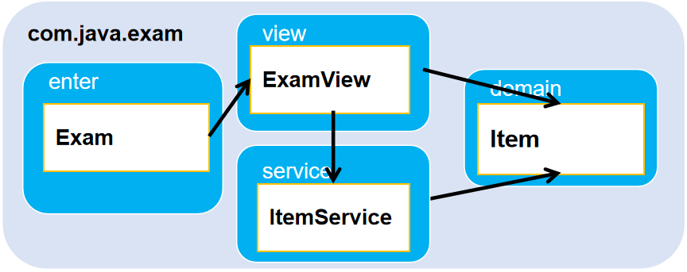

单机考试管理软件
==

# 目标
* 仿真实现一个基于文本界面的考试管理系统
* 增量式开发，循序渐进完成项目
* 建立查看使用API文档的习惯
* 掌握编程技巧和调试技巧
* 主要涉及以下主要知识点：
    * 基础API
    * 集合的存储与遍历
    * I/O流的使用
    * 将散装数据合成对象
    * 泛型的使用


# 需求说明
* 仿真实现基于文本界面的考试管理系统。
* 应提供机上考试功能，并且能够自动判分。
* 能够自动记录最后一次考试成绩。
* 应尽量做到界面友好，操作方便。
* 可选步骤，能够查询显示最后一次考试的答题情况和成绩。


# 软件设计结构
  

* Item类 — 表示考试题目类，每个Item对象对应一道题目
* ItemService类 — 封装了与考试题目访问相关的业务方法
* ExamView类 — 为应用程序的主控类，负责与用户交互，完成考试及成绩查询功能
* Exam类 — 程序入口类(main方法)

## 第1步 —使用基本I/O流读取文本文件
1 在IDE（例如eclipse）中创建Exam项目，在该项目下完成后续步骤。
* 将Items.txt复制到当前工程下
* 编写ItemService类，提供public void readTextFile(String filename)方法，该方法可读取参数指定的文本文件内容 （不使用包装） ，并打印输出到屏幕上；
* Exam类的main方法中，创建ItemService对象并调用 readTextFile方法，来打印输出指定文本文件内容。

## 第2步 —使用流的链接读取文本文件
* 改进ItemService类的readTextFile方法
>public List<String> readTextFile(String filename)，该方法使用流的链接，以文本行的方式读取参数指定的文本文件内容，并放置到集合中以作为该方法的返回值；
* Exam类的main方法中
>创建ItemService对象并调用 readTextFile方法，接收方法返回的List集合，在屏幕上打印集合内容。

### 知识点--将散装数据合成对象
* 通常需要将文件中读取的内容封装到指定类型的对象中，以便于程序处理。

* 例如：读取Teacher.txt中的数据，用来创建Teacher对象。
```text
// Teacher.txt文件内容如下：

俞敏洪
男
30
六班
```

## 第3步 —将散装数据合成对象
1. 制作包含10道选择题的文本文件，选择题内容包括：题目、4个选项和标准答案（均为单选）；
* 定义题目Item类，属性与上述单选题对应，并提供对应的get/set方法和toString()方法；
* 在ItemService类中声明实例变量Item[] items；将ItemService类的readTextFile方法改为私有方法；
* 在ItemService 类中添加构造器，构造器中调用 readTextFile方法，将方法返回的字符串集合组装为 Item对象，并将所有 Item对象以数组形式保存在 items实例变量中；
* 添加getItem方法： public Item getItem(int no)，该方法返回 ItemService中保存的由参数no指定的 Item对象；no从1开始
* Exam类的main方法中调用 getItem方法，接收方法返回的Item对象，在屏幕上打印对象。

## 第4步 —使用对象流写入文本文件
* 在ItemService类中添加saveAnswer方法： public void saveAnswer(char[] answer)，该方法创建answer.dat二进制文件，并将数组中的内容以对象形式写入到文件中保存；
	* 提示：使用对象序列化机制
* 在Exam类的main方法中调用 saveAnswer方法，测试是否正常工作。

## 第5步 — 访问键盘设备
编写ExamView类，声明getUserAction方法：public char getUserAction()，在方法中读取键盘键入值（每次只取键入序列的第一个键值），判断键值应为a、b、c、d、n、p键（包括大小写）值之一时，将其作为方法返回值，否则忽略不计；

在Exam类的main方法中调用重复（循环）调用getUserAction方法，打印返回值，直到程序结束运行。

## 第6步--完善业务功能（一）
在ExamView类中，声明displayItem方法：public void displayItem(int  no)，该方法显示参数no指定的考题内容，不含答案；
在ExamView类，声明testExam方法：public void testExam()，在方法中：
初始时，调用 displayItem显示考题第1题；
调用 getUserAction方法，判断当用户键入n时，显示下一题；当用户键入p时，显示上一题（如果当前不是第1题时）；
在当前为最后一题时键入n，方法结束并返回。
在Exam类的main方法中调用 testExam方法，验证结果。

## 第7步--完善业务功能（二）
在ExamView类中，定义char[] answer属性，改进testExam方法，在原基础上：
调用 getUserAction方法，判断当用户键入a、b、c、d中的任意键时，将其记为当前题目的答案（记入 answer数组中）；
在显示最后一题时键入n，方法结束， 调用ItemService中的saveAnswer保存所有答案，并返回。
在Exam类的main方法中调用 ExamView类的testExam方法，测试题目显示及按键操作是否正确。

## 第8步--高级业务功能（一）
在ExamView类中，继续改进testExam方法，在原基础上：
起始进入考试时，首先显示一页“帮助信息”，用来说明考试过程中的操作方法，尤其是各按键的使用。当键入n时，显示第一道题；
在显示每题题目的同时，如果之前考生已经选择了该题目的答案，则答案也同时显示以便考生查看；
键入f表示结束考试，程序应提示用户进行确认。如确认则自动判分，并调用ItemService中的saveAnswer保存所有答案及分数；并显示所有考题的正确答案和考生所选答案，以及考试分数，然后方法结束。如果不确认，则继续答题。
在Exam类的main方法中调用 ExamView类的testExam方法，验证程序是否正确运行。

## 第9步--高级业务功能（二）
添加以下功能：程序启动时，显示主菜单，菜单包含以下两项：
进入考试
显示上次考试成绩
当用户选择1时，进入考试过程；当用户选择2时，显示上次考试成绩，按n键后回到主菜单。

